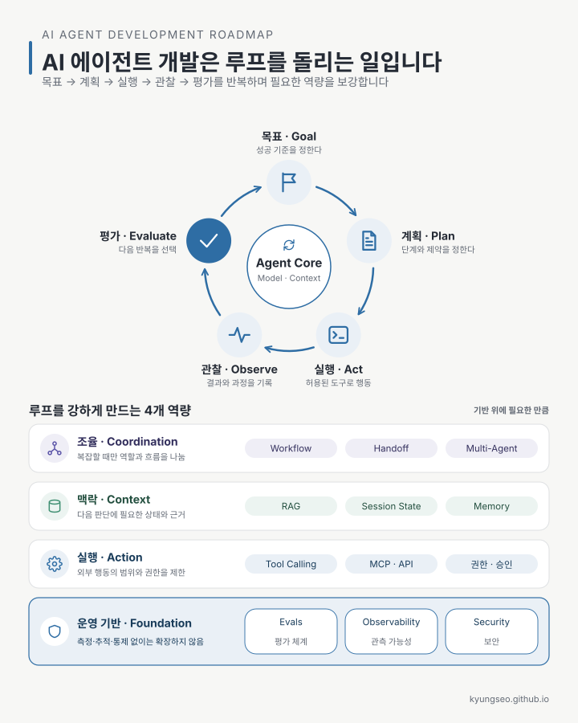
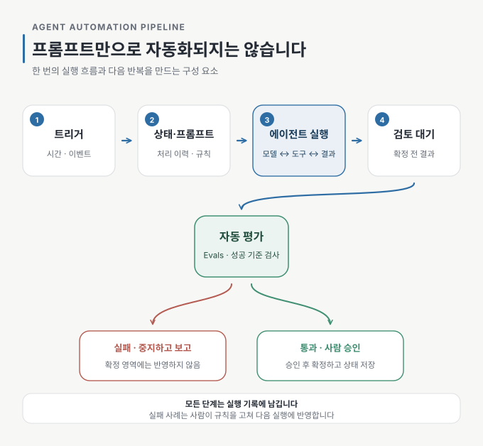

AI 에이전트 개발 로드맵을 찾아보면 LLM, RAG, MCP, 메모리, 오케스트레이션, 멀티 에이전트 같은 기술이 빼곡하게 등장합니다.

그런데 막상 무언가를 직접 만들어보려 하면 더 기본적인 질문에서 막힙니다.

> 목표와 절차를 프롬프트로 정리해 에이전트에게 전달하면 되는 걸까?
>
> 프롬프트만 있으면 에이전트가 알아서 반복해서 일하는 걸까?

대화형으로 시험해보는 단계라면 프롬프트만으로도 시작할 수 있습니다. 하지만 같은 작업을 안정적으로 반복하고 자동화하려면 프롬프트 밖의 구조가 필요합니다.

프롬프트는 에이전트에게 일을 설명합니다. 자동화는 그 일을 언제 시작하고, 어디까지 처리했는지 기억하고, 결과가 올바른지 검사하고, 위험한 행동 앞에서 멈추게 만드는 일까지 포함합니다.



그림 아래 네 영역은 에이전트 루프 전반을 지탱하는 역량을 묶어 본 것입니다. 뒤에서 다룰 트리거·상태·평가·승인·기록은 이 역량을 하나의 작업에 적용할 때 필요한 구체적인 자동화 구성 요소입니다.

## 하나의 ‘루프’ 안에는 세 가지 반복이 있다

AI 에이전트의 루프를 이해하기 어려운 이유는 서로 다른 반복을 모두 같은 단어로 부르기 때문입니다.

| 구분 | 무엇이 반복되는가 | 주로 담당하는 곳 |
| --- | --- | --- |
| 도구 호출 루프 | 모델이 도구를 선택하고 실행 결과를 받아 다음 행동을 결정 | 에이전트 실행 환경 |
| 작업 실행 루프 | 같은 업무를 정해진 시점이나 사건마다 다시 수행 | 사람 → 자동화 프로그램 |
| 개선 루프 | 실패를 분석하고 프롬프트·평가 기준·권한을 수정 | 당분간 사람 |

대화형 에이전트와 작업할 때는 이 세 가지가 한 화면에서 일어납니다.

사용자가 작업을 요청하면 에이전트가 파일이나 API를 읽습니다. 사용자는 결과를 확인하고 “승인한다”, “이 항목은 잘못 분류됐다”, “다시 평가해라”라고 답합니다.

이때 도구 호출 루프는 에이전트 실행 환경이 처리하지만, 작업을 시작하고 결과를 평가하고 다음 반복을 결정하는 일은 여전히 사람이 하고 있습니다.

자동화는 이 과정에서 사람이 반복적으로 맡던 역할을 하나씩 코드로 옮기는 일입니다.

## 이메일 영수증을 가계부에 기록해보자

매일 아침 이메일함에서 영수증을 찾아 가계부에 기록하는 에이전트를 만든다고 가정해보겠습니다.

처음부터 자동 실행하지 않고, 대화형 에이전트에게 다음과 같이 요청해볼 수 있습니다.

```text
어제 도착한 영수증 메일을 찾아 가계부 초안을 작성하라.

목표:
- 영수증 메일이 빠지지 않아야 한다.
- 금액, 날짜, 상호는 원문과 일치해야 한다.
- 같은 영수증을 두 번 기록하지 않는다.
- 결과는 검토 대기 파일에만 작성한다.

허용된 작업:
- 이메일 읽기
- 기존 처리 목록 읽기
- 검토 대기 파일 작성

금지된 작업:
- 원본 이메일 삭제
- 확정 가계부 수정
- 결제 또는 외부 전송

진행 절차:
1. 대상 메일을 수집한다.
2. 이미 처리한 메일을 제외한다.
3. 금액, 날짜, 상호를 추출한다.
4. 검토 대기 파일에 기록한다.
5. 원문과 결과를 대조한다.
6. 결과와 불확실한 항목을 보고하고 승인을 기다린다.
```

여기서 기존 처리 목록은 처음에는 비어 있거나 사람이 손으로 만든 간단한 파일이어도 됩니다. 몇 차례 수동으로 실행하며 어떤 값을 남겨야 중복 처리를 막을 수 있는지도 함께 확인합니다.

이 프롬프트를 실행하면 에이전트는 `목표 → 계획 → 실행 → 관찰 → 평가`의 루프를 한 번 수행합니다.

중요한 것은 한 번에 완벽한 프롬프트를 만드는 일이 아닙니다. 직접 몇 번 돌려보면서 어떤 메일을 놓치는지, 어떤 금액을 잘못 선택하는지, 어디에서 사람의 판단이 필요한지 발견하는 것이 먼저입니다.

## 자동화 파이프라인은 이렇게 흐른다

파이프라인은 작업 한 번이 처리되는 순서이고, 루프는 그 파이프라인이 반복되면서 평가 결과가 다음 실행에 반영되는 구조입니다.

한 번의 자동 실행을 펼쳐보면 다음과 같습니다.



그림 가운데 `모델 ↔ 도구 ↔ 결과`가 도구 호출 루프입니다. 이 흐름 전체를 일정이나 사건에 따라 다시 실행하는 것이 작업 실행 루프이고, 실행 기록과 실패 사례를 보고 사람이 규칙을 고치는 것이 개선 루프입니다.

프롬프트는 이 파이프라인 가운데 에이전트가 따라야 할 작업 규칙을 담당합니다. 트리거, 상태 저장, 자동 평가, 승인, 실행 기록까지 프롬프트가 대신해주지는 않습니다.

## 프롬프트 밖에 필요한 다섯 가지

매일 아침 사용자가 같은 프롬프트를 붙여 넣고 결과를 확인한다면 아직 수동 루프입니다. 이를 자동화하려면 최소한 다섯 가지가 추가로 필요합니다.

### 1. 트리거

매일 오전 7시처럼 작업을 시작할 조건입니다. 일정 실행, 새 메일 도착, 웹훅 같은 방식이 될 수 있습니다.

지금까지 사람이 “오늘 영수증을 정리해줘”라고 입력하던 역할을 대신합니다.

### 2. 상태 저장

이미 처리한 메일 ID를 파일이나 데이터베이스에 보관합니다.

대화에서는 에이전트가 앞선 문맥을 기억하지만, 자동 실행은 매번 새로운 세션으로 시작할 수 있습니다. 상태를 외부에 저장하지 않으면 같은 영수증이 반복해서 기록될 수 있습니다.

### 3. 자동 평가

결과가 성공 기준을 만족하는지 검사합니다.

수동 루프에서는 결과를 읽는 사람의 눈이 이 역할을 했습니다. 자동화에서는 그 기준 가운데 명확한 부분을 검사 코드로 옮깁니다.

예를 들면 다음과 같습니다.

- 기록한 메일 ID가 중복되지 않았는가
- 대상 영수증 수와 신규 기록 수가 일치하는가
- 기록한 금액·날짜·상호가 원문에 실제로 존재하는가
- 필수 필드가 비어 있지 않은가
- 허용되지 않은 파일이나 시트를 변경하지 않았는가

AI 분야에서 말하는 Evals는 이런 평가 체계를 뜻합니다. 정답이 명확한 항목은 스크립트로 검사하고, 문장의 의미나 분류처럼 기계적인 검사만으로 판단하기 어려운 항목은 평가 전용 모델이나 사람의 표본 검토를 이용할 수 있습니다.

물론 원문에 같은 금액이 여러 번 등장하는 경우처럼 자동 검사만으로 의미를 확정하기 어려운 상황도 있습니다. 그런 항목은 통과시킨 척하지 말고 검토 대기 상태로 남겨야 합니다.

### 4. 승인 게이트

에이전트는 검토 대기 영역까지만 작성하고, 확정 가계부 반영은 사람이 승인한 뒤 수행합니다.

프롬프트에 “확정 가계부를 수정하지 마라”라고 쓰는 것과 실제로 수정 권한을 주지 않는 것은 다릅니다.

프롬프트의 금지는 지시입니다. 권한 제한은 강제입니다. 사람이 지켜보지 않는 자동 루프일수록 위험한 행동은 프롬프트보다 도구와 권한 경계로 막아야 합니다.

### 5. 실행 기록

어떤 메일을 읽었고, 무엇을 제외했으며, 어떤 값이 추출됐고, 검증 결과가 어땠는지를 기록합니다.

이 기록이 있어야 나중에 “왜 이 영수증이 빠졌지?”라는 질문에 답할 수 있습니다. 결과만 저장하고 실행 과정을 남기지 않으면 실패 원인을 찾기 어렵습니다.

## 자동화된 실행 뒤에도 사람의 루프는 남는다

트리거, 상태, 평가, 승인, 기록을 구현하면 영수증 정리 작업은 매일 자동으로 실행될 수 있습니다. 하지만 모든 루프가 자동화된 것은 아닙니다.

며칠간의 실행 기록에서 간편결제 영수증이 계속 누락된다는 사실을 발견했다고 해보겠습니다. 사람은 원인을 확인하고 수집 조건이나 프롬프트를 수정합니다. 필요하다면 새로운 테스트 사례도 추가합니다.

에이전트가 작업 실행을 자동으로 반복하더라도, 무엇을 성공으로 볼지 정하고 실패를 다음 실행의 규칙에 반영하는 일은 한동안 사람에게 남습니다.

## Agent Platform부터 골라야 할까?

꼭 그렇지는 않습니다.

Agent Platform은 도구 호출 실행기, 상태 저장, 로그, 권한 관리, 일정 실행, 승인 화면처럼 자동화 파이프라인에 반복해서 필요한 **공통 실행 기반**을 제공합니다. 여러 에이전트와 워크플로를 함께 운영할 때는 분명 유용합니다.

하지만 플랫폼이 목표와 성공 기준까지 정해주지는 않습니다.

개인의 단일 작업이라면 이미 사용하는 에이전트 실행 환경에 다음 요소를 붙이는 것만으로도 시작할 수 있습니다.

- 파일로 저장한 프롬프트 템플릿
- 처리 상태 파일
- 결과 검증 스크립트
- 일정 실행 또는 이벤트 트리거
- 사람 승인 전 정지
- 날짜별 실행 기록

작업이 여러 개로 늘어나고 여러 사람이 운영하거나, 모니터링과 권한 관리가 복잡해질 때 플랫폼을 검토해도 늦지 않습니다.

플랫폼은 반복 실행에 필요한 공통 기반을 제공하지만, 루프의 방향까지 결정해주지는 않습니다. 무엇을 목표로 삼을지, 어떤 결과를 성공으로 볼지, 어디에서 사람 승인을 요구할지는 결국 사용자가 설계해야 합니다.

## 가장 현실적인 시작 순서

처음부터 완전 자동화를 목표로 하기보다 다음 순서가 현실적입니다.

1. 대화형 에이전트로 같은 작업을 두세 번 수행한다.
2. 반복해서 사용하는 프롬프트를 파일로 고정한다.
3. 사람이 눈으로 확인하던 기준을 검사 코드로 옮긴다.
4. 처리 상태와 실행 기록을 외부 파일에 남긴다.
5. 일정 실행이나 이벤트 트리거를 연결한다.
6. 외부에 영향을 주는 마지막 행동은 사람 승인 뒤에 둔다.
7. 워크플로가 많아져 관리가 어려워질 때 플랫폼을 검토한다.

각 단계는 앞 단계의 반복이 안정됐을 때 넘어가는 편이 좋습니다.

결국 중요한 것은 새로운 도구를 가능한 많이 연결하는 일이 아닙니다. 작은 작업을 정하고, 실패를 관찰하고, 성공 기준을 검사 가능하게 만들고, 필요한 권한만 열어주는 일에 가깝습니다.

좋은 에이전트는 한 번에 많은 일을 하는 에이전트가 아니라, 같은 일을 반복해도 결과를 확인할 수 있고 문제가 생겼을 때 멈출 수 있는 에이전트입니다.

<!-- 글 하단 기록은 site가 front matter에서 자동 렌더. -->
