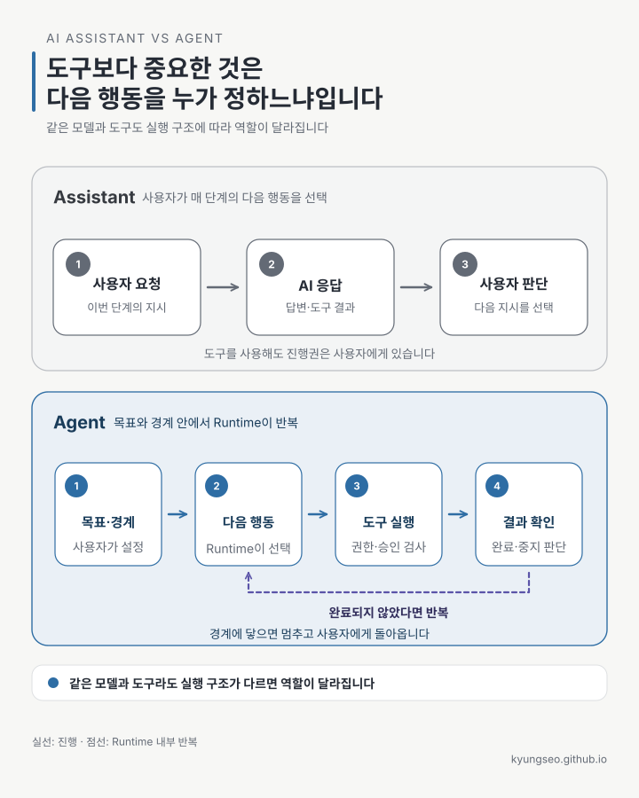

요즘 AI 제품 소개에서 Agent라는 말을 빼기 어렵습니다. 질문에 답하던 AI가 검색하고, 파일을 읽고, 코드를 고치기 시작하면서
Assistant와 Agent의 경계도 흐려졌습니다.

도구를 하나라도 쓰면 Agent일까요? 여러 번 모델을 호출하면 Agent일까요?

저는 제품에 붙은 이름보다 한 가지 질문을 먼저 봅니다.

> 이 일을 진행하면서 다음 행동을 누가 정하는가?

사용자가 매 단계에서 다음 지시를 내리면 Assistant 쪽입니다. 사용자가 목표와 경계를 정하고, 시스템이 그 안에서 다음 행동을
고르며 완료 조건까지 진행하면 Agent 쪽입니다.

이것은 업계 전체가 합의한 사전적 정의가 아닙니다. 실제 제품은 두 성격을 함께 가지고 있고, 같은 제품도 사용법과 권한 설정에 따라
Assistant처럼 동작할 수도, Agent처럼 동작할 수도 있습니다. 여기서는 이름이 아니라 실행 구조를 읽기 위한 기준으로 사용합니다.



## 같은 회의 준비도 진행 방식이 다르다

내일 회의를 준비한다고 해보겠습니다.

Assistant와 함께한다면 대화는 이런 식으로 이어집니다.

1. 사용자가 내일 일정을 찾아 달라고 합니다.
2. Assistant가 일정을 보여 줍니다.
3. 사용자가 관련 문서를 찾아 달라고 합니다.
4. Assistant가 문서를 정리합니다.
5. 사용자가 그 내용을 바탕으로 안건 초안을 써 달라고 합니다.

Assistant가 캘린더와 문서 검색 도구를 사용하더라도, 무엇을 할지와 언제 다음 단계로 넘어갈지는 사용자가 정합니다.

Agent에는 조금 다른 형태로 일을 맡길 수 있습니다.

```text
내일 회의를 준비하라.

목표:
- 참석자와 기존 논의 내용을 반영한 안건 초안을 만든다.

허용된 작업:
- 캘린더와 회의 문서 읽기
- 안건 초안 파일 작성

금지된 작업:
- 참석자에게 메시지 전송
- 기존 회의 문서 수정

완료·중지 조건:
- 일정, 참석자, 관련 문서가 서로 맞는지 확인한다.
- 정보가 부족하면 추측하지 말고 질문한다.
- 안건 초안을 만든 뒤 사용자 승인을 기다린다.
```

이 경우 시스템은 일정을 확인하고, 관련 문서를 찾고, 빠진 정보가 있는지 살펴본 뒤 초안을 만듭니다. 중간에 필요한 도구와 순서를
매번 사용자가 지정하지 않아도 됩니다. 다만 금지된 행동 앞에서는 멈추고, 완료 조건을 만족하지 못하면 질문해야 합니다.

둘의 차이는 모델이 더 똑똑한가에 있지 않습니다. 같은 모델과 같은 도구를 사용해도 **누가 진행권을 쥐고 있는지**, 그리고
**어디까지 실행을 이어 갈 수 있는지가** 다릅니다.

## 도구를 쓴다는 사실만으로는 구분할 수 없다

Assistant도 웹을 검색하고 코드를 실행할 수 있습니다. 도구가 제한된 Agent도 여러 단계의 판단을 이어 갈 수 있습니다. 도구의
유무나 개수만으로 둘을 나누면 실제 실행 구조를 놓치기 쉽습니다. Assistant가 한 응답 안에서 도구를 여러 번 호출하더라도,
응답이 끝나면 진행권은 사용자에게 돌아옵니다. 중요한 것은 내부 호출 횟수가 아니라 위임 범위가 응답 하나인지 목표 전체인지입니다.

여기서 한 가지 경계도 분명히 볼 필요가 있습니다. 흔히 “AI가 파일을 고쳤다”거나 “모델이 메일을 보냈다”고 말하지만, 모델이
외부 작업을 직접 수행하는 것은 아닙니다. 모델은 어떤 도구를 어떤 인자로 호출할지 구조화된 요청을 만들고,
Runtime(에이전트 실행 환경)이나 서버가 그 요청을 받아 실행한 뒤 결과를 다시 모델에 전달합니다. 서버가 제공하는 도구라면 이
과정이 화면 뒤에서 처리될 수 있지만, 모델의 판단과 실제 실행은 여전히 다른 책임입니다.

이 구분은 권한을 설계할 때 중요합니다. 프롬프트에 “메일을 보내지 마라”라고 쓰는 것은 지시이고, 전송 도구를 주지 않거나 서버에서
승인을 요구하는 것은 강제입니다. 다음 행동을 시스템에 더 많이 맡길수록 안전 경계는 모델 바깥에서 더 분명하게 작동해야 합니다.

## 네 가지 질문으로 실행 구조를 읽는다

제품명이 Assistant인지 Agent인지 따지는 대신 다음 질문을 해보면 실제 성격을 파악하기 쉽습니다.

| 질문 | Assistant에 가까운 모습 | Agent에 가까운 모습 |
| --- | --- | --- |
| 다음 행동은 누가 고르는가 | 사용자가 다음 지시를 내림 | 시스템이 목표 안에서 선택함 |
| 실행은 얼마나 이어지는가 | 한 요청과 응답 단위로 멈춤 | 완료·실패·중지 조건까지 반복함 |
| 작업 상태는 누가 이어 가는가 | 사용자가 대화 흐름을 관리함 | Runtime이 진행 상태와 도구 결과를 관리함 |
| 위험한 행동은 어디서 멈추는가 | 사용자가 매 단계를 직접 결정함 | 권한 제한과 승인 지점에서 사용자에게 돌아옴 |

모든 칸이 한쪽에만 들어맞을 필요는 없습니다. 읽기는 자동으로 진행하지만 파일 수정은 매번 승인받는 시스템도 있고, 정해진 단계만
자동으로 수행하다 예외가 생기면 사람에게 돌아오는 시스템도 있습니다. Assistant와 Agent를 두 종류로 딱 잘라 나누기보다,
위임한 진행권의 범위를 보는 편이 실제 동작을 더 잘 설명합니다.

## 자율성은 권한을 모두 넘기는 일이 아니다

Agent를 사람의 개입 없이 무엇이든 끝내는 시스템으로 이해하면 설계가 위험해집니다. 실용적인 Agent는 혼자서 오래 움직이는
시스템이 아닙니다. **허용된 범위에서는 스스로 진행하고, 경계에 닿으면 정확히 멈춰야 합니다.**

위임 범위는 조금씩 넓힐 수 있습니다.

1. 답변과 다음 행동을 제안합니다.
2. 읽기 전용 도구로 근거를 수집합니다.
3. 초안이나 검토 대기 파일을 만듭니다.
4. 외부에 영향을 주는 행동 앞에서 승인을 요청합니다.
5. 충분히 검증된 낮은 위험의 작업만 정해진 조건에서 자동 실행합니다.

이 단계는 표준 등급이 아니라 권한을 점검하기 위한 실용적인 순서입니다. 중요한 것은 “Agent인가 아닌가”라는 이름보다, 현재 어느
단계의 진행권과 실행 권한을 넘겼는지 아는 것입니다. 뒤 단계로 범위를 넓혀도 앞에서 둔 경계와 승인 지점은 그대로 남아야 합니다.

## 정해진 길은 Workflow가 더 낫다

Agent가 항상 더 발전된 선택인 것도 아닙니다.

처리 순서를 미리 정할 수 있다면 일반 코드나 Workflow가 더 단순하고 예측하기 쉽습니다. Anthropic은 이를 정해진 코드 경로로
LLM과 도구를 연결하는 Workflow와, 모델이 과정과 도구 사용을 동적으로 이끄는 Agent로 구분합니다. 이 역시 모든 제품을 구속하는
표준 정의라기보다 구조를 비교하기 위한 유용한 구분입니다.

실제 시스템은 둘을 섞는 경우가 많습니다. 전체 순서와 위험한 단계는 코드가 고정하고, 문서 검색이나 예외 처리처럼 경로를 미리
알기 어려운 구간만 Agent에게 맡길 수 있습니다.

- 한 번의 질문에 답하거나 사용자가 계속 곁에서 판단한다면 Assistant로 충분합니다.
- 순서가 고정되고 성공 조건을 코드로 검사할 수 있다면 Workflow가 잘 맞습니다.
- 필요한 단계가 상황마다 달라지고, 환경의 결과를 보며 다음 행동을 선택해야 한다면 Agent를 검토할 이유가 생깁니다.

처음부터 자율성을 크게 열기보다 가장 단순한 방식으로 시작하고, 반복되는 사람의 결정을 하나씩 시스템으로 옮기는 편이 안전합니다.

## Agent를 도입한다는 것

Agent를 도입하는 일은 대화창을 더 똑똑하게 만드는 데서 끝나지 않습니다. 다음 행동을 고르는 권한 일부를 시스템에 넘기고, 그
권한이 작동할 목표·도구·상태·완료 조건·중지 지점을 함께 설계하는 일입니다.

따라서 “이 제품이 Agent인가?”보다 먼저 물을 질문은 다음과 같습니다.

> 무엇을 맡길 것인가? 어디까지 진행하게 할 것인가? 언제 반드시 사람에게 돌아오게 할 것인가?

## 그럼 ChatGPT, Codex, Claude Code는?

> 그럼 내가 쓰는 ChatGPT, Codex, Claude Code는 Assistant야, 아니면 Agent야?

짧게 답하면, 제품 하나를 어느 한쪽으로 고정하기는 어렵습니다. 같은 제품도 사용자가 다음 단계를 계속 지시하면 Assistant처럼,
목표와 경계를 맡기고 결과가 나올 때까지 진행하게 하면 Agent처럼 동작합니다.

| 제품과 사용 방식 | 이 글의 기준으로 보면 | 이유 |
| --- | --- | --- |
| ChatGPT에서 짧은 질문·설명·초안을 주고받을 때 | Assistant에 가까움 | 응답 뒤의 다음 행동을 사용자가 정함 |
| ChatGPT Work에 결과가 분명한 여러 단계의 작업을 맡길 때 | Agent에 가까움 | 자료와 도구를 사용해 검토 가능한 결과까지 진행함 |
| Codex에 저장소 작업과 검증을 함께 맡길 때 | Agent에 가까움 | 작업 환경에서 파일을 바꾸고 결과와 diff를 검토 가능한 상태로 돌려줌 |
| Claude Code에 기능 구현·오류 수정·검증을 맡길 때 | Agent에 가까움 | 코드베이스를 읽고 여러 파일과 도구를 오가며 작업을 이어 감 |

OpenAI 공식 문서도 일반 Chat은 답변·설명·짧은 초안에, ChatGPT Work는 명확한 결과가 있는 작업을 위임할 때 사용한다고 구분합니다.
Codex cloud는 작업을 별도 환경에서 실행하고 결과와 diff를 검토하는 흐름을 안내합니다. Claude Code 공식 개요는 같은 제품을
`agentic coding tool`이라고 소개하면서 `AI-powered coding assistant`라고도 설명합니다. 제품 이름만으로 둘을 가르기 어려운 이유를
잘 보여 주는 사례입니다.

물론 Codex에 코드 한 줄만 설명해 달라고 하면 그 순간에는 Assistant처럼 쓰는 셈입니다. 반대로 ChatGPT에 목표와 도구,
완료·중지 조건을 주고 여러 단계를 맡기면 Agent식 사용이 됩니다. 결국 분류해야 할 것은 제품이 아니라 지금 실행 중인 작업 방식입니다.

위험도 마찬가지입니다. Agent라는 이름 자체보다 어떤 행동을 실행할 수 있고, 실패했을 때 얼마나 되돌리기 어려운지가 중요합니다.
읽기 전용 Agent보다 메일 전송이나 삭제 권한을 가진 Assistant의 되돌리기 비용이 더 클 수도 있습니다. 시스템이 여러 행동을 이어서
실행할수록 반복 횟수와 비용 한도, 중지 조건, 승인 지점을 실행 환경에서 제한해야 합니다.

다음 글 [「AI 에이전트 개발은 루프를 돌리는 일이다」](https://kyungseo.github.io/posts/agent-development-loop/)에서는 목표를 받은
Agent가 도구를 호출하는 반복과, 같은 업무를 다시 실행하는 반복, 실패를 고치는 사람의 반복을 나누어 살펴봅니다.

## 참고한 자료

- [Anthropic, Building effective agents](https://www.anthropic.com/engineering/building-effective-agents) — Workflow와 Agent의 작업 정의, 단순한 구조부터 시작하라는 권고
- [Anthropic, How tool use works](https://platform.claude.com/docs/en/agents-and-tools/tool-use/how-tool-use-works) — 모델의 tool call과 실제 도구 실행의 책임 구분
- [OpenAI Agents SDK, Agents](https://openai.github.io/openai-agents-python/agents/) — instructions·tools·handoffs·guardrails를 포함한 Agent 구성
- [OpenAI Agents SDK, Running agents](https://openai.github.io/openai-agents-python/running_agents/) — 모델 호출·tool call·handoff·종료 조건을 처리하는 Agent loop
- [OpenAI, Get started with ChatGPT Work](https://learn.chatgpt.com/docs/get-started-with-work) — 일반 Chat과 결과 중심의 Work 사용 구분
- [OpenAI, Codex cloud](https://learn.chatgpt.com/docs/cloud) — 격리된 환경에서 작업을 실행하고 결과와 diff를 검토하는 흐름
- [Anthropic, Claude Code overview](https://code.claude.com/docs/en/overview) — Claude Code의 agentic coding과 coding assistant 설명

자료 확인일: 2026-09-04

<!-- 글 하단 기록은 site가 front matter에서 자동 렌더. -->
