Drawing is only one part of making a technical diagram. I repeatedly widen a box, move an arrow, shorten text that overflowed, and render the PNG again. The result may look convincing, yet one wording change can break the layout. A Korean edition can end up requiring almost the same diagram to be drawn all over again.

This is especially awkward in a CLI agent workflow. A finished image gives the agent little to work with when the next revision arrives. An editable source file keeps wording, layout, and rendering in the same workflow.

`svg-infographic` changes the order of operations. It does not start by drawing. It starts by writing down the numbers.



## A diagram is closer to a relationship than a picture

An architecture note contains components and connections. A release procedure contains sequence and approval. A migration explanation has a before and an after, while a roadmap has time and stages. All of them can be drawn with a few rectangles, but the relationships readers need to understand are different.

That difference is where `svg-infographic` begins. It reads the material for its relationship model, then chooses an appropriate form: topology, flow, approval, before-and-after, hierarchy, roadmap, or matrix. Choosing a form is not the same as choosing a decorative template. It means deciding what should be read first, where the path branches, and what contains what.

Only then does it divide the canvas. It calculates the outer margins, card widths and gaps, the number of lines each box can hold, and the corridors reserved for connectors. SVG does not provide dependable automatic line wrapping, so it is better to set a text budget for both English and Korean before rendering than to discover overflowing text afterward.

The point is not to make design mechanical. It is to turn the parts that repeatedly cause rework into explicit constraints instead of leaving them to intuition. Before drawing, the skill checks whether the last card crosses the outer margin, whether an arrow still has a visible shaft after accounting for its head, and whether both languages can use the same layout formula.

> The quality of the first render depends more on the relationships and spacing defined beforehand than on the skill of the final touch-up.

## Keep an editable source and a shareable result

When a diagram arrives only as an image, the next change often means starting again. `svg-infographic` keeps the SVG as the source. Text remains text, color values stay centralized, and cards and connectors remain editable. The SVG can be reused in HTML, READMEs, documents, and slides, while social channels can use a 2x PNG rendered from the same source.

“It also makes a PNG” means more than converting a file. The skill's standard render path reruns source lint, checks the available Chromium-based browser, creates the 2x PNG, and verifies the actual dimensions in the PNG header. If something goes wrong, it does not switch renderers on its own or retouch only the PNG. It returns to the SVG, fixes the source, and renders again.

Source lint catches defects that are tedious to track visually every time: broken references, marker definition errors, and clearly overflowing text. Opt-in layout rules can also check recurring problems such as the vertical rail beside a page title, spacing between a panel heading or subtitle and its divider, or vertical alignment between an icon and its description.

That does not make every judgment automatic. A person still needs to inspect the actual PNG to decide whether connectors remain visible at reduced size, whether the reading order feels natural, and whether the title carries the conclusion. Anything source lint cannot prove remains a warning for human review rather than being treated as an automatic pass.

The separation matters. The machine filters errors it can determine reliably; the person concentrates on the message and the visual judgment. Neither replaces the other.

The lead image for this article followed the same process. Its v0.9.0 source lint completed with zero errors and zero warnings, and the 1080×1350 SVG was rendered to an exact 2160×2700 PNG. I still inspected the PNG and adjusted the title rail and card alignment by eye.

## Korean is not something to insert at the end

If an English diagram is finished first and Korean text is inserted later, different sentence lengths and glyph widths can shift cards and connectors together. This skill treats CJK text, including Korean, as an initial layout condition rather than an exception. It includes operating-system fallback font stacks in the SVG and applies a more conservative character budget to Korean. When producing English and Korean editions together, it uses the same layout formula instead of hand-tuning separate coordinates.

The default result is a restrained technical-document style. An optional sketch preset changes only the presentation and leaves the structure intact, adding paper texture, Korean handwriting, rough strokes, and highlighter effects. The layout remains calculated and the words remain real text. A hand-drawn look is not treated as permission for a careless layout.

The Korean handwriting font can also be subset to the glyphs actually used in the SVG. Embedding the full font would make the SVG about 4 MB; the published sketch example is around 100 KB. The tradeoff is that changing the wording requires regenerating the subset so the new glyphs are not omitted. Editability comes with that maintenance responsibility.

## What this skill does not do

`svg-infographic` is not a general-purpose image tool. It is not suited to photo-led marketing images, characters and mascots, or logo design. Statistical bar, line, and scatter charts also belong in a dedicated charting tool that preserves quantitative accuracy. A simple qualitative 2×2 matrix is a structural diagram and fits the skill; data visualization, which must stay faithful to the numbers, remains outside its scope.

Its automated verification is bounded as well. Browser rendering has been verified on macOS and in a Windows 11 ARM64 virtual machine. The Linux path is documented but has not been directly verified. If Node.js 18 or newer is unavailable, the skill asks before installing it. If the automated source lint could not be run, a manual review is not reported as equivalent to it.

Those boundaries make the purpose clearer. The goal is not to turn anything into a picture. It is to leave a one-page structural explanation in a form that can still be edited and reviewed.

## Four things to decide before drawing

This is the order in which the skill begins a technical diagram:

1. What conclusion must the diagram still communicate at the end?
2. Is the relationship readers need to grasp a connection, sequence, comparison, containment, or timeline?
3. Which visual form fits that relationship, and what are the budgets for the canvas, cards, text, and connectors?
4. Which errors can a machine determine, and which aspects of quality require human judgment?

Only then does it draw the SVG.

## Installation

`svg-infographic` is a self-contained folder package. For a reproducible installation, use the pinned tag from the Skillstead installation guide together with the matching `skills/svg-infographic/` folder. The commands below install the `v0.9.0` version verified for this article into a macOS/Linux project. Run only the block for your agent environment.

Claude Code project:

```bash
install_root="$(mktemp -d)"
git clone --depth 1 --branch svg-infographic/v0.9.0 https://github.com/kyungseo/skillstead.git "$install_root/skillstead"
mkdir -p .claude/skills
cp -R "$install_root/skillstead/skills/svg-infographic" .claude/skills/
```

Codex project:

```bash
install_root="$(mktemp -d)"
git clone --depth 1 --branch svg-infographic/v0.9.0 https://github.com/kyungseo/skillstead.git "$install_root/skillstead"
mkdir -p .agents/skills
cp -R "$install_root/skillstead/skills/svg-infographic" .agents/skills/
```

See the [Skillstead installation guide](https://github.com/kyungseo/skillstead/blob/main/docs/INSTALL.md) for global installation, Windows PowerShell, updates, and the latest pinned tag. Node.js 18 or newer and a Chromium-based browser are required for automated source lint and the standard PNG render path, but not simply to copy and discover the skill.

The [svg-infographic README](https://github.com/kyungseo/skillstead/blob/main/skills/svg-infographic/README.md) covers the complete workflow. The [gallery contains 15 English and Korean examples](https://github.com/kyungseo/skillstead/tree/main/examples/svg-infographic), each with its prompt and result. The full catalog is available in [Skillstead](https://github.com/kyungseo/skillstead).
