기술 다이어그램을 만들 때 반복되는 일은 그림을 그리는 것만이 아닙니다. 박스를 조금 넓히고, 화살표를 옮기고, 넘친 문장을 줄이고, 다시 PNG로 뽑습니다. 결과는 그럴듯해도 한 문구만 바뀌면 배치가 무너질 수 있고, 한국어판을 만들 때 같은 그림을 거의 다시 그리게 되기도 합니다.

특히 CLI 에이전트 환경에서는 완성된 이미지 한 장만으로 다음 수정을 이어가기 어렵습니다. 처음부터 편집 가능한 원본을 만들면 문구와 배치를 고쳐 다시 렌더링하는 과정이 같은 작업 안에서 이어집니다.

`svg-infographic`은 이 순서를 바꿉니다. 먼저 그리지 않습니다. 먼저 숫자를 적습니다.



## 다이어그램은 그림보다 관계에 가깝다

아키텍처 메모에는 컴포넌트와 연결이 있습니다. 릴리스 절차에는 순서와 승인이 있습니다. 마이그레이션 설명에는 이전과 이후가 있고, 로드맵에는 시간과 단계가 있습니다. 같은 사각형 몇 개로 표현할 수는 있어도, 읽는 사람이 파악해야 하는 관계는 서로 다릅니다.

`svg-infographic`은 이 차이에서 시작합니다. 내용에서 관계의 종류를 읽고 토폴로지, 흐름, 승인, 변경 전후, 계층, 로드맵, 매트릭스 중 알맞은 형태를 먼저 고릅니다. 형태를 고른다는 것은 예쁜 틀을 고르는 일이 아닙니다. 무엇을 먼저 읽고, 어디서 갈라지고, 무엇이 안에 포함되는지를 정하는 일입니다.

그다음에야 캔버스를 나눕니다. 바깥 여백, 카드 너비와 간격, 박스마다 허용할 줄 수, 연결선이 지나갈 통로를 계산합니다. 특히 SVG에는 문장을 안정적으로 자동 줄바꿈해 주는 기능이 없습니다. 렌더링 뒤에 글자가 넘친 것을 발견하기보다, 박스 너비에 맞춰 영문과 한국어의 글자 예산을 먼저 정하는 편이 낫습니다.

이 계산은 디자인을 기계적으로 만들기 위한 것이 아닙니다. 반복 수정이 생기기 쉬운 부분을 감각이 아니라 명시적인 제약으로 다루기 위한 것입니다. 마지막 카드의 오른쪽 끝이 바깥 여백을 침범하지 않는지, 화살표 머리를 빼고도 몸통이 보이는지, 두 언어에 같은 배치 공식을 적용할 수 있는지를 그리기 전에 확인합니다.

> 첫 렌더링의 품질은 마지막 보정의 손재주보다, 렌더링 전에 정한 관계와 여백에서 더 많이 결정됩니다.

## 편집 가능한 원본과 공유 가능한 결과를 함께 남긴다

다이어그램을 이미지 한 장으로만 받으면 다음 수정부터 다시 시작해야 합니다. `svg-infographic`은 SVG를 원본으로 둡니다. 텍스트는 텍스트로 남고, 색상 값은 한곳에 모이며, 카드와 연결선도 계속 고칠 수 있습니다. HTML과 README, 문서와 슬라이드에는 SVG를 재사용하고, 소셜처럼 PNG가 필요한 곳에는 같은 원본에서 2배 크기의 이미지를 만듭니다.

여기서 “PNG도 만든다”는 말은 단순한 파일 변환을 뜻하지 않습니다. 이 스킬의 표준 렌더링 경로는 먼저 SVG 원본 검사(source lint)를 다시 실행하고, 사용할 Chromium 계열 브라우저를 확인한 뒤 2× PNG를 만들고, PNG 헤더의 실제 크기까지 검사합니다. 문제가 생겼다고 다른 렌더러로 임의 전환하거나 PNG만 따로 보정하는 우회는 하지 않습니다. 결과가 틀리면 SVG로 돌아가 고치고 다시 렌더링합니다.

원본 검사가 찾는 것은 사람이 매번 눈으로 추적하기 어려운 오류입니다. 끊어진 참조, 화살표 머리(marker) 정의 오류, 명백한 글자 넘침처럼 기계적으로 판정할 수 있는 문제를 먼저 막습니다. 반복해서 어긋나던 페이지 제목 옆 세로선, 패널 제목·부제와 구분선 사이의 여백, 아이콘과 설명의 세로 정렬도 선택형 레이아웃 규칙으로 검사할 수 있습니다. 반대로 모든 것을 자동화했다고 말하지는 않습니다. 연결선이 축소 화면에서도 충분히 보이는지, 읽는 순서가 자연스러운지, 제목이 정말 결론을 담는지는 사람이 실제 PNG를 보고 판단해야 합니다. 확실히 판정하지 못해 경고로만 남은 항목도 자동으로 통과시키지 않고 사람이 확인합니다.

이 분리가 중요합니다. 기계는 명확히 판정할 수 있는 오류를 걸러내고, 사람은 메시지와 시각적 판단에 집중합니다. 둘 중 하나를 다른 하나의 대체물로 취급하지 않습니다.

이 글의 대표 이미지도 같은 순서로 만들었습니다. v0.9.0 원본 검사는 오류·경고 0건으로 통과했고, PNG는 1080×1350 SVG의 정확한 2배인 2160×2700으로 렌더링했습니다. 그래도 제목 옆 세로선과 카드 정렬은 사람이 PNG를 보고 다시 고쳤습니다.

## 한국어를 나중에 끼워 넣지 않는다

영문 다이어그램을 먼저 만든 뒤 한국어를 넣으면 문장이 길어지거나 글자 폭이 달라져 카드와 연결선이 함께 흔들립니다. 이 스킬은 한국어를 포함한 CJK 문자를 별도 예외가 아니라 초기 배치 조건으로 다룹니다. 운영체제별 대체 폰트 목록을 SVG에 넣고, 한국어의 글자 예산을 영문보다 보수적으로 잡습니다. 영문판과 한국어판을 함께 만들 때는 서로 다른 좌표를 손으로 보정하는 대신 같은 배치 공식을 사용합니다.

기본 결과는 차분한 기술 문서 스타일입니다. 필요하면 구조는 그대로 두고 표현만 바꾸는 스케치 프리셋을 선택할 수 있습니다. 종이 질감, 한국어 손글씨, 거친 선과 형광펜 표현을 쓰더라도 배치는 계산된 상태로 남고 텍스트도 실제 텍스트로 유지됩니다. “손으로 그린 느낌”과 “대충 배치한 그림”을 같은 말로 취급하지 않기 위해서입니다.

한국어 손글씨 폰트는 실제로 사용한 글자만 추려 SVG 안에 넣을 수 있습니다. 전체 폰트를 넣으면 약 4MB가 될 SVG를, 공개된 스케치 예제에서는 100KB 안팎으로 줄였습니다. 다만 문구를 바꾸면 새 글자가 빠지지 않도록 폰트 부분집합도 다시 만들어야 합니다. 편집 가능한 원본에는 이런 관리 책임도 함께 따릅니다.

## 이 스킬이 하지 않는 일

`svg-infographic`은 모든 종류의 이미지를 잘 만드는 범용 그림 도구가 아닙니다. 사진 중심의 마케팅 이미지, 캐릭터와 마스코트, 로고 디자인에는 맞지 않습니다. 정확한 수치를 표현하는 막대·선·산점도 같은 통계 차트도 전용 차트 도구의 몫입니다. 간단한 정성적 2×2 매트릭스는 구조이므로 다룰 수 있지만, 숫자에 충실해야 하는 데이터 시각화까지 범위를 넓히지는 않습니다.

자동 검증의 범위도 한정돼 있습니다. 현재 브라우저 렌더링은 macOS와 Windows 11 ARM64 가상 머신에서 검증됐고, Linux 경로는 문서화돼 있지만 직접 검증됐다고 주장하지 않습니다. Node.js 18 이상이 없으면 설치 전에 사용자에게 동의를 구하며, 자동 원본 검사를 실행하지 못했다면 수동 점검과 자동 검증을 같은 것으로 말하지 않습니다.

이 경계 덕분에 스킬의 장점도 선명해집니다. 목표는 무엇이든 그림으로 만드는 것이 아니라, 구조를 설명하는 한 장을 수정하고 검토할 수 있는 형태로 남기는 것입니다.

## 그리기 전에 확인하는 네 가지

이 스킬이 기술 다이어그램을 시작할 때 확인하는 순서는 이렇습니다.

1. 이 그림이 끝까지 전달할 결론은 무엇인가.
2. 독자가 파악해야 할 관계는 연결, 순서, 비교, 포함, 시간 중 무엇인가.
3. 그 관계를 담을 형태는 무엇이고, 캔버스·카드·글자·연결선의 예산은 얼마인가.
4. 기계가 확인할 오류와 사람이 판단할 품질은 각각 무엇인가.

그 뒤에야 SVG를 그립니다.

## 설치

`svg-infographic`은 폴더 하나로 설치하는 독립 패키지입니다. 재현 가능한 설치를 위해 Skillstead 설치 안내에 표시된 고정 태그와 `skills/svg-infographic/` 폴더를 한 쌍으로 사용합니다. 아래 명령은 이 글을 게시할 때 확인한 `v0.9.0`을 macOS/Linux 프로젝트에 설치합니다. 최신 고정 태그는 아래의 Skillstead 설치 안내에서 확인할 수 있습니다. 사용하는 실행 환경에 맞는 블록 하나만 선택해 실행합니다.

Claude Code 프로젝트:

```bash
install_root="$(mktemp -d)"
git clone --depth 1 --branch svg-infographic/v0.9.0 https://github.com/kyungseo/skillstead.git "$install_root/skillstead"
mkdir -p .claude/skills
cp -R "$install_root/skillstead/skills/svg-infographic" .claude/skills/
```

Codex 프로젝트:

```bash
install_root="$(mktemp -d)"
git clone --depth 1 --branch svg-infographic/v0.9.0 https://github.com/kyungseo/skillstead.git "$install_root/skillstead"
mkdir -p .agents/skills
cp -R "$install_root/skillstead/skills/svg-infographic" .agents/skills/
```

전역 설치, Windows PowerShell과 업데이트 방법은 [Skillstead 설치 안내](https://github.com/kyungseo/skillstead/blob/main/docs/INSTALL.ko.md)에서 확인할 수 있습니다. 자동 원본 검사와 표준 PNG 렌더링에는 Node.js 18 이상과 Chromium 계열 브라우저가 필요하지만, 스킬을 복사하고 발견하는 데는 Node.js가 필요하지 않습니다.

`svg-infographic`의 전체 사용법은 [스킬의 한국어 README](https://github.com/kyungseo/skillstead/blob/main/skills/svg-infographic/README.ko.md)에서, 실제 프롬프트와 결과물은 [영문·한국어 예시 15개 갤러리](https://github.com/kyungseo/skillstead/tree/main/examples/svg-infographic)에서 볼 수 있습니다. 저장소 전체는 [Skillstead](https://github.com/kyungseo/skillstead)에 공개돼 있습니다.
