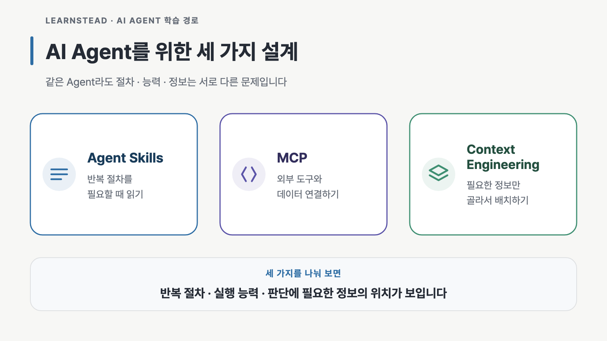

AI Agent가 기대한 대로 움직이지 않으면 프롬프트부터 길어지기 쉽습니다. 매번 작업 순서를 다시 설명하고, 사용할 도구와 참고
자료, 지켜야 할 규칙까지 한꺼번에 붙입니다. 설명은 계속 늘어나는데 결과가 왜 흔들리는지는 오히려 찾기 어려워집니다.

이번 Learnstead 자료를 정리하면서 이 문제를 세 갈래로 나눴습니다.

> 반복할 절차, 사용할 도구, 지금 읽어야 할 정보는 따로 설계할 수 있습니다.

## Agent Skills — 반복할 절차를 가르칩니다

Agent Skills는 자주 반복하는 작업 순서를 `SKILL.md`에 적어 두고, 필요한 순간에 Agent가 찾아 읽게 하는 방식입니다. 예를 들어
회의록을 액션 아이템으로 바꾸거나 공개 전에 저장소를 점검하는 것처럼 **같은 절차를 매번 다시 설명하는 일을** 줄여 줍니다.

Skill은 무엇을 언제 해야 하는지 알려 주는 절차입니다. 권한을 강제하려면 별도의 보안 장치가 필요합니다. 설명 범위가 너무 넓으면
관계없는 요청에도 호출될 수 있고, 파일을 찾았더라도 본문을 제대로 따르지 않을 수 있습니다. 그래서 발견·로드·준수, 즉 파일을
찾았는지, 읽었는지, 실제로 따랐는지를 나눠 확인해야 합니다.

## MCP — 사용할 도구와 데이터를 연결합니다

MCP(Model Context Protocol)는 노트, 파일, 데이터베이스, API 같은 외부 능력을 여러 AI 앱이 공통 방식으로 사용할 수 있게
연결합니다. 여기서 모델은 도구 호출을 제안하고, 실제 실행과 권한 확인은 host(Claude Code·Codex처럼 모델과 도구를 중개하는
실행 앱)와 MCP 서버가 맡습니다.

도구에 `read_only_hint` annotation(읽기 전용이라는 성질 표시)을 붙였다고 해서 실제 쓰기가 막히지는 않습니다. 서버의 데이터 권한,
도구가 제공하는 annotation, host의 승인 정책이 각각 어떤 경계를 담당하는지 따로 봐야 합니다. 중요한 제한은 실행 계층에서
강제해야 합니다.

## Context Engineering — 지금 필요한 정보를 고릅니다

Context Engineering은 긴 프롬프트를 잘 쓰는 요령보다 범위가 넓습니다. 진입 지시문, 대화 기록, Skill, MCP 도구 결과, 기억 가운데
지금 판단에 필요한 정보를 고르고 순서를 정하며, 작업이 길어져도 중요한 내용이 남도록 설계합니다.

앞의 두 주제도 결국 컨텍스트로 만납니다. Skill은 필요한 절차를 가져오고, MCP는 도구 설명과 실행 결과를 가져옵니다. 필요한
만큼만 넣어야 판단에 중요한 내용이 묻히지 않습니다. 코드에서 이미 알 수 있는 규칙은 되풀이하지 않고, 항상 필요한 내용과
조건이 맞을 때만 필요한 내용을 구분하는 편이 낫습니다.

## 가이드마다 작은 실험을 붙였습니다

세 가이드는 설명만으로 끝내지 않고 각각 실습으로 이어집니다.

1. **[Agent Skills 기초](https://github.com/kyungseo/learnstead/tree/main/guides/agent-skills)와**
   **[Skill 워크숍](https://github.com/kyungseo/learnstead/tree/main/labs/skill-workshop)** — 회의록 Skill을 만들고 두 코딩
   Agent에서 자동 호출·과호출·경로 발견·이름 충돌을 비교합니다.
2. **[MCP 기초](https://github.com/kyungseo/learnstead/tree/main/guides/mcp-basics)와**
   **[노트 MCP 서버](https://github.com/kyungseo/learnstead/tree/main/labs/mcp-notes-server)** — Python으로 읽기 전용 서버를
   만들고 권한 밖 호출, 거짓 annotation, 문서 속 주입 지시, stdout 오염을 재현합니다.
3. **[Context Engineering 기초](https://github.com/kyungseo/learnstead/tree/main/guides/context-engineering)와**
   **[지시문 예산](https://github.com/kyungseo/learnstead/tree/main/labs/instruction-budget)** — 지시문의 길이와 위치가 다른 여섯
   구성을 두 도구에서 반복 실행해 규칙 준수 결과를 비교합니다.

결과 중에는 예상과 달랐던 것도 있었습니다. 넓게 쓴 Skill 설명은 단순 요약 요청에서도 3회 모두 호출됐습니다.
`approval: never`(실행 전 승인을 묻지 않는 설정)로 테스트한 Codex에서는 쓰기 도구에 `read_only_hint`를 거짓으로 표시하자 실제
쓰기가 실행됐습니다. 지시문 실험에서는 176줄짜리 긴 문서가 짧은 지시문보다 나은 결과를 내지 못했습니다. Claude Code에서는
결과가 같았고, Codex에서는 오히려 낮았습니다. 이미 코드에서 추론할 수 있는 규칙은 지시문 없이도 모두 통과했습니다.

이 수치는 2026년 8월 30~31일의 고정된 예제 프로젝트와 당시 설치한 Claude Code·Codex에서 얻은 실행 기록입니다. 다른 버전과 과제에서도
같은 결과가 나온다는 뜻은 아닙니다. 환경과 판정 기준, 확인하지 못한 범위는 각 자료의 `VALIDATION.md`에 남겼습니다.

## 어디서 시작하면 좋을까

터미널에서 코딩 Agent를 한 번이라도 써 봤다면 바로 시작할 수 있습니다. 세 주제는 `Agent Skills → MCP → Context Engineering`
순서로 읽으면 자연스럽습니다. 먼저 Agent가 어떻게 움직이고 절차를 언제
읽는지 이해한 뒤, 외부 도구를 연결하고, 마지막으로 지시문·Skill·도구 결과·기억을 한 흐름에서 정리합니다.

[Learnstead 저장소](https://github.com/kyungseo/learnstead)의 **AI Agent 다루기** 절에서 가이드와 실습 여섯 편을 순서대로 볼 수
있습니다. Agent가 모델과 도구를 오가는 기본 반복 구조가 먼저 궁금하다면
[「AI 에이전트 개발은 루프를 돌리는 일이다」](https://kyungseo.github.io/posts/agent-development-loop/)를 함께 읽어도 좋습니다.

반복 절차와 실행 능력, 판단에 필요한 정보를 나눠 보자는 것이 세 가이드의 출발점입니다.

<!-- 글 하단 기록은 site가 front matter에서 자동 렌더. -->
