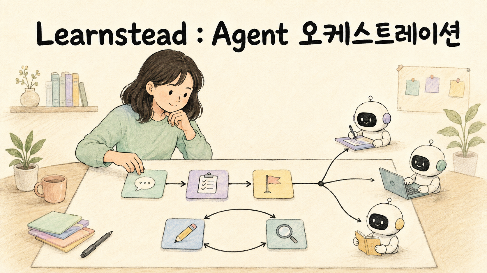

AI Agent에게 큰 작업을 맡기다 보면 다른 Agent의 도움을 받고 싶어집니다. 자료 조사는 따로 맡기고, 여러 파일을 동시에 수정하고, 완성된 코드는 다른 Agent에게 검토받는 식입니다.

그렇게 역할을 정하면 일이 빨라질 것 같습니다. 하지만 지시를 전달하고 결과를 확인하는 시간이 더 들 수도 있습니다. 각자 만든 결과가 맞더라도, 하나로 합치는 과정에서 내용이 빠지거나 뜻이 바뀔 수 있습니다.

이번 Learnstead 자료에서는 이 질문을 살펴봤습니다.

> 어떤 작업을 별도로 맡겨야 하고, 그렇게 한 결과가 실제로 나아졌는지는 어떻게 확인할까?

## 호출 순서와 결과 전달을 설계합니다

오케스트레이션(orchestration)은 여러 모델 호출이나 에이전트가 어떤 순서로 일하고, 누구에게 어떤 결과를 전달할지 조정하는 일입니다. 질문을 분류해 담당에게 보내거나, 문서별 검토 결과를 모으거나, 초안을 평가한 뒤 다시 작성하게 하는 과정이 여기에 해당합니다.

첫 가이드에서는 한 번의 모델 호출로 답하는 방식을 기준으로, 네 가지 처리 방식을 비교합니다.

- **파이프라인:** 분류 → 답변 → 문장 다듬기처럼 정해진 순서로 처리합니다.
- **라우터:** 질문의 분야를 판단해 담당 역할 하나를 선택합니다.
- **워커 배정·취합:** 문서별로 작업을 맡기고, 각 워커가 돌려준 결과를 모읍니다.
- **평가-개선 루프:** 초안을 평가하고, 지적된 내용을 반영해 다시 작성합니다.

이 실습은 Python 코드가 같은 모델을 역할별로 호출하고 실행 순서를 정합니다. 모델들이 스스로 협업 방식을 결정하는 시스템을 만드는 실습은 아닙니다. 먼저 작은 코드로 호출 흐름과 전달 자료를 살펴보고, 각 구성이 어떤 비용과 실패를 만드는지 확인합니다.

## 호출을 늘린 만큼 좋아지지는 않았습니다

가상의 사내 규정 세 편을 놓고 같은 질문을 다섯 방식으로 처리했습니다. 한 번에 답할 때는 입력 508토큰을 사용했고, 관련 문서를 고른 뒤 답하는 파이프라인은 세 번 호출하면서도 입력 합계가 365토큰으로 줄었습니다. 호출 횟수와 입력량이 같은 방향으로 움직이지 않은 것입니다.

라우터는 입력량이 적었지만 담당 분야를 잘못 선택했습니다. 연차 질문을 회의실 담당에게 보내니, 담당은 필요한 규정을 읽지 못한 채 답하게 됐습니다. 별도의 8문항 분류 실험에서는 4문항을 잘못 분류했습니다.

워커 결과를 취합할 때도 문제가 생겼습니다. 워커가 정확하게 적은 “15분 이내에 입실하지 않으면 자동 취소”라는 규정이 최종 답변에서는 “15분 내 입실해야 자동 취소”로 바뀌었습니다. 각 워커의 답이 맞는지뿐 아니라, 최종 답에 그 뜻이 그대로 남았는지도 확인해야 했습니다.

이 결과는 2026년 8월 30일의 `gemma3:4b`와 작은 규정 예제에서 얻은 기록입니다. 특정 패턴의 우열을 일반화하기 위한 결과는 아닙니다. 모델과 과제가 달라졌을 때 직접 비교할 수 있도록 명령과 판정 기준을 함께 담았습니다.

## 코딩 Agent에게 맡길 때는 작업 범위와 마무리까지 정합니다

짝이 되는 가이드는 Claude Code와 Codex에서 작업을 맡기는 방법을 다룹니다. 사용자가 대화하는 메인 세션이 서브에이전트(subagent)에게 검토나 구현을 맡기고, 결과를 받아 확인하는 흐름입니다.

“앞에서 이야기한 문제를 고쳐 줘”라는 요청만으로는 이전 대화를 받지 못한 서브에이전트가 작업을 이해하기 어렵습니다. 대상 파일, 기대하는 동작, 수정하지 않을 범위, 결과를 보고할 형식을 요청 안에 적어야 합니다. 대화 이력을 전달하는 방식도 도구와 설정에 따라 확인해야 합니다.

병렬 편집에서는 각자 수정할 파일 범위와 작업 폴더를 정합니다. 같은 저장소를 별도 폴더에서 작업하는 Git worktree를 써도, 완료된 변경을 합치는 일은 남습니다. 누가 통합하고 최종 기능을 확인할지까지 정해야 작업을 마칠 수 있습니다.

실습에서는 한 세션이 직접 처리할 때와 작업을 위임했을 때를 비교합니다. 동시에 실행한 경우와 순서대로 실행한 경우, 작성한 세션이 검토한 경우와 새 세션이 검토한 경우도 살펴봅니다. 토큰 사용량, 실행 시간, 결함 발견과 최종 변경을 따로 기록해 어떤 점이 나아졌는지 판단합니다.

## 가이드와 실습 네 편으로 이어집니다

1. **[여러 AI를 엮어 일하게 하기](https://github.com/kyungseo/learnstead/tree/main/guides/agent-orchestration)** — 모델 호출의 순서, 역할별 입력, 결과 취합과 중단 조건을 이해합니다.
2. **[나눴더니 틀렸다](https://github.com/kyungseo/learnstead/tree/main/labs/when-splitting-fails)** — 다섯 처리 방식을 실행하고 분류 오류, 취합 중 왜곡, 평가 반복과 사용량 증가를 확인합니다.
3. **[AI Agent에게 일을 나눠 맡기는 법](https://github.com/kyungseo/learnstead/tree/main/guides/agent-delegation)** — 서브에이전트에게 작업을 요청하고, 병렬 편집과 검토 결과를 확인하는 방법을 다룹니다.
4. **[나눠 맡기고 확인하기](https://github.com/kyungseo/learnstead/tree/main/labs/delegate-and-verify)** — 작은 가계부 프로젝트로 직접 처리·위임·병렬 실행·검토 결과를 비교합니다.

Python으로 모델을 호출해 본 분이라면 첫 가이드에서, Claude Code나 Codex로 코딩하면서 작업 위임을 시도하려는 분이라면 세 번째 가이드에서 시작해도 됩니다. 도구별 실행 환경과 측정 방법, 확인하지 못한 범위는 각 자료의 `VALIDATION.md`에 남겼습니다.

처음에는 작은 작업 하나만 골라 직접 처리한 결과와 위임한 결과를 비교해 보세요. 시간이 줄었는지, 입력량이 얼마나 늘었는지, 요구한 결과가 끝까지 남았는지를 확인하면 다음에 무엇을 맡길지 판단하기 쉬워집니다.

<!-- 글 하단 기록은 site가 front matter에서 자동 렌더. -->
