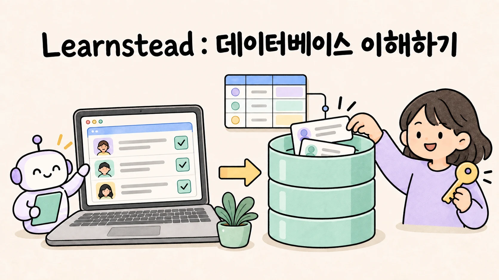

AI로 모임 신청 앱을 만들었다고 해 봅시다. 화면에서 신청 버튼을 누르면 이름이 목록에 나타납니다. 그런데 새로고침한 뒤에도 남을까요? 다른 계정으로 들어오면 누구의 신청이 보일까요? AI에게 구조를 바꿔 달라고 할 때, 이미 받은 신청은 어떻게 될까요?

앱을 만드는 사람이 코드를 모두 읽을 수는 없어도, 이 질문들에 답할 수는 있어야 합니다. 이번 Learnstead 시리즈는 **비개발자가 AI로 만든 앱의 데이터를 이해하고 확인하는 방법을** 다룹니다. 가상의 스터디 모임 신청 앱을 공통 예로 삼아, 개념을 읽고 작은 앱을 실행한 뒤 실패와 복구를 확인하도록 구성했습니다.

## 저장 버튼 뒤에서 일어나는 일

화면에 값이 보인다는 사실만으로 저장을 확인할 수는 없습니다. 브라우저 메모리에만 남았는지, 브라우저 저장소를 쓰는지, 서버의 데이터베이스에 기록했는지에 따라 다시 여는 방법과 다른 사람에게 보이는 범위가 달라집니다.

가이드에서는 먼저 데이터가 지나가는 경로를 살펴봅니다. 이번 신청 앱에서는 브라우저의 요청이 API와 접근 규칙을 거쳐 PostgreSQL에 도달합니다. 화면에서 입력을 막는 것과 DB에서 잘못된 요청을 거절하는 것도 구분합니다.

그다음에는 모임·사용자·신청을 어떤 구조로 나누고 연결할지, 중복 신청이나 마지막 한 자리에 동시에 들어온 요청을 어떻게 다룰지 살펴봅니다. SQL을 외우기보다 **앱이 지켜야 할 규칙을 말로 설명하고, 실제 데이터로 확인하는 데** 초점을 맞췄습니다.

## DB 선택부터 권한과 복구까지

SQLite·PostgreSQL·MySQL·MongoDB·Cloud Firestore를 예로 들어 저장 방식과 선택 기준을 비교합니다. 여러 사람이 함께 쓰는지, 기록 사이의 관계가 중요한지, 어디서 실행하고 누가 관리할지에 따라 선택을 생각해 봅니다.

로그인도 따로 확인해야 합니다. 로그인에 성공했다고 해서 자동으로 내 데이터만 보이는 것은 아닙니다. 사용자 A와 B, 로그인하지 않은 상태에서 같은 작업을 해 보고, 허용한 데이터만 읽고 바꿀 수 있는지 확인합니다.

구조 변경과 백업도 결과로 판단합니다. 새 열을 추가한 뒤 기존 신청이 남아 있는지, 백업 파일을 만들었을 뿐인지 실제로 다른 DB에 복원했는지를 나눠 봅니다. AI에게 변경을 맡길 때 요청할 내용과 결과를 기록하는 데이터 관리 카드도 함께 제공합니다.

## 읽기·만들기·확인하기, 세 자료로 이어집니다

1. **[가이드 — AI로 만든 앱의 데이터, 이해하고 다루기](https://github.com/kyungseo/learnstead/blob/main/guides/database-for-vibe-coders/README.md)**: 저장 위치·DB 선택·데이터 구조·권한·변경·복구를 설명합니다. SQL이나 클라우드 계정 없이 읽을 수 있습니다.
2. **[튜토리얼 — AI와 함께 만드는 작은 신청 앱](https://github.com/kyungseo/learnstead/blob/main/tutorials/study-signup-db/README.md)**: 로컬 Supabase와 PostgreSQL로 로그인·신청·계정 전환을 확인합니다. 지원 경로는 macOS·로컬 Docker 기준입니다. Docker Desktop과 Node.js를 사용하며, 따라 실행할 수 있는 기준 코드를 제공합니다.
3. **[실습 — 저장됐다고 끝이 아니다](https://github.com/kyungseo/learnstead/blob/main/labs/database-safety/README.md)**: 저장·제약조건·동시 변경·접근 권한·구조 변경·복원을 직접 판정합니다. Python만으로 시작하는 SQLite 경로와 신청 앱을 사용하는 DB 경로가 있습니다. DB 경로는 튜토리얼의 준비를 마친 뒤 진행합니다.

개념부터 알고 싶다면 가이드에서, 먼저 작게 실행해 보고 싶다면 실습의 SQLite 경로에서 시작하면 됩니다. 신청 앱을 만들고 싶다면 튜토리얼의 준비 환경을 먼저 확인해 주세요. 클라우드 서비스 가입 없이 가상 데이터로 연습합니다.

## 어디까지 확인했나요?

2026년 9월 13일 macOS에서 신청 앱의 브라우저 동작 11개, Supabase/PostgreSQL 통합 판정 14개, SQLite 비교 6개를 확인했습니다. 이 숫자는 정해 둔 교육용 시나리오의 판정 수입니다. 실패 상황도 실습을 위해 의도적으로 구성했으며, 특정 AI 모델의 실패율을 측정한 결과는 아닙니다.

MySQL·MongoDB·Cloud Firestore는 공식 문서를 확인해 비교한 대상이며, 이 시리즈에서 설치·운영까지 실행한 대상은 아닙니다. Windows·클라우드 운영·대규모 부하와 실제 장애 복구도 검증 범위에 포함하지 않습니다. 자세한 환경과 확인하지 못한 부분은 [튜토리얼 검증 기록](https://github.com/kyungseo/learnstead/blob/main/tutorials/study-signup-db/VALIDATION.md)과 [실습 검증 기록](https://github.com/kyungseo/learnstead/blob/main/labs/database-safety/VALIDATION.md)에 남겼습니다.

자신의 앱에 저장 기능이 있다면, 먼저 연습 환경에 가상 데이터를 하나 넣고 새로고침한 뒤 다시 읽어 보세요. 어디에 남았는지 설명할 수 있게 되면, 다른 사용자의 접근과 기존 데이터를 지키는 변경도 차례로 확인할 수 있습니다.

<!-- 글 하단 기록은 site가 front matter에서 자동 렌더. -->
