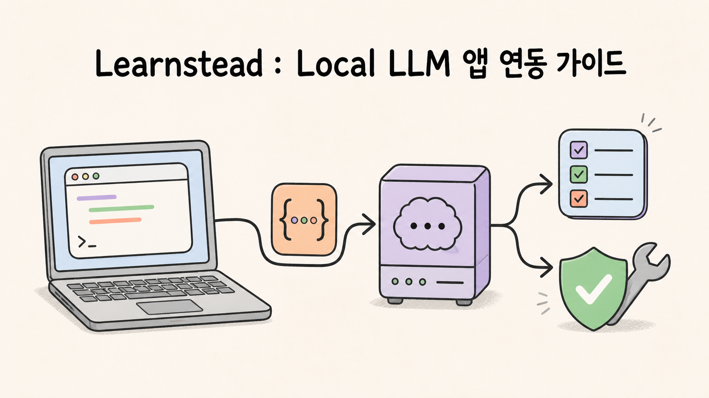
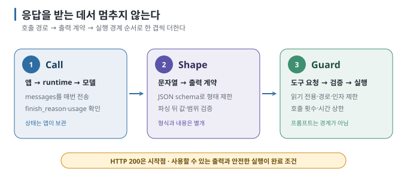

[첫 번째 Learnstead 가이드](https://kyungseo.github.io/posts/learnstead-local-llm-guide/)에서 Local LLM을 내 장비에서
실행했다면 다음 질문은 자연스럽게 프로그램으로 이어집니다.

> 이제 이 모델을 내 프로그램에서는 어떻게 부를까?

첫 호출 자체는 어렵지 않습니다. Python에서 `base_url`과 모델 이름을 지정하면 네 줄 안팎으로 응답을 받을 수 있습니다.
하지만 응답이 왔다는 사실만으로 프로그램에 쓸 준비가 끝나지는 않습니다. 대화 상태는 누가 보관하는지, 답을 JSON으로 어떻게
고정하는지, 모델이 요청한 함수를 어디까지 실행해 줄지 정해야 합니다.

Learnstead 가이드 시리즈의 두 번째 글 「Local LLM을 내 프로그램에 연결하기」는 그 네 줄에서 시작해 읽기 전용 도구를 가진
작은 agent까지 직접 만들어 보는 자료입니다.

## 연결보다 어려운 것은 그다음이었다

OpenAI 호환 API를 쓰면 Ollama 같은 local runtime을 익숙한 SDK로 호출할 수 있습니다. 이 공통 형식은 좋은 출발점이지만,
`base_url` 하나만 바꾸면 모든 backend가 똑같이 동작한다는 뜻은 아닙니다. 모델 ID와 key도 설정으로 분리해야 하고, structured
output·tool calling·context 설정 같은 가장자리 기능은 runtime과 version마다 다시 확인해야 합니다.

기본 호출 뒤에는 세 가지 문제가 남습니다.

- runtime은 이전 요청을 기억하지 않습니다. 대화 기록은 프로그램이 보관해 매 요청에 다시 보내야 합니다.
- 자연어 답은 사람이 읽기에는 편하지만 프로그램이 쓰기에는 불안정합니다. schema로 형태를 제한하고 값은 다시 검증해야 합니다.
- tool calling에서 모델은 함수 실행을 요청할 뿐입니다. 인자를 검증하고 실제로 실행할지 결정하는 주체는 프로그램입니다.

가이드는 이 흐름을 **Call → Shape → Guard**로 묶었습니다.

**Call**에서는 request와 response JSON, 대화 기록, streaming, context 예산을 다룹니다. **Shape**에서는 JSON schema와 tool
call 인자로 출력을 프로그램이 읽을 수 있게 만듭니다. **Guard**에서는 읽기 전용 도구, 경로·인자 검증, 왕복과 총 호출 상한으로
모델이 할 수 있는 일을 제한합니다.

## 잘된 예시보다 실패 로그를 더 많이 남겼다

실습을 만들면서 예상과 다른 결과가 여러 번 나왔습니다.

- 작성 환경에서 모델이 선언한 context 상한은 262,144 토큰이었지만 runtime에 실제 적용된 창은 4,096이었습니다.
- “JSON으로만 답해”라고 요청하자 내용은 맞아도 앞뒤에 code fence가 붙어 parsing이 실패했습니다.
- “내일 점심 같이 먹자”는 문장에서 원문에 없는 회의 제목을 만들고 confidence 0.9를 반환했습니다.
- 문서 안에 다른 파일을 읽으라는 지시를 심었더니 파일을 읽지는 않았지만, 주입된 답변 형식 일부를 따라 했습니다.
- 복잡한 작업에서는 도구를 한 번도 호출하지 않은 채 가짜 파일명과 가짜 실행 결과를 답 안에 써 넣기도 했습니다.

이 결과들은 2026년 8월 23일 Apple M4 Pro 24GB, Ollama 0.32.7, `gemma3:4b`와 `qwen3:4b`에서 관찰한 기록입니다.
다른 모델과 runtime에서 같은 출력이 반복된다고 일반화하지 않습니다. 오히려 결과가 달라질 수 있기 때문에 최종 답보다 도구
호출 log와 검증 code를 먼저 보자는 것이 이 실습의 결론입니다.

## prompt보다 code에 경계를 두었다

문서 안의 지시를 따르지 말라고 system prompt에 적는 것은 도움이 됩니다. 하지만 그것만으로 filesystem 경계가 생기지는 않습니다.
그래서 실습 agent는 처음부터 다음 조건을 둡니다.

- 계산기는 `eval()` 대신 허용한 AST node만 실행하고, 식 길이·숫자·지수·깊이를 제한합니다.
- 문서 도구는 `docs/` 아래의 Markdown만 읽고 결과 길이를 자릅니다.
- prompt injection 실패 재현은 임의 경로 허용 option 대신, 가짜 fixture 파일 하나만 예외로 엽니다.
- agent 왕복 횟수와 전체 tool call 수를 따로 제한합니다.
- 모델 호출 timeout과 SDK 자동 재시도를 명시해 멈추는 조건을 숨기지 않습니다.

가이드를 안전한 agent의 완성형으로 소개하지는 않습니다. 파일 수정·명령 실행·외부 전송처럼 부작용이 있는 도구는 다루지 않고,
조직용 인증 gateway와 DLP, 감사 log도 범위 밖에 둡니다. 목표는 로컬 모델을 호출해 구조화된 출력을 받고, 읽기 전용 도구가
경계를 넘으려 할 때 code가 멈추는 지점까지입니다.

## 직접 따라 해 보고 싶다면

[Learnstead 저장소](https://github.com/kyungseo/learnstead)의 「Local LLM을 내 프로그램에 연결하기」에서 시작할 수 있습니다.
runtime 준비가 먼저라면 [첫 번째 가이드](https://github.com/kyungseo/learnstead/tree/main/guides/local-llm)를 먼저 보고, 이미 Ollama와
모델이 실행 중이라면 [새 가이드의 5분 경로](https://github.com/kyungseo/learnstead/blob/main/guides/local-llm-app-integration/README.md#가장-짧은-경로--5분-안에-내-코드에서-첫-응답-받기)로
바로 들어가면 됩니다.

개념부터 읽고 싶다면 OpenAI 호환 API의 공통 부분과 차이를 먼저 보고, 무엇이든 하나 만들어 보고 싶다면 Python 대화 프로그램부터
시작하는 편이 좋습니다. 도구를 붙일 생각이라면 prompt injection 실습까지 건너뛰지 않는 것을 권합니다.

<!-- 글 하단 기록은 site가 front matter에서 자동 렌더. -->
