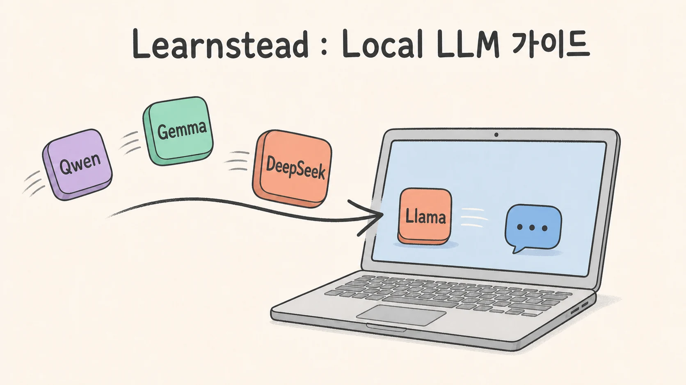

Local 장비에서 LLM을 직접 실행해 보고 싶지만, 어디서 시작해야 할지 막연한 분을 위한 가이드를 만들었습니다.

새로운 학습 자료 저장소 [Learnstead](https://github.com/kyungseo/learnstead)의 첫 가이드,
「내 장비에서 LLM 직접 실행하기」를 공개했습니다. Local LLM이 무엇인지부터 모델과 실행 도구를 고르는 기준,
Ollama로 첫 응답을 확인하는 절차까지 초급자의 눈높이에서 한 흐름으로 정리했습니다.

## 설치 절차만 적지 않은 이유

모델을 한 번 실행하는 데 필요한 명령은 길지 않습니다. 하지만 막상 시작하려고 하면 그보다 먼저 여러 질문을
만나게 됩니다. Local과 Hosted는 무엇이 다른지, Open-weight는 어느 쪽에 속하는지, 모델 이름 뒤의 `4B`나
`Q4`는 무엇을 뜻하는지, 내 장비의 memory에 모델이 들어가는지, Ollama와 llama.cpp 같은 runtime은 어떤
역할을 하는지부터 구분해야 합니다.

이 가이드는 명령어만 따라 하고 끝나는 대신, **무엇을 선택하고 왜 그렇게 선택하는지** 이해할 수 있도록
구성했습니다. 전체 흐름은 세 단계입니다.

- **Fit** — model, quantization, context가 장비의 memory 예산에 들어가는지 판단합니다.
- **Run** — 목적과 장비에 맞는 runtime으로 응답을 끝까지 생성합니다.
- **Prove** — GPU 적재, API 응답, version과 실행 조건을 확인하고 기록합니다.

Local·Hosted·Open-weight도 하나의 선 위에 놓인 반대말로 다루지 않습니다. Local과 Hosted는 모델의 **실행
위치**를, Open-weight는 **가중치 접근 범위와 라이선스**를 구분하는 말입니다. 조직 환경에서 두 실행 위치를
함께 쓰는 hybrid 구성도 선택지가 될 수 있지만, routing·민감 정보 차단·접근 제어·log·장애 대응을 별도로 설계해야 한다는
운영 경계까지 함께 설명합니다.

## 이런 분들께 도움이 될 수 있습니다

- 무작정 설치하기보다 Local·Hosted·Open-weight의 차이부터 이해하고 싶다.
- 내 장비에서 실행할 수 있는 모델을 어떻게 고르는지 알고 싶다.
- Ollama를 설치하고 실제 모델과 첫 대화를 나눠보고 싶다.
- model·memory·runtime·data가 서로 어떤 관계인지 궁금하다.
- privacy와 network 연결, hybrid 구성까지 함께 살펴보고 싶다.

## 확인한 것과 아직 확인하지 않은 것

가이드의 가장 짧은 시작 경로는 Apple Silicon Mac에서 Ollama와 `gemma3:4b`를 실행하는 과정입니다. M4
Pro·24GB Mac의 Homebrew 설치 경로에서 모델 응답, GPU 적재와 OpenAI 호환 API 응답까지 직접 확인했습니다.
이 결과는 해당 환경의 검증 기록이며, 모든 Mac에서 같은 속도와 memory 사용량을 보장한다는 뜻은 아닙니다.

NVIDIA 단일 GPU와 Windows+WSL2, 멀티 GPU 서버 경로도 문서에 포함했지만 현재는 공식 문서를 대조한
상태입니다. 실제 실행 검증 전에는 그대로 동작한다고 보장하지 않습니다. 모델·runtime·hardware 정보는 빠르게
바뀌기 때문에 각 문서에는 원리, 실행 검증, 문서 확인, 미검증을 구분해 표시했습니다.

Local 실행이 자동으로 privacy나 보안을 보장하는 것도 아닙니다. 모델과 설치 파일을 내려받거나 원격 도구,
telemetry, hosted API를 연결하면 data가 network로 나갈 수 있습니다. 이 가이드는 모델을 새로 학습시키는
방법이나 production 서비스 전체를 설계하는 방법이 아니라, 이미 학습된 모델을 직접 실행하고 기본 API로
확인하는 지점까지 다룹니다.

## 가이드 시작하기

[Learnstead 저장소](https://github.com/kyungseo/learnstead)에 접속해 ‘가이드 시작하기 →’를 누르면 됩니다.
개념부터 읽고 싶다면 [01 오리엔테이션](https://github.com/kyungseo/learnstead/blob/main/guides/local-llm/01-orientation.md)에서,
우선 모델을 실행해 보고 싶다면 [가이드의 10분 경로](https://github.com/kyungseo/learnstead/blob/main/guides/local-llm/README.md#10분-안에-첫-응답-받기)에서 시작할 수 있습니다.

Learnstead에는 앞으로도 한 가지 주제를 개념부터 직접 실행까지 이어서 볼 수 있는 guide, tutorial,
hands-on lab을 차례로 쌓아갈 예정입니다.

<!-- 글 하단 기록은 site가 front matter에서 자동 렌더. -->
