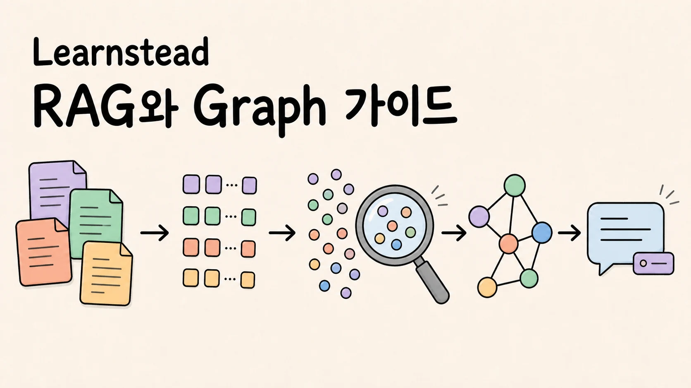
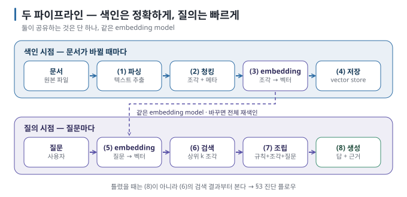

Local LLM을 내 장비에서 실행했다면 다음에는 이런 질문을 하게 됩니다.

> 내가 가진 문서를 찾아 근거와 함께 답하게 하려면 무엇을 붙여야 할까?

모델은 회사 규정이나 개인 메모처럼 학습할 때 보지 못한 문서를 알지 못합니다. RAG(Retrieval-Augmented Generation,
검색 증강 생성)는 질문과 관련된 문서 조각을 먼저 찾고, 그 내용을 답변 시점에 모델에게 건네는 방식입니다. 모델을 다시 학습시키는
대신 **문서를 찾고 근거를 전달하는 경로를** 덧붙입니다.

이번 Learnstead 자료는 RAG를 설명하는 가이드 한 편으로 끝내지 않았습니다. 구조를 이해하고, 직접 만들고, 일부러 틀리게 한 뒤,
변경 전후를 다시 재는 세 자료로 나눴습니다.

## RAG는 모델을 바꾸는 일이 아니었다

RAG에는 서로 다른 두 시점이 있습니다. 색인할 때는 문서를 조각으로 나누고 embedding model로 벡터를 만들어 저장합니다. 질문을
받았을 때는 같은 embedding model로 질문을 벡터화하고, 가까운 조각을 찾아 LLM의 입력에 넣습니다.

이 경계를 나누면 답이 틀렸을 때 확인할 순서도 달라집니다. 정답 조각을 찾지 못했다면 검색 문제이고, 조각이 중간에서 끊겼다면 청킹
문제입니다. 필요한 조각이 들어갔는데도 답을 잘못 썼다면 그때 생성 단계와 모델을 봅니다. 답에 출처 번호가 붙었다는 사실만으로
내용이 맞다고 판단할 수도 없습니다. 실제 문서 조각이 답을 뒷받침하는지 다시 확인해야 합니다.

## 이해하고, 만들고, 실패를 재현한다

세 자료는 같은 예제 문서와 실행 기록을 공유하지만 각자 맡은 역할이 다릅니다.

1. **[내 문서와 대화하는 AI 이해하기 — RAG와 Graph](https://github.com/kyungseo/learnstead/tree/main/guides/local-rag)**
   — RAG·Long Context·Fine-tuning의 차이, 색인·검색·생성 흐름, embedding·청킹·근거 제시와 GraphRAG 선택 기준을 설명합니다.
2. **[내 문서에 답하는 Local RAG 만들기](https://github.com/kyungseo/learnstead/tree/main/tutorials/local-rag-build)**
   — Ollama와 Python으로 가상 규정 4편을 색인하고, 검색된 근거와 함께 답하는 최소 RAG를 직접 만듭니다.
3. **[RAG는 왜 틀리는가](https://github.com/kyungseo/learnstead/tree/main/labs/why-rag-fails)**
   — 검색 누락, 잘못 자른 조각, 관련 없는 문서, 근거 없는 답변과 multi-hop 실패를 재현하고 골든셋으로 다시 측정합니다.

원리를 먼저 알고 싶다면 가이드부터, 우선 하나를 실행해 보고 싶다면 튜토리얼부터 시작해도 됩니다. 다만 답이 한 번 잘 나왔다는
이유로 끝내지 않고 실패 실습까지 이어 가는 것이 이 시리즈의 핵심입니다.

## 성공한 결과만으로는 품질을 알 수 없었다

가상 규정 4편을 17개 조각으로 나눈 최소 RAG에서는 네 질문 모두 관련 조각을 상위에서 찾았고, 답과 근거도 일치했습니다. 하지만
조건을 조금 바꾸자 다른 문제가 드러났습니다.

- 관리자 연차 이월 질문에서 `top-k 1`은 최대 10일만 답하고 사용 기한을 빠뜨렸습니다. 조각 세 개를 넣어도 모델은 여전히 기한을
  생략했습니다.
- 문서에 없는 “연차 교육”을 물었더니 보안 교육 조각을 보고 “연차 교육은 연 1회”라고 답했습니다. 근거 번호까지 붙었지만 틀린
  답이었습니다.
- 여러 문서의 관계를 잇는 질문에서는 graph hop 수와 vector 검색의 `top-k`에 따라 “못 찾음”, 오답, 정답이 모두 나왔습니다.
- 골든셋 15문항의 검색 성공률과 핵심 문구 회수율은 모든 비교 설정에서 같았습니다. 그러나 점수 하한을 `0.55`로 두자 정답 조각
  하나를 막았고, 단어만 겹친 관련 없는 조각은 통과시켰습니다.

즉, 하나의 평균 점수나 성공 사례만으로는 검색 품질을 설명할 수 없습니다. 어떤 질문에서 무엇이 검색됐고, 그 조각이 답을 실제로
뒷받침했는지를 함께 봐야 합니다.

## Graph는 vector database의 상위 버전이 아니다

벡터 검색은 질문과 의미가 가까운 조각을 찾는 데 강합니다. 반면 여러 문서에 흩어진 “누가 어떤 팀에 속하고, 그 팀이 어떤
프로젝트를 맡았는가” 같은 관계를 여러 단계 건너가야 할 때는 graph가 비교 대상이 됩니다.

그렇다고 graph를 붙이면 자동으로 더 정확해지는 것은 아닙니다. 실습에서는 문서에서 관계를 뽑는 단계에 원문에 없는 edge가
생겼고, 정답을 찾은 실행에서도 인용한 근거가 틀렸습니다. GraphRAG는 vector RAG의 상위 호환이 아니라 **다른 종류의 질문을
풀기 위해 추가 비용과 새로운 실패 지점을 받아들이는 선택지입니다.**

## 어디까지 직접 확인했나

2026년 8월 30일 Apple M4 Pro 24GB, macOS 26.6.2에서 Ollama 0.33.0, `bge-m3`, `gemma3:4b`와 Python
3.14.7을 사용했습니다. 최소 RAG와 Chroma 색인·질의·초기화, 실패 시나리오, graph build와 hop 비교, 골든셋 4개 설정을 직접
실행했습니다.

이 결과는 해당 장비와 모델 조합의 실행 기록입니다. 다른 문서, embedding model, 대화 model, runtime에서도 같은 점수와 답이
나온다고 일반화하지 않습니다. 세부 환경과 실행 결과는 각 자료의 `VALIDATION.md`에 남겼고, 제품과 기법에 관한 출처는
`SOURCES.md`에서 따로 확인할 수 있습니다.

## 어디서 시작하면 좋을까

[Learnstead 저장소](https://github.com/kyungseo/learnstead)에 접속하면 Local LLM 실행부터 RAG 실패 진단까지 이어지는 순서를
한눈에 볼 수 있습니다. 모델이 아직 실행 중이 아니라면 먼저
[「내 장비에서 LLM 직접 실행하기」](https://github.com/kyungseo/learnstead/tree/main/guides/local-llm)를 따라가세요.

이미 Ollama와 모델을 준비했다면 다음 중 필요한 지점에서 시작하면 됩니다.

- **개념부터 이해하기:** [RAG와 Graph 가이드](https://github.com/kyungseo/learnstead/tree/main/guides/local-rag)
- **우선 직접 만들기:** [Local RAG 튜토리얼](https://github.com/kyungseo/learnstead/tree/main/tutorials/local-rag-build)
- **답이 왜 틀리는지 확인하기:** [RAG 실패 실습](https://github.com/kyungseo/learnstead/tree/main/labs/why-rag-fails)

<!-- 글 하단 기록은 site가 front matter에서 자동 렌더. -->
