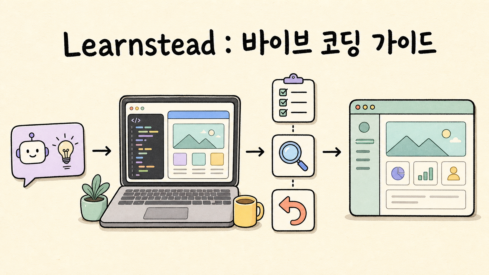
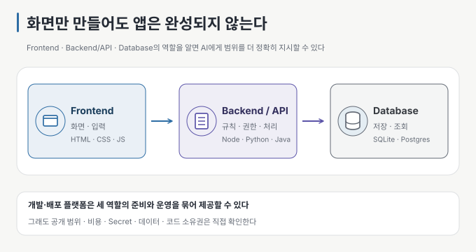

AI가 코드를 만들어 주는 속도는 빠릅니다. 그런데 같은 도구를 써도 결과는 꽤 다릅니다. 누구는 짧은 시간에 쓸 만한 앱을 만들고,
누구는 기능을 하나 붙일 때마다 다른 곳이 깨져 다시 시작합니다.

차이는 프롬프트를 얼마나 그럴듯하게 쓰느냐보다, 어디까지 맡기고 무엇을 직접 확인하느냐에서 생기곤 합니다. 그래서 이번
Learnstead 가이드는 코드를 읽는 법보다 **AI에게 일을 맡기면서도 결정권을 놓치지 않는 작업 방식**에 집중했습니다.

## 바이브 코딩이라는 말에서 시작했습니다

`vibe coding`이라는 표현은 2025년 Andrej Karpathy가 AI가 만든 코드를 자세히 들여다보지 않고 결과를 보며 작은 프로젝트를
만드는 모습을 설명하면서 널리 알려졌습니다. 코딩을 모르는 사람도 웹사이트나 앱을 직접 만들어 볼 수 있게 됐고, 개발자는 반복
작업을 줄이며 구체적인 계획을 더 빨리 구현할 수 있게 됐습니다.

다만 빠르게 보이는 결과가 품질이나 유지보수성까지 보장하지는 않습니다. 비개발자라도 앱의 구조와 기술의 역할을 조금씩 익히며
작게 확인하면 결과가 단단해질 수 있습니다. 반대로 개발 경험이 많아도 계획 없이 짧은 지시만 반복하고 생성된 코드를 살펴보지
않으면 구조를 흔들 수 있습니다.

Karpathy는 1년 뒤, Agent가 구현하고 사람이 조율·감독하며 품질을 책임지는 전문적인 작업을 `Agentic Engineering`이라는
말로 구분해 설명했습니다. 두 표현의 경계가 업계 표준으로 정해진 것은 아닙니다. 이 가이드도 익숙한 ‘바이브 코딩’에서 시작하지만,
결국 다루는 것은 사람이 목표와 검증을 책임지는 습관입니다. 용어의 유래와 근거는
[가이드의 출처 기록](https://github.com/kyungseo/learnstead/blob/main/guides/vibe-coding-practice/SOURCES.md)에 따로 정리했습니다.

## 화면 뒤에서 무엇이 움직이는지

코드를 전부 읽지 못해도 큰 구조는 알아둘 만합니다. 웹앱은 대개 화면과 입력을 담당하는 Frontend, 업무 규칙과 권한을 처리하는
Backend/API, 데이터를 저장하고 조회하는 Database로 나눠 볼 수 있습니다.

AI builder나 BaaS, hosting 서비스는 이 역할의 일부를 묶어 대신해 줍니다. 편리한 만큼 공개 범위, 비용, Secret, 데이터 위치,
코드 소유권은 직접 확인해야 합니다. 도구가 무엇을 대신해 주는지 알아야 AI에게 변경 범위를 더 정확히 지시할 수 있습니다.

## 짧게 만들고, 직접 확인하고, 돌아갈 곳을 남기기

가이드의 작업 흐름은 단순합니다.

1. 누구를 위해 무엇을 만들지, 성공 조건과 이번에 하지 않을 일을 먼저 적습니다.
2. 변경 전에 Git으로 돌아갈 지점을 남깁니다.
3. 한 번에 하나의 변화만 지시하고, 건드리지 않을 범위도 함께 말합니다.
4. 결과를 직접 눌러 보고, 잘못된 입력·새로고침·기존 기능·변경 파일을 확인합니다.
5. 같은 실패가 반복되면 같은 지시를 되풀이하지 않고 되돌리거나 접근을 바꿉니다.
6. 남에게 보여 주기 전에는 Secret과 실행 환경, 입력, 남은 파일, license를 점검합니다.

자동 검사와 review 도구를 묶은 harness를 쓰면 이 흐름을 반복하는 데 도움이 됩니다. 그래도 처음에는 특정 도구 없이 이 기준선을
직접 익히는 편이 좋다고 보았습니다. 무엇이 자동화됐고 마지막 결정은 누가 하는지 알아야 도구의 도움도 제대로 받을 수 있기
때문입니다.

개발자라면 AI에게 시켜 만든 코드라도 다른 사람에게 충분히 설명하고, 문제가 생겼을 때 어디부터 확인할지 말할 수 있어야 한다고
생각합니다. 모든 줄을 외우라는 뜻은 아닙니다. 입력이 어디로 가는지, 데이터가 어디에 저장되는지, 왜 이 구조를 골랐는지,
무엇을 검증했고 무엇은 아직 확인하지 않았는지는 알고 있어야 합니다.

## “완료했습니다”를 다섯 번 확인해 보기

설명만 읽고 끝나지 않도록 작은 실습도 붙였습니다. 같은 요청을 처리한 것처럼 보이는 할 일 앱 세 판을 놓고 다음 다섯 가지를
확인합니다.

- 직접 눌러 보기
- 일부러 틀린 입력 넣기
- 껐다 켜거나 새로고침하기
- 기존 기능이 깨지지 않았는지 보기
- 어떤 파일이 바뀌었는지 확인하기

세 판 모두 요청한 완료 표시 기능은 겉으로 동작합니다. 하지만 한 판은 새로고침하면 목록이 사라지고, 다른 한 판은 가운데 항목을
지웠는데 맨 위 항목이 사라집니다. 요청하지 않은 디자인과 파일도 따라옵니다. 정상 경로만 눌러 봤다면 놓치기 쉬운 문제입니다.

fixture는 고정돼 있고 macOS Chrome과 임시 Git 저장소에서 직접 실행해 결과를 기록했습니다. 이 실습은 초심자를 위한 최소 동작
확인이며, 전문적인 code review나 security·성능 검증을 대신하지는 않습니다.

## 가이드 시작하기

먼저 [AI로 코딩하는 사람을 위한 Git](https://github.com/kyungseo/learnstead/blob/main/guides/git-for-vibe-coders/README.md)에서
저장·diff·되돌리기의 기본을 익힌 뒤 이번 가이드와 실습으로 이어 가면 자연스럽습니다.

- [AI와 함께 만들기 — 바이브 코딩에서 Agentic Engineering으로](https://github.com/kyungseo/learnstead/blob/main/guides/vibe-coding-practice/README.md)
- [다섯 가지 확인 실습](https://github.com/kyungseo/learnstead/blob/main/labs/five-checks/README.md)
- [Learnstead 전체 학습 경로](https://github.com/kyungseo/learnstead)

빠르게 만드는 장점은 그대로 누리되, 무엇을 만들지 정하고 결과를 확인하며 돌아갈 곳을 남기는 일은 직접 챙기는 것. 이번 가이드가
남기려는 기준은 그 정도입니다.

<!-- 글 하단 기록은 site가 front matter에서 자동 렌더. -->
