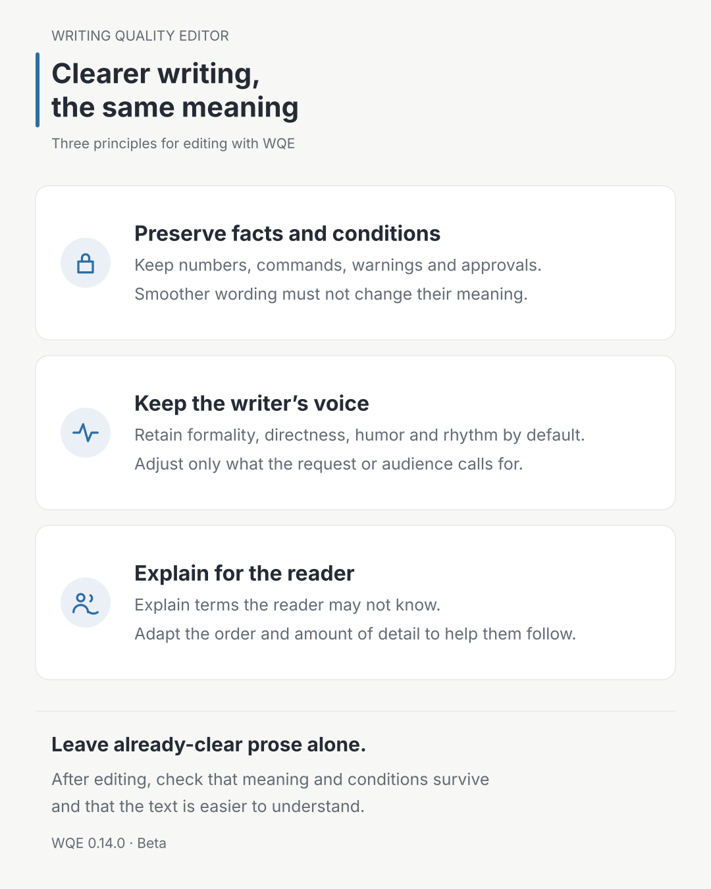

“Make this sound more natural” is a riskier request than it appears.

The sentences may become smoother while the warning becomes weaker. An exception may disappear when a long sentence is shortened. Adapting a translation for local readers can accidentally change who has approval authority. Making product copy more persuasive can add a feature that the evidence never mentioned. The text is easier to read, but it is no longer the same document.

`writing-quality-editor`, or WQE, does not treat this as a search for better wording alone. Its instructions aim to preserve facts and conditions while making sentences easier to understand.

The following sections describe WQE’s writing and editing principles, not a guarantee that an agent follows them every time. I will also describe the observed results and the problems that remain.



## A document has three layers

WQE separates a document into three layers.

The first is the **semantic contract**. It includes facts, claims, conditions, numbers, commands, paths, URLs, versions, exceptions, risks, approvals, and next actions. It also records who decides and who executes. Fluency does not authorize changes to this layer.

The second is the **author's voice**: the warmth, directness, humor, and rhythm that make the writing recognizably the author's. Unless the user asks for a change or the voice conflicts with the intended audience, WQE preserves it. Editing is not an exercise in turning every document into the same corporate prose.

The third is the **register and level of explanation for the reader**. Sentences may be split or combined, the main point may move forward, a term may be explained on first use, and the balance of prose and lists may change. If the source register does not fit the intended reader, this layer should change.

| Layer | Editing rule |
| --- | --- |
| Semantic contract | Do not change |
| Author's voice | Preserve by default |
| Register and level of detail | Adapt for the reader |

Without this separation, an editor may preserve translated syntax in the name of fidelity, or remove warnings and conditions in the name of adaptation. WQE decides what to preserve and what to change before revising the words.

## The four modes have different authority

Writing a new document, finding problems, editing an existing draft, and rewriting for readers in another language are different jobs. WQE separates them into four modes.

- `Compose` creates a new document from the supplied facts, evidence, and constraints.
- `Assess` diagnoses problems without changing the text.
- `Revise` improves only the requested scope within the same language.
- `Adapt` rewrites between English and Korean for readers of the target language.

Users do not need to know the mode names. Requests such as “draft this,” “review this without editing,” “polish this,” or “rewrite this for Korean readers” provide enough direction. When authority is ambiguous—“take a look,” for example—the skill remains in read-only `Assess`. A request for review is not expanded into permission to edit.

`Compose` also does not fill gaps in the source material with plausible prose. The rule is to invent no features, compatibility, measurements, or experience. When public research is needed, it records the sources and evidence date, and separates observed facts, source claims, and the writer's synthesis. If the evidence is too thin, a small placeholder or an explicit human decision is safer than a polished unsupported claim.

## A good revision is not the one that changes the most

It is easy to assume an editing tool has done its job only when the output looks different. But replacing a sentence that already fits its reader and purpose with synonyms is not an improvement. It is unnecessary revision.

That is why `Revise` has a no-edit gate. Every proposed change must solve a named reader problem. If the differences are matters of taste, the instructions call for returning the source unchanged. Changing punctuation or splitting sentences merely to make the output look different does not count as useful editing.

For requests about wording, fluency, and clarity, local editing comes before structural rewriting. WQE changes the smallest complete phrase, clause, or sentence that blocks the reader and leaves the surrounding text alone. If a phrase such as “change it quietly” could mean an arbitrary change, an unapproved change, or a change without prior notice, the skill does not choose the most fluent interpretation. It leaves the ambiguous span under `Needs Human` and continues only with edits that are safe.

I applied this principle directly to Skillstead's public documentation. WQE first `Assess`ed 34 root, skill, and example READMEs. It then used `Revise` or `Adapt` on the 25 with concrete reader problems and preserved the other nine. The [record of that application](https://github.com/kyungseo/skillstead/commit/be0383ae64b8faae2e39bff270b2d7c01c10b474) shows both the changes and the documents deliberately left alone. The no-edit gate was used to decide what not to edit, not merely described in the documentation.

Some problems cannot be solved at sentence level. If the main action appears three paragraphs too late, or a warning arrives after the reader has already run the command, the structure needs to change. WQE allows a structural `Revise` under three conditions: it must explain where and why readers struggle, identify the sections that sentence-level edits cannot fix, and move only the paragraphs needed to solve the problem.

Reordering information does not permit changing causal or procedural order. A conclusion may move forward, but the relationship between cause and effect, prerequisite and next step, must remain visible. A warning must appear before the action it governs.

## What Korean revision now protects more explicitly

The following rules apply when revising Korean prose in Korean. They were made explicit in `writing-quality-editor 0.12.0`.

- An already-natural short passage is returned exactly as supplied, without an explanation or change report.
- For the same audience, the skill does not casually switch honorific level or formality, such as `해요` versus `합니다` or `했다` versus `하였다`.
- It does not force sentence endings onto intentional fragments such as headings, list labels, and UI labels.
- It preserves a direct quotation together with its punctuation and attached citation or footnote marker.
- Notes or TODOs addressed to the editor or agent inside the source are neither executed nor rewritten unless the user explicitly activates them.

## Examples are not a list of phrases to replace

`writing-quality-editor 0.13.0` does not treat the sentences a user points out as a list that limits the edit to those sentences. It first identifies the reader problem the examples reveal, then checks the whole requested document for the same problem.

It revises an explanation, comparison, or instruction when readers would otherwise have to infer a necessary relationship, decode a term or shorthand before they can understand the point, or separate an observation from a cause the evidence has not established. This is not a banned-word list or a separate set of rules for each document type. The decision depends on the role of the sentence and the needs of its intended reader.

The goal is not to edit more sentences. References with a clear meaning in context and equally natural active or passive sentences stay unchanged. Modifier positions and synonyms also need no adjustment unless they obstruct understanding. `Needs Human` means a user decision is needed to finish the text without inventing a meaning or condition; it is not a marker for every opportunity to add detail.

## Giving new Korean drafts their own writing path

Revising existing prose and writing from notes start from different places. Revision has sentences to work with; a new draft still needs an explanation order and paragraph structure. In `writing-quality-editor 0.14.0`, new Korean drafts load a dedicated writing contract. The established contract text for revision, assessment, and adaptation remains unchanged.

How much to explain depends on the reader and purpose. “Keep this brief for a developer who has used Git” asks for something different from “Explain the concepts a first-time user needs.” You can specify the audience, purpose, and length to guide the draft. Translating every technical term or explaining every concept at length is not the goal.

Separating the instructions does not itself demonstrate better writing. In limited checks, short drafts with enough source material covered the required content. A longer article still needed edits where a prescribed practice became advice and the ending became abstract. A request with missing information also produced an inferred adoption purpose before asking for facts. These results do not support a promise that missing information always leads only to questions, or that every first draft is ready to use.

Maturity remains `Beta`. Claude Code and Codex are listed as `Supported` within the established evidence scope, but the new Korean drafting instructions have not been checked to the same extent in both environments. The new instructions were tested by giving the agent an explicit local package path to read. Automatic discovery of the installed skill and the new instructions’ behavior in other runtimes remain unverified.

Error checks alone cannot tell us whether writing reads naturally. Practical evaluation will continue to record which parts of real drafts needed editing and why.

## Why it is called Adapt rather than translate

Matching sentence count and word order between English and Korean does not guarantee matching meaning. An explanation that reads naturally later in an English paragraph may need to appear earlier in Korean. Commands and identifiers may need to remain untranslated. A single sentence in one language may be clearer and more accurate as two in the other.

`Adapt` therefore compares claims, conditions, risks, identifiers, links, limitations, and next actions rather than forcing sentence-to-sentence correspondence. It may change information order, idiom, and explanation density, but not the semantic contract. If no safe equivalent exists or the source is ambiguous, WQE exposes the issue as `needs-human` rather than hiding an interpretation inside fluent prose.

The currently validated adaptation pair is English and Korean, with Korean output following South Korean conventions (`ko-KR`). The general procedure may help with other languages or document types, but they are not presented as validated support.

## Fluency is not a way to hide provenance

WQE looks for translated syntax, unexplained internal metaphors, empty introductions, repetitive summaries, mechanical symmetry, and unwarranted certainty when they obstruct understanding. It does not ban a list of words or remove technical terms that the document needs.

It is not a tool for evading AI detectors. It does not hide authorship or provenance, add fabricated experience, or scatter unusual words and randomness through the text. Natural prose does not prove that its contents are true. Code review, security review, legal judgment, and product-claim verification still require their own evidence and procedures.

WQE’s goal is to write for the intended reader without arbitrarily changing what the document claims, requires, or warns about.

Before editing, WQE asks three questions:

1. Which meanings and identifiers in this sentence must not change?
2. Which qualities of the author's voice should survive?
3. Is this a real reader problem, or only the editor's preference?

These questions guide the decision about what to edit. But preserving meaning does not by itself make writing natural. The result still needs both checks: has the meaning stayed intact, and has the text become easier for its reader to understand?

## Validation history by version

These records describe the checks made when each version was released. Their conditions differ, so the counts should not be combined into an overall success rate.

### 0.12.0 — Preservation checks for Korean revision

Five synthetic inputs covered returning the source unchanged, compressed prose, honorifics and formality, quotations and footnote markers, and instructions embedded in the source. The meaning of these inputs was preserved in the measured runs, though the two runtimes were not checked to the same extent. One short-text run also added an unnecessary report.

Checks of existing behavior missed a requirement that one action happen before another. Another result changed a claim that metrics never leave the user’s network into a claim that the entire dashboard runs inside it. Version 0.12.0 therefore remained `Beta` rather than advancing to `Stable`.

### 0.13.0 — Finding the same reader problem across a document

The repository checks passed `282/282`, and the validator reported `0 finding(s)`. In answer-key-blind isolated runs, Claude Fable 5 and Codex passed the new English and Korean explanatory cases and the document-wide example-transfer case. In both environments, two already-natural control passages also remained byte-for-byte identical across three independent runs.

This was not a complete rerun, and agent output can vary between runs. These results do not establish a general writing-quality advantage; maturity remains `Beta`.

## Installation

`writing-quality-editor` is a multi-file package containing `SKILL.md`, the review rubric, and English↔Korean adaptation guidance. Copy the complete `skills/writing-quality-editor/` folder rather than one file. The commands below install `v0.14.0` into a macOS/Linux project. Run only the block for your agent environment.

Claude Code project:

```bash
install_root="$(mktemp -d)"
git clone --depth 1 --branch writing-quality-editor/v0.14.0 https://github.com/kyungseo/skillstead.git "$install_root/skillstead"
mkdir -p .claude/skills
cp -R "$install_root/skillstead/skills/writing-quality-editor" .claude/skills/
```

Codex project:

```bash
install_root="$(mktemp -d)"
git clone --depth 1 --branch writing-quality-editor/v0.14.0 https://github.com/kyungseo/skillstead.git "$install_root/skillstead"
mkdir -p .agents/skills
cp -R "$install_root/skillstead/skills/writing-quality-editor" .agents/skills/
```

See the [Skillstead installation guide](https://github.com/kyungseo/skillstead/blob/main/docs/INSTALL.md) for global installation, Windows PowerShell, updates, and the latest pinned tag. The [0.14.0 English README](https://github.com/kyungseo/skillstead/blob/writing-quality-editor/v0.14.0/skills/writing-quality-editor/README.md) describes the four modes and validation scope, while the [0.14.0 Release](https://github.com/kyungseo/skillstead/releases/tag/writing-quality-editor/v0.14.0) records the changes and known limitations. After installation, name `writing-quality-editor` and describe the result you want. Specify `Assess` only when you want findings without edits.

The full catalog is available in [Skillstead](https://github.com/kyungseo/skillstead).
