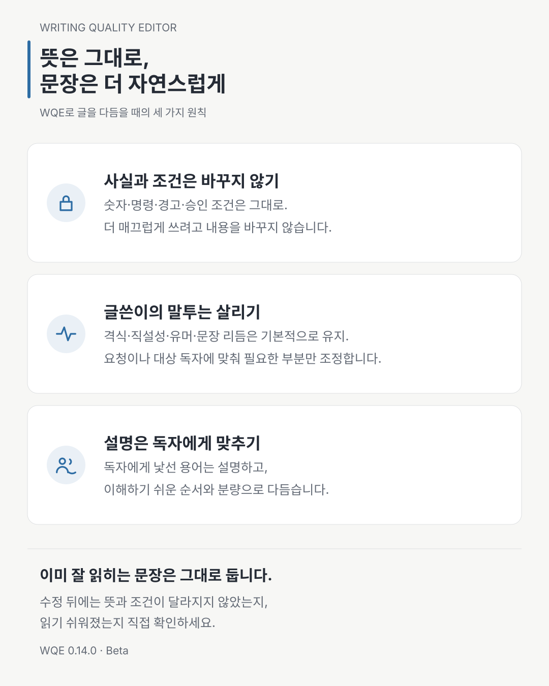

“문장을 자연스럽게 다듬어 주세요”라는 요청은 생각보다 위험합니다.

문장은 매끄러워졌는데 경고가 약해질 수 있습니다. 긴 문장을 줄이다가 예외가 사라질 수 있고, 번역문을 현지 독자에게 맞추다가 승인 주체가 바뀔 수도 있습니다. 제품 소개를 더 설득력 있게 만들려다 근거에 없는 기능을 한 줄 보탤 수도 있습니다. 읽기는 편해졌지만, 더 이상 같은 글이 아닙니다.

`writing-quality-editor`, 줄여서 WQE는 이 문제를 “더 좋은 표현 찾기”로만 다루지 않습니다. 먼저 무엇이 바뀌면 안 되는지 정하고, 그 경계 안에서 독자에게 어떻게 전달할지를 다룹니다.



## 글에는 세 층이 있다

WQE는 글을 세 층으로 구분합니다.

첫째는 **의미 계약**입니다. 사실과 주장, 조건, 숫자, 명령, 경로, URL, 버전, 예외, 위험, 승인, 다음 행동이 여기에 들어갑니다. 누가 결정하고 누가 실행하는지도 포함됩니다. 이 층은 자연스러움을 위해 바꿀 수 없습니다.

둘째는 **작성자의 목소리**입니다. 글의 온도, 직설성, 유머, 문장 리듬처럼 글쓴이의 개성이 드러나는 방식입니다. 별도 요청이 없고 독자와 충돌하지 않는다면 유지합니다. 모든 글을 획일적인 기업 문체로 바꾸는 것이 편집의 목표는 아닙니다.

셋째는 **독자에게 맞는 문체와 설명 수준**입니다. 문장을 나누거나 합치고, 핵심을 앞으로 옮기고, 처음 나오는 용어를 설명하고, 산문과 목록의 비율을 조정할 수 있습니다. 원문 문체가 대상 독자에게 맞지 않는다면 이 층은 조정해야 합니다.

| 층 | 편집 원칙 |
| --- | --- |
| 의미 계약 | 바꾸지 않는다 |
| 작성자의 목소리 | 기본적으로 지킨다 |
| 문체와 설명 수준 | 독자에게 맞춘다 |

이 구분이 없으면 “원문을 보존한다”는 이유로 번역투까지 남기거나, “독자에게 맞춘다”는 이유로 경고와 조건까지 지우기 쉽습니다. WQE는 보존할 것과 바꿀 것을 먼저 구분합니다.

## 네 가지 모드는 변경 권한이 다르다

새 글을 쓰고, 문제만 찾고, 기존 글을 고치고, 다른 언어의 독자에게 맞게 다시 쓰는 일은 서로 다른 작업입니다. WQE는 이를 네 가지 모드로 나눕니다.

- `Compose`는 제공된 사실·근거·제약에서 새 문서를 작성합니다.
- `Assess`는 문제를 진단하지만 문장을 바꾸지 않습니다.
- `Revise`는 같은 언어 안에서 요청받은 범위만 개선합니다.
- `Adapt`는 영어와 한국어 사이에서 대상 독자에게 맞게 다시 씁니다.

사용자가 언제나 모드 이름을 알아야 하는 것은 아닙니다. “초안을 써 달라”, “문제만 봐 달라”, “다듬어 달라”, “한국어 독자에게 맞게 옮겨 달라”는 요청에서 필요한 동작을 판단합니다. 다만 “검토해 달라”처럼 변경 권한이 분명하지 않은 요청은 `Assess`로 남깁니다. 검토 요청을 수정 허가로 확대하지 않기 위해서입니다.

`Compose`도 자료의 빈틈을 그럴듯한 문장으로 채우는 모드가 아닙니다. 자료에 없는 기능, 호환성, 수치, 경험을 새로 만들지 않습니다. 공개 자료 조사가 필요한 글이라면 검토한 출처와 근거 기준일을 기록하고, 관측 사실과 출처의 주장, 작성자의 종합 판단을 구분합니다. 근거가 부족해 쓸 수 없는 내용은 최소한의 자리표시자나 사람의 판단이 필요한 항목으로 남기는 편이, 완성된 척하는 문장보다 낫습니다.

## 좋은 수정은 많이 바꾼 수정이 아니다

편집 도구는 결과가 달라 보여야 일을 한 것처럼 보이기 쉽습니다. 그러나 이미 독자와 목적에 맞는 문장을 동의어로 바꾸는 일은 품질 개선이 아니라 불필요한 수정 반복일 수 있습니다.

그래서 `Revise`에는 수정하지 않을 문장을 가려내는 no-edit gate가 있습니다. 바꾸려는 문장마다 어떤 독자 문제를 푸는지 설명할 수 있어야 합니다. 모든 차이가 취향 수준이라면 원문을 그대로 돌려줍니다. 문장 부호를 바꾸거나 문장을 쪼개는 것만으로 활동량을 증명하지 않습니다.

문장 표현과 자연스러움, 명료성을 고치는 요청에서는 구조보다 국소 편집을 먼저 선택합니다. 독자가 실제로 막히는 가장 작은 구·절·문장만 고치고 주변 문장은 그대로 둡니다. “조용히 바꾼다”처럼 임의 변경, 승인 없는 변경, 사전 고지 없는 변경 중 어느 뜻인지 분명하지 않은 표현은 자연스러워 보이는 한 가지 뜻으로 바꾸지 않습니다. 해당 구간은 `Needs Human`으로 남기고, 안전하게 판단할 수 있는 부분만 고칩니다.

이 원칙은 Skillstead의 공개 문서에 직접 적용해 봤습니다. 루트·스킬·예제 README 34개를 먼저 `Assess`한 뒤, 구체적인 독자 문제가 확인된 25개만 `Revise` 또는 `Adapt`하고 나머지 9개는 그대로 보존했습니다. 실제 변경과 보존 범위는 [dogfood commit](https://github.com/kyungseo/skillstead/commit/be0383ae64b8faae2e39bff270b2d7c01c10b474)에서 확인할 수 있습니다. no-edit gate는 문서에만 적힌 원칙이 아니라, 고치지 않을 문서를 가려내는 데도 쓰였습니다.

반대로 문장만 만져서는 해결할 수 없는 문제도 있습니다. 핵심 행동을 세 문단 뒤에서야 만나거나, 사용자가 명령을 실행한 다음에야 경고가 나온다면 구조를 바꿔야 합니다. WQE는 이때 문단과 절의 위치를 바꾸는 구조 수정(`structural revise`)을 허용합니다. 단 세 가지 조건이 붙습니다. 풀어야 할 독자 문제를 이름 붙일 수 있어야 하고, 관련 절을 지목할 수 있어야 하며, 그 문제를 해결하는 최소 범위만 움직여야 합니다.

정보의 순서를 바꿀 수 있다는 말도 사실의 순서를 바꿔도 된다는 뜻은 아닙니다. 결론을 앞에 놓을 수는 있지만, 원인과 결과, 전제 조건과 다음 단계의 관계는 그대로 보여야 합니다. 경고는 독자가 행동하기 전에 제시돼야 합니다.

## 한국어 수정에서 더 지키게 된 것

`writing-quality-editor 0.12.0`은 같은 언어의 한국어 글을 다듬을 때 바꾸지 않아야 할 경계를 더 구체적으로 정했습니다.

- 이미 자연스러운 짧은 글에는 설명이나 변경 보고를 붙이지 않고 원문만 그대로 반환합니다.
- 대상 독자가 같다면 `해요`와 `합니다`, `했다`와 `하였다` 같은 높임말과 격식을 임의로 바꾸지 않습니다.
- 제목, 목록 라벨, UI 라벨처럼 의도적으로 짧은 조각에는 문장 종결을 억지로 붙이지 않습니다.
- 직접 인용문의 문구와 문장부호, 이에 붙은 인용·각주 표식을 함께 보존합니다.
- 원문 안의 편집자 메모나 TODO는 외부 사용자가 명시적으로 활성화하지 않는 한 실행할 지시가 아니라 편집할 데이터로 봅니다.

이 경계를 점검하기 위해 무편집, 압축 문장, 높임말·격식, 직접 인용·인용 표식, 원문 내부 지시를 다루는 합성 fixture 다섯 개를 추가했습니다. 새 한국어 fixture의 의미 본문은 측정한 실행에서 보존됐지만, 두 실행 환경을 같은 범위로 측정하지는 않았습니다. 짧은 글에 불필요한 보고가 붙은 실행도 한 번 있었습니다. 별도 회귀에서는 보호된 시간 관계와 network boundary를 놓친 경우가 남았습니다. 그래서 0.12.0 릴리스는 한국어 편집 계약을 보강하지만 `Stable` 승격을 주장하지 않았으며, 성숙도는 계속 `Beta`였습니다.

## 예시는 고칠 문구의 목록이 아니다

`writing-quality-editor 0.13.0`은 사용자가 예시로 짚은 문장을 그 문장만 고치라는 목록으로 보지 않습니다. 예시가 보여 주는 독자의 어려움을 먼저 정의하고, 요청한 문서 전체에서 같은 문제가 반복되는지 살핍니다.

설명·비교·안내 문장을 읽는 사람이 필요한 관계를 직접 추론해야 하거나, 용어나 축약 표현을 해석한 뒤에야 핵심을 이해할 수 있거나, 관찰한 결과가 확인되지 않은 원인처럼 쓰였다면 해당 구간을 다듬습니다. 특정 표현을 금지어로 등록하거나 문서 종류마다 별도 규칙을 추가하는 방식은 아닙니다. 문장이 맡은 역할과 대상 독자를 기준으로 실제 읽기 문제를 판단합니다.

그렇다고 더 많은 문장을 고치는 것이 목표는 아닙니다. 가까운 문맥에서 자연스럽게 가리키는 말, 능동형과 수동형처럼 어느 쪽도 자연스러운 종결, 수식어 위치나 동의 표현의 차이는 독자의 이해를 방해하지 않는 한 그대로 둡니다. `Needs Human`도 선택적으로 더 자세히 쓸 수 있다는 이유가 아니라, 안전하게 사용할 결과를 만들 수 없게 하는 중요한 미확정 선택이 있을 때만 사용합니다.

이번 보강은 저장소 검증 `282/282`와 validator `0 finding(s)`을 통과했습니다. 정답을 숨긴 독립 실행에서는 Claude Fable 5와 Codex가 새 한국어·영어 설명 사례와 문서 전체에서 같은 문제를 찾는 사례를 통과했고, 이미 자연스러운 두 대조 문단은 두 환경에서 각각 세 번 모두 한 글자도 바뀌지 않았습니다. 다만 전체 평가를 다시 수행한 결과는 아니며 실행 결과의 비결정성도 남아 있습니다. 그래서 성숙도는 계속 `Beta`입니다.

## 새 글 작성은 따로 다루기로 했다

기존 글을 고칠 때와 메모에서 새 글을 만들 때는 출발점이 다릅니다. 교정에는 이미 쓴 문장이 있지만, 새 글에는 설명 순서와 문단 구성부터 정해야 합니다. `writing-quality-editor 0.14.0`에서는 한국어 새 글 작성에 필요한 지침을 따로 읽도록 분리했습니다. 기존 글의 편집·진단·번역 지침 본문은 유지했습니다.

설명을 얼마나 풀어쓸지는 독자와 글의 목적에 따라 달라집니다. “Git을 조금 써본 개발자에게 짧게 설명해 줘”와 “처음 쓰는 사람도 이해하도록 필요한 개념을 풀어 줘”는 다른 요청입니다. 독자·목적·분량을 알려주면 그 조건에 맞춰 작성하도록 합니다. 용어를 모두 번역하거나 모든 개념을 자세히 설명하는 것을 목표로 삼지는 않습니다.

다만 지침을 분리한 사실이 곧 글의 품질 향상을 뜻하지는 않습니다. 제한된 확인에서 자료가 충분한 짧은 설명문은 필요한 내용을 담았지만, 더 긴 글에서는 작업 규칙을 권장사항처럼 약하게 쓰거나 추상적인 마무리를 붙여 추가 수정이 필요했습니다. 자료가 부족한 경우에도 실제 도입 목적을 추정한 도입부를 쓴 뒤 질문한 사례가 있었습니다. “자료가 없으면 반드시 질문만 한다”거나 “한 번에 바로 쓸 글이 나온다”고 말할 수는 없습니다.

이번 변경은 계속 Beta입니다. 새 경로는 로컬 패키지를 명시해 읽히는 방식으로 확인했고, 설치 후 자동 발견이나 다른 runtime에서의 동작은 아직 확인하지 않았습니다. 자연스러움은 오류가 없다는 검사만으로 판단하기 어려워, 앞으로도 실제 글을 읽고 어디를 왜 고쳤는지 함께 남기려 합니다.

## 번역보다 Adapt라고 부르는 이유

영어와 한국어는 문장 수와 어순을 그대로 맞춘다고 의미까지 같아지는 것은 아닙니다. 어떤 설명은 한국어에서 앞에 와야 자연스럽고, 어떤 명령과 식별자는 번역하지 않아야 합니다. 한 언어의 긴 문장을 다른 언어에서는 둘로 나누는 편이 더 정확할 수도 있습니다.

`Adapt`는 그래서 문장끼리의 일대일 대응보다 주장, 조건, 위험, 식별자, 링크, 한계, 다음 행동이 서로 맞는지를 봅니다. 정보 순서와 관용 표현, 설명 밀도는 바꿀 수 있지만 의미 계약은 바꾸지 않습니다. 두 언어에서 안전하게 대응되는 표현이 없거나 원문이 모호하면, 매끄러운 문장 안에 임의의 해석을 숨기지 않고 `needs-human`으로 드러냅니다.

현재 현지화 검증 범위는 영어와 한국어이며, 한국어 로케일은 `ko-KR`입니다. 공개된 검증 범위에서 Claude Code와 Codex는 `Supported`이고, 성숙도는 아직 `Beta`입니다. 다른 언어나 문서 종류에도 일반적인 절차가 도움이 될 수는 있지만, 검증된 지원 범위라고 넓혀 말하지 않습니다.

## 자연스러움은 출처를 숨기는 기술이 아니다

WQE가 찾는 것은 번역투, 설명되지 않은 내부 은유, 내용 없는 도입, 반복되는 요약, 기계적인 대칭, 과도한 확신처럼 독자의 이해를 방해하는 패턴입니다. 특정 단어를 금지하거나 필요한 기술 용어를 없애는 방식이 아닙니다.

AI 탐지기를 피하기 위한 도구도 아닙니다. 작성 주체나 출처를 숨기지 않고, 가짜 경험을 넣지 않으며, 일부러 낯선 단어와 무작위성을 섞지 않습니다. 자연스럽게 읽힌다는 사실이 내용의 진실성을 증명하지도 않습니다. 코드 검토, 보안 검토, 법률 판단, 제품 주장 검증은 각각의 근거와 절차가 필요합니다.

이 스킬이 약속하는 것은 더 좁고 실용적입니다. 독자에게 맞는 글을 만들되, 그 글이 무엇을 주장하고 요구하고 경고하는지는 임의로 바꾸지 않는 것입니다.

그래서 WQE로 글을 고칠 때는 먼저 세 가지를 묻습니다.

1. 이 문장에서 바뀌면 안 되는 의미와 식별자는 무엇인가.
2. 이 글에서 살려야 할 작성자의 목소리는 무엇인가.
3. 지금 바꾸려는 것은 실제 독자 문제인가, 편집자의 취향인가.

세 질문에 답한 뒤에야 문장을 손댑니다. 자연스러움은 그 결과이지, 의미를 희생해 얻는 별도 목표가 아닙니다.

## 설치

`writing-quality-editor`는 `SKILL.md`와 검토 기준표, 영어↔한국어 각색 규칙 등을 함께 사용하는 다중 파일 패키지입니다. 개별 파일이 아니라 `skills/writing-quality-editor/` 폴더 전체를 복사해야 합니다. 아래 명령은 `v0.14.0`을 macOS/Linux 프로젝트에 설치합니다. 사용하는 실행 환경에 맞는 블록 하나만 선택해 실행합니다.

Claude Code 프로젝트:

```bash
install_root="$(mktemp -d)"
git clone --depth 1 --branch writing-quality-editor/v0.14.0 https://github.com/kyungseo/skillstead.git "$install_root/skillstead"
mkdir -p .claude/skills
cp -R "$install_root/skillstead/skills/writing-quality-editor" .claude/skills/
```

Codex 프로젝트:

```bash
install_root="$(mktemp -d)"
git clone --depth 1 --branch writing-quality-editor/v0.14.0 https://github.com/kyungseo/skillstead.git "$install_root/skillstead"
mkdir -p .agents/skills
cp -R "$install_root/skillstead/skills/writing-quality-editor" .agents/skills/
```

전역 설치, Windows PowerShell, 업데이트 방법과 최신 고정 태그는 [Skillstead 설치 안내](https://github.com/kyungseo/skillstead/blob/main/docs/INSTALL.ko.md)에서 확인할 수 있습니다. 설치 뒤에는 `writing-quality-editor`라는 이름과 원하는 결과를 말하면 됩니다. 수정 없이 문제만 받고 싶을 때만 `Assess`를 명시하면 가장 분명합니다.

`writing-quality-editor`의 네 가지 모드와 검증 범위는 [0.14.0 한국어 README](https://github.com/kyungseo/skillstead/blob/writing-quality-editor/v0.14.0/skills/writing-quality-editor/README.ko.md)에서 확인할 수 있습니다. 변경 내용과 알려진 한계는 [0.14.0 Release](https://github.com/kyungseo/skillstead/releases/tag/writing-quality-editor/v0.14.0)에 정리돼 있으며, 저장소 전체는 [Skillstead](https://github.com/kyungseo/skillstead)에 공개돼 있습니다.
