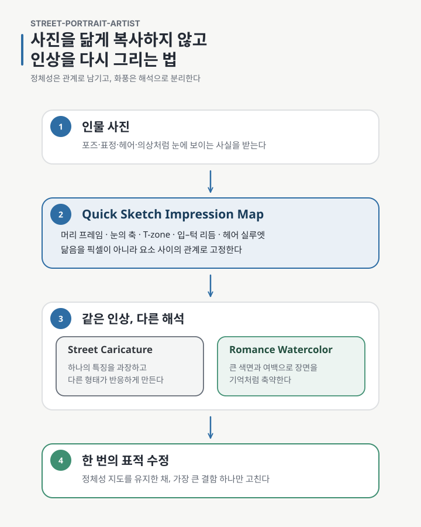
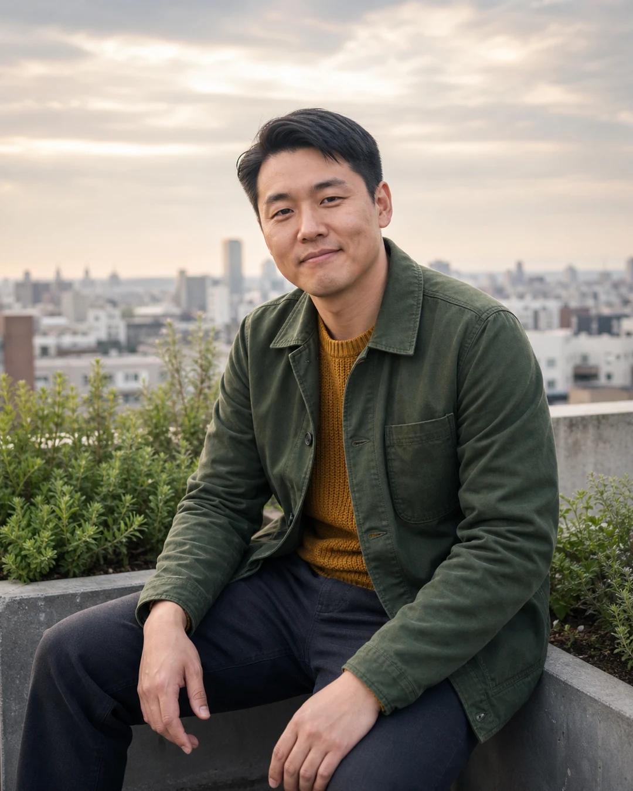
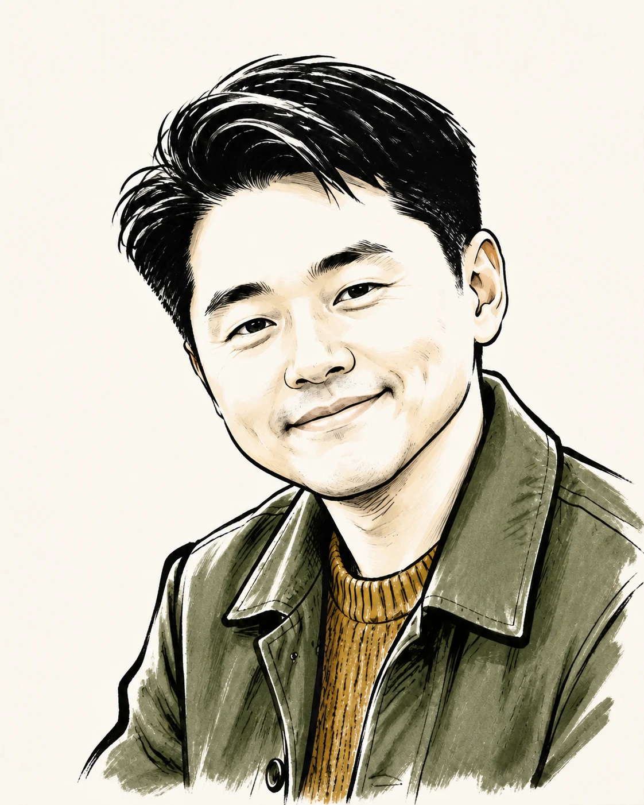
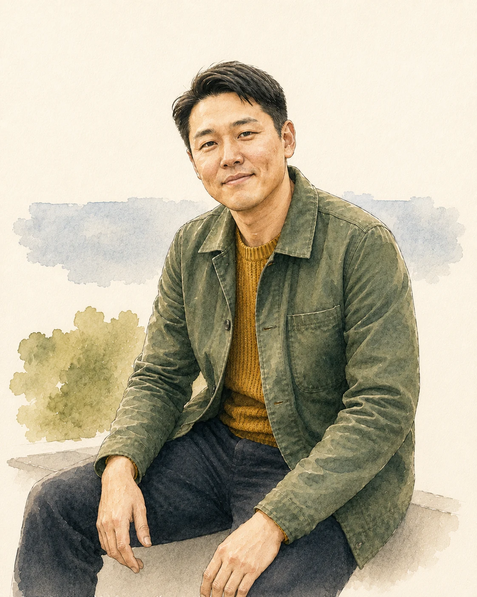
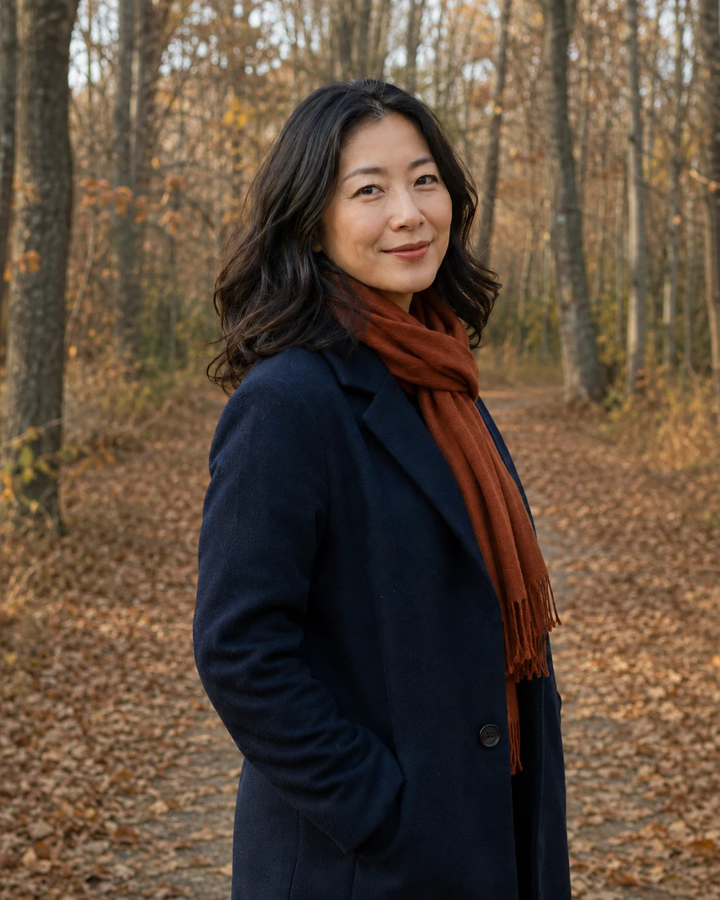
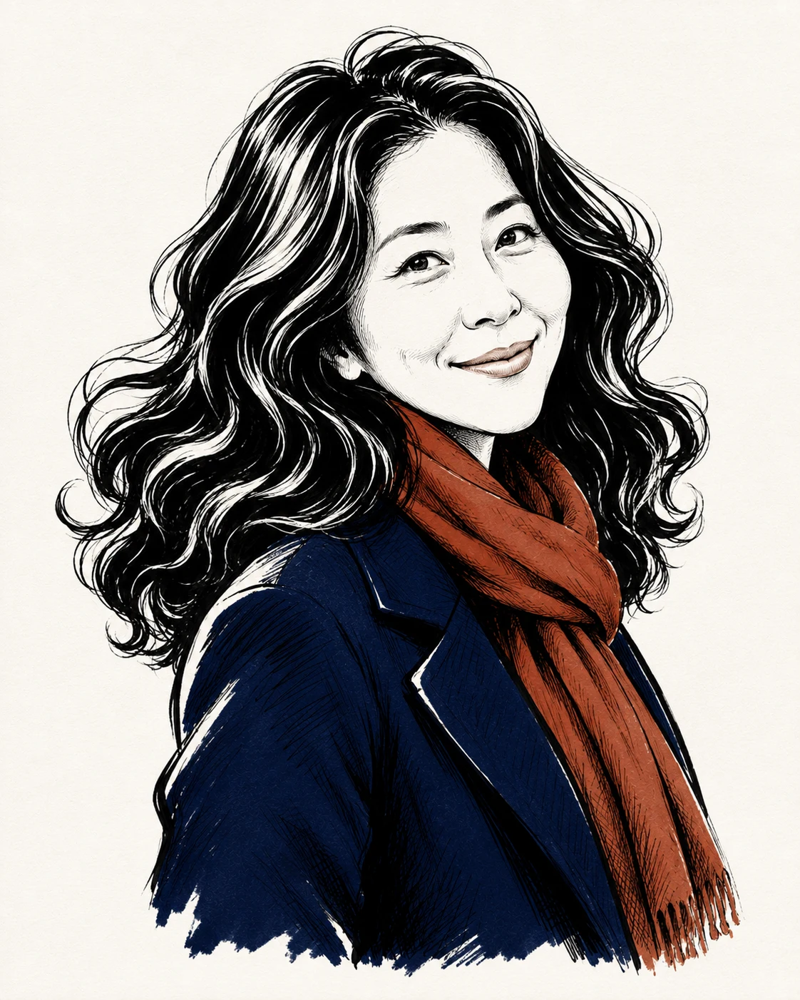
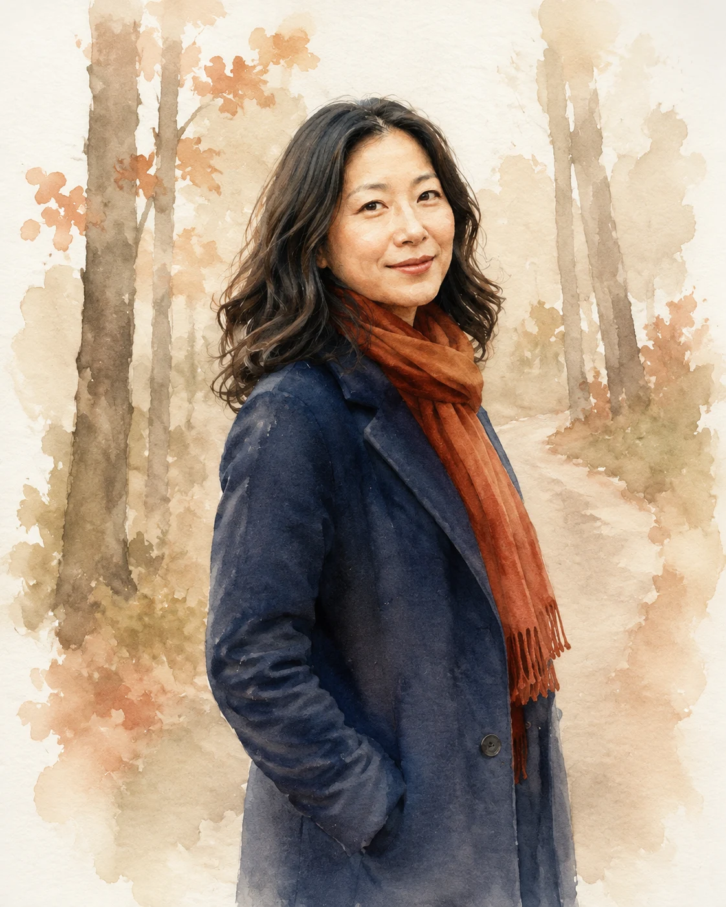

인물 사진을 그림으로 바꾸는 일은 쉬워졌습니다. 사진을 넣고 펜 스케치, 수채화, 만화풍 같은 단어를 붙이면 몇 분 안에 그럴듯한 결과가 나옵니다.

그런데 여러 번 만들어 보니 이상한 선택지 사이를 오가게 됐습니다. 얼굴을 사진처럼 정확하게 남기면 그림이라기보다 필터를 씌운 사진에 가까웠고, 화풍을 강하게 밀면 정작 그 사람의 인상이 사라졌습니다. 캐리커처라고 했는데 실사 얼굴에 머리만 커지기도 했고, 수채화라고 했는데 사진의 건물과 식물을 하나씩 다시 그린 뒤 종이 질감만 얹기도 했습니다.

제가 만들고 싶었던 것은 그 중간이 아니었습니다. **알아볼 수 있지만 복사는 아닌 그림이었습니다.**

`street-portrait-artist`는 이 문제를 풀기 위해 사진과 화풍 사이에 `Quick Sketch Impression Map`이라는 얇은 설계 단계를 둡니다.

## 닮음은 픽셀보다 관계에 오래 남았다

처음에는 눈, 코, 입의 모양을 각각 잘 보존하면 닮을 것이라고 생각했습니다. 실제 결과는 달랐습니다. 요소 하나하나는 비슷한데 전체 인상은 다른 경우가 있었고, 반대로 디테일은 단순해졌는데도 누구인지 바로 알아볼 수 있는 그림이 있었습니다.

차이는 요소 사이의 관계에 있었습니다.

- 얼굴 전체가 둥근지, 길고 각진지
- 두 눈을 잇는 축이 수평인지 살짝 기울었는지
- 미간과 코, 입이 이루는 T-zone의 폭과 경사
- 코 아래에서 입과 턱으로 이어지는 간격과 리듬
- 눈가와 볼, 입꼬리가 함께 만드는 표정의 곡선
- 가르마와 머리카락 바깥선이 만드는 큰 실루엣

Impression Map은 이 관계를 짧게 적는 메모입니다. 성격이나 나이를 추측하지 않고, 사진에서 실제로 보이는 구조만 기록합니다. 여러 장의 사진이 있으면 한 장은 포즈와 구도, 다른 장은 얼굴 관계나 헤어처럼 역할도 나눕니다.

이 지도가 있으면 화풍을 바꿔도 무엇을 지켜야 하는지 덜 흔들립니다. 사진을 그대로 보존하는 대신, 그림 안에서 다시 찾아야 할 **인상의 좌표가** 생기기 때문입니다.

아래 사진은 실제 인물이 아니라 공개 예시를 위해 만든 합성 원본입니다. 두 모드 모두 이 한 장에서 출발했습니다.

## 캐리커처는 머리 크기가 아니라 반응하는 구조였다

캐리커처의 초기 결과 중에는 사진의 얼굴을 거의 그대로 둔 채 머리만 크게 만든 것이 많았습니다. 귀엽기는 했지만, 제가 기대한 거리 화가의 그림과는 달랐습니다. 좋은 캐리커처는 모든 부위를 같은 비율로 과장하지 않습니다.

먼저 한 가지 `primary anchor`를 고릅니다. 눈–볼–입꼬리를 잇는 곡선일 수도 있고, 길고 좁은 턱이나 독특한 헤어 실루엣일 수도 있습니다. 그리고 그 특징을 밀었을 때 다른 부분이 어떻게 반응해야 균형이 생기는지 정합니다.

예를 들어 눈과 볼의 곡선을 넓고 둥글게 밀었다면 턱은 더 작고 날카로운 쐐기로 반응할 수 있습니다. 하관의 세로 리듬을 길게 늘렸다면 이마와 눈 주변은 압축될 수 있습니다. 한쪽이 움직였는데 나머지가 사진 비례 그대로 남아 있으면, 구조를 다시 그린 캐리커처가 아니라 부분 효과에 그칩니다.

마지막에 블랙 잉크, 굵고 가는 붓펜 선, 무채색과 제한된 색 같은 재료 언어를 입힙니다. 순서가 중요합니다. 먹선이 아무리 멋져도 그 아래 구조가 평범한 사진 비례라면 결과는 캐리커처가 아니라 좋은 잉크 초상화가 됩니다.

이 예시는 눈–볼–미소의 상승 곡선을 넓어진 머리 프레임과 짧아진 턱, 축약된 어깨로 받아냈습니다. 채색은 없애기보다 재킷과 스웨터에 제한된 색만 남겼고, 사진의 배경은 지워 인물의 선과 여백이 먼저 보이게 했습니다.

## 수채화는 배경을 잘 그리는 대신 무엇을 지울지 정했다

수채화 모드에서는 반대 문제가 나타났습니다. 생성 모델은 사진에 보이는 건물, 창문, 화분과 잎을 친절하게 하나씩 보존하려고 했습니다. 그 위에 투명한 색과 종이 질감이 올라가도 장면은 여전히 사진의 설명을 따라갔습니다.

`Romance Watercolor`는 배경을 사물 목록이 아니라 두세 개의 환경 앵커로 줄입니다. 옥상 정원이라면 멀리 보이는 skyline의 띠, 식물이 모인 하나의 wash, 난간이나 화분 가장자리 정도면 장소를 기억하기에 충분할 수 있습니다. 나머지는 흰 종이와 끊긴 색면으로 남깁니다.

인물도 피부 전체에 균일한 수채화 질감을 덮지 않습니다. 얼굴과 목, 손, 의상을 몇 개의 연결된 중간톤으로 먼저 묶고, 눈과 입, 머리 경계와 옷깃처럼 인상을 결정하는 곳에만 가는 선을 남깁니다. 물감 튀김이나 pigment dot은 수채화의 증명서가 아닙니다. 초점 밖에서 필요한 만큼만 씁니다.

이 모드의 목표는 사진을 수채화로 다시 인쇄하는 것이 아니라, 그날의 인물과 장소를 **기억 속 장면처럼 압축하는 것입니다.**

처음 나온 결과에는 건물과 식물이 개별 사물처럼 남아 있었습니다. 인물은 건드리지 않고 배경만 한 번 표적 수정해, skyline과 식물의 기척을 몇 개의 큰 색면과 종이 여백으로 다시 줄였습니다.

## 같은 원칙은 다른 얼굴에서도 분리되어야 했다

한 사람에게 잘 맞은 관계를 다른 얼굴에 그대로 옮기면, 화풍은 통일되어도 인물은 같은 캐릭터처럼 수렴할 수 있습니다. 그래서 두 번째 예시는 실존 인물이나 유명인을 참조하지 않은 합성 성인 여성으로 새로 만들고, 별도의 Impression Map에서 출발했습니다.

이 얼굴에서는 높은 볼에서 입꼬리로 이어지는 대각선과 넓은 웨이브 머리 덩어리가 먼저 보였습니다. 캐리커처는 그 대각선을 짧고 좁은 하관과 반대 방향으로 퍼지는 머리 실루엣으로 받아냈습니다. 큰 눈이나 어려 보이는 얼굴로 바꾸지 않고, 성인 인상의 범위 안에서 귀여운 거리 화가풍으로 압축했습니다.

수채화에서는 숲의 나무를 하나씩 보존하지 않았습니다. 길의 흐름, 나무줄기의 세로 리듬, 늦가을 잎의 색 덩어리만 환경 앵커로 남기고, 인물과 배경 사이를 투명한 wash와 흰 종이로 연결했습니다.

이 글에 실은 남녀 캐리커처와 수채화 결과 네 장은 ChatGPT의 이미지 생성 기능으로 만든 공개용 editorial asset입니다. 앞서 기록한 설치본 discovery·invocation 검증과는 분리된 제작물이며, `street-portrait-artist 0.1.1`이 ChatGPT에서 이름으로 호출됐다는 증거로 사용하지 않습니다.

## 한 번에 완벽하게 만들기보다 수정의 대상을 좁혔다

이미지 생성은 같은 입력에서도 결과가 달라집니다. 그래서 `street-portrait-artist`는 첫 결과를 완성품이라고 가정하지 않습니다. 대신 네 가지를 따로 봅니다.

- 그 사람을 알아볼 수 있는가
- 선택한 모드가 실제 구조와 재료에서 드러나는가
- 배경 정보가 주인공보다 앞서지 않는가
- 선, 색면, 여백이 한 그림 안에서 같은 방향을 보는가

문제가 있으면 Impression Map을 새로 쓰거나 프롬프트 전체를 갈아엎기보다 가장 큰 결함 하나를 골라 한 번 표적 수정합니다. 수채화 배경이 너무 상세하다면 인물은 그대로 두고 환경 앵커만 줄입니다. 캐리커처가 일반 펜화로 돌아갔다면 색이나 종이 질감보다 primary anchor와 reaction shape를 다시 강조합니다.

이 방식이 항상 더 좋은 그림을 보장하지는 않습니다. 다만 무엇이 실패했는지 모른 채 같은 요청을 반복하는 것보다는, 정체성을 지키면서 수정할 범위를 좁혀 줍니다.

## 지금 공개할 수 있는 범위

이번에 공개한 `street-portrait-artist 0.1.1`에는 `Street Caricature`와 `Romance Watercolor` 두 모드, Impression Map 작성법, 표적 수정 절차와 공개 가능한 합성 예시가 들어 있습니다.

현재 성숙도는 `Experimental`입니다. 공개 예시는 의도한 방향을 보여 주지만, 다양한 얼굴·조명·인원·배경에서 일관된 품질을 증명하는 폭넓은 회귀 시험은 아닙니다. 닮음과 이미지 품질도 생성 모델의 비결정성에 영향을 받습니다.

Codex에서는 공개된 0.1.1 package의 설치, discovery, 이름 기반 호출, 합성 reference를 사용한 두 모드 생성과 한 번의 표적 수정을 확인했습니다. 다만 현재 이미지 생성 표면은 4:5 구도를 따르면서도 요청한 1080×1350 대신 1122×1402 PNG를 전달했습니다. 따라서 정확한 픽셀 크기 export는 지원한다고 주장하지 않고, 사용할 수 없을 때 실제 크기를 알리는 `fail-visible` 경계로 남겼습니다.

ChatGPT에서도 공개 tag의 0.1.1 설치와 package 파일 검증까지 확인했습니다. 그러나 설치 직후와 그다음 새 턴 모두 이름 기반 discovery가 이전 0.1.0 cache를 가리켰습니다. 잘못된 버전의 규칙을 대신 쓰지 않고 호출과 이미지 생성을 중단했습니다. 이 시점의 ChatGPT 0.1.1 post-release 검증은 **설치·파일 확인은 성공, discovery와 invocation은 실패 또는 확인 불가입니다.** 설치와 현재 턴의 discovery가 같은 상태라는 가정은 하지 않습니다.

## 직접 확인하기

- [street-portrait-artist 0.1.1 Release](https://github.com/kyungseo/skillstead/releases/tag/street-portrait-artist/v0.1.1)
- [한국어 README](https://github.com/kyungseo/skillstead/blob/street-portrait-artist/v0.1.1/skills/street-portrait-artist/README.ko.md)
- [공개 가능한 합성 Twin Portrait 예시](https://github.com/kyungseo/skillstead/tree/street-portrait-artist/v0.1.1/examples/street-portrait-artist)
- [Skillstead 설치 안내](https://github.com/kyungseo/skillstead/blob/main/docs/INSTALL.ko.md)

설치한 뒤에는 이런 식으로 시작할 수 있습니다.

> street-portrait-artist를 사용해서 이 인물 사진을 친절한 거리 화가풍 캐리커처로 만들어 줘. 먼저 인상을 결정하는 관계를 짧게 정리하고, 단순히 머리만 키우지 말고 하나의 특징과 그에 반응하는 형태를 설계해 줘.

사진을 닮게 복사하는 일과 그 사람의 인상을 남기는 일은 같지 않았습니다. 둘을 분리하고 나서야 화풍은 장식이 아니라 해석의 방법이 되기 시작했습니다.
