비공개 저장소를 처음 공개하려는 순간, 가장 먼저 드는 걱정은 대개 비슷합니다.

> 혹시 API 키나 토큰, 개인 경로와 계정 정보, 외부에 보여서는 안 될 내부 주소를 함께 커밋하지 않았을까?

저장소를 다시 비공개로 돌리는 버튼은 있습니다. 그러나 이미 만들어진 복제본과 내려받은 사본까지 되돌릴 수는 없습니다. 공개 상태에서 만들어진 포크도 원본을 다시 비공개로 바꾼다고 함께 비공개가 되지는 않습니다. GitHub 역시 [저장소 공개 범위 변경의 결과](https://docs.github.com/en/repositories/managing-your-repositorys-settings-and-features/managing-repository-settings/setting-repository-visibility)와 [포크에 미치는 영향](https://docs.github.com/en/pull-requests/collaborating-with-pull-requests/working-with-forks/what-happens-to-forks-when-a-repository-is-deleted-or-changes-visibility)을 별도로 경고합니다.

특히 노출된 정보가 비밀번호나 토큰 같은 인증 정보라면 저장소를 다시 감추거나 커밋을 지우는 것으로 끝나지 않습니다. GitHub의 [민감정보 제거 안내](https://docs.github.com/en/authentication/keeping-your-account-and-data-secure/removing-sensitive-data-from-a-repository)도 먼저 해당 인증 정보를 폐기하거나 교체하라고 설명합니다. 이미 유출됐을 가능성이 있는 인증 정보는 일반적인 되돌리기가 아니라 보안 사고 대응의 대상입니다.

`github-release-guide`는 바로 이 지점에서 시작합니다. 공개 버튼을 누르기 전에 무엇이 섞여 있는지 확인하고, 확인하지 못한 영역을 그대로 드러내며, 되돌리기 어려운 변경 앞에서 사용자가 한 번 더 판단하게 합니다. 그래서 릴리스를 단순히 실행할 명령이 아니라, 점검과 승인에 따라 변경 권한이 단계적으로 넘어가는 과정으로 다룹니다.



## 공개 전에 무엇이 섞여 있는지 먼저 본다

첫 공개를 위한 `Assess`에서는 확인할 수 있는 범위에서 민감정보와 이력 위험을 점검합니다.

- 추적 중인 소스 코드·문서·설정·생성 텍스트에 API 키, 토큰, 비밀번호, 개인 키로 보이는 값이 있는지 봅니다.
- 현재 파일에서는 지웠지만 커밋·태그와 관련 Git 이력에 남아 있을 가능성을 확인합니다.
- 개인 파일 경로, 사용자 이름, 이메일, 계정·조직 식별자와 내부 서버 URL이 공개 의도에 맞는지 구분합니다.
- 압축 파일, PDF·Office 파일, 이미지와 스크린샷처럼 내용이나 메타데이터에 정보가 남을 수 있는 생성물을 확인 가능한 범위에서 살핍니다.
- 환경 설정, CI와 배포 파일이 공개·배포에 민감한 값을 직접 담거나 참조하는지 봅니다.

이 과정에서 인증 정보의 실제 값을 다시 출력하거나 복사하지 않습니다. 위치와 유형, 필요한 경우 가려진 식별 정보만 보여줍니다. 모든 식별자를 민감정보로 단정하지도 않습니다. 내부 주소나 계정 ID처럼 맥락에 따라 공개 의도가 달라지는 항목은 사람이 판단할 수 있도록 남깁니다.

무엇보다 “문제를 발견하지 못했다”와 “민감정보가 없다”를 같은 말로 쓰지 않습니다. 사용할 수 없는 검사나 읽지 못한 파일 형식은 `unknown`(확인하지 못함)으로 남고, 이 점검은 전문적인 민감정보 조사나 보안 감사를 대신하지 않습니다. 이 스킬은 민감정보가 없다고 보증하지 않습니다. 대신 확인 가능한 실수를 찾아내고, 공개 전에 멈출 기회를 제공합니다.

공개 전에 확인할 것은 두 가지입니다. 외부에 공개하면 안 될 정보가 섞였는가. 공개할 문서와 설치 절차, 버전 정보는 실제 릴리스 상태와 일치하는가.

두 번째 질문에 답하기 위해 README와 설치 안내, LICENSE, 버전, CHANGELOG와 릴리스 노트가 서로 맞는지 확인합니다. 이미 공개된 저장소의 새 버전이라면 대상 커밋, 기존 태그와의 충돌, 브랜치·태그 보호 상태, 문서에 적힌 설치와 호환성을 뒷받침할 근거도 봅니다. `github-release-guide`는 민감정보 검사 도구에 머물지 않고, 공개할 내용과 실제 릴리스 상태가 일치하는지까지 점검합니다.

이 두 질문에 답한 뒤에는 점검 결과가 곧바로 변경 권한으로 이어지지 않게 해야 합니다.

## 점검과 변경을 분리한다

첫 선택은 `Assess`와 `Guided`입니다.

`Assess`는 읽기 전용입니다. 확인할 수 있는 저장소와 GitHub 상태를 모으고, 준비 상태를 `Ready`, `Needs attention`, `Blocked`로 나눕니다. 정보가 없으면 추측으로 채우지 않고 `unknown`으로 남깁니다. 점검 중 저장소의 스크립트나 빌드를 실행하는 일도 자동으로 허용되지 않습니다. 읽기 권한이 있다는 사실과, 저장소가 제공한 코드를 안전하게 실행해도 된다는 판단은 서로 다르기 때문입니다.

`Guided`도 바로 변경부터 시작하지 않습니다. 먼저 Assess를 끝내고 릴리스를 막는 핵심 항목을 해결합니다. 그다음 한 번에 하나의 변경만 다음 순서로 진행합니다.

```text
ASSESS → PREVIEW → RECHECK → APPROVAL → MUTATE → VERIFY → NEXT or STOP
```

무엇을 바꿀지 먼저 보여주고, 변경 직전에 대상 브랜치·커밋·태그·공개 범위 같은 전제를 다시 확인합니다. 상태가 달라졌다면 앞서 받은 승인은 더는 유효하지 않습니다. 새 상태를 설명하고 다시 승인받습니다. 실행한 뒤에는 기대한 상태가 실제로 만들어졌는지 확인한 후에야 다음 변경을 제안합니다.

이 과정이 느려 보일 수 있습니다. 그러나 실패했을 때 어디까지 진행됐는지 알 수 있고, 계획 전체에 대한 동의가 실제 변경 권한으로 둔갑하는 일을 막습니다.

## 릴리스 하나를 여러 승인으로 나누는 이유

파일 수정, 커밋, 푸시, 태그, 공개 범위, 저장소 설정, GitHub 릴리스 공개는 서로 다른 결과를 만듭니다. 그래서 이 스킬은 그것들을 하나의 “릴리스 승인”으로 묶지 않습니다.

특히 비공개 저장소를 공개로 바꾸는 일은 다른 변경과 별도입니다. 공개된 내용은 복제본, 포크, 캐시, 미러 등으로 남을 수 있습니다. 나중에 다시 비공개로 돌려도 이미 만들어진 사본을 회수할 수 없습니다. 자동 민감정보 검사도 “아무것도 없다”는 증명이 아닙니다. `github-release-guide`는 공개 범위를 바꾸기 직전에 이 비회수성을 다시 설명하고, 그 변경만을 위한 직접 승인을 요구합니다.

공개된 태그도 비슷합니다. 이미 배포됐거나 노출 이력을 확인할 수 없는 태그는 옮기거나 지우고 다시 만들지 않습니다. 사용자가 무엇을 받았는지 알 수 없기 때문입니다. 그런 경우에는 새 태그나 후속 릴리스처럼 앞으로 고치는 방법을 검토하고, 위험한 교정은 자격 있는 사람이나 별도 전문 절차에 넘깁니다.

이미 게시된 릴리스도 “삭제할 수 있는가”와 “이미 노출된 내용을 회수할 수 있는가”를 구분합니다. 변경 종류마다 별도로 판단하되, 특히 Immutable Release를 삭제하면 연결된 태그 이름을 다시 사용할 수 없으므로 그 결과를 먼저 설명합니다.

> 안전한 자동화는 결정을 대신하는 자동화가 아니라, 결정할 순간과 그 결과를 숨기지 않는 자동화에 가깝습니다.

## 첫 공개와 다음 버전은 다른 문제다

이 스킬은 현재 두 종류의 GitHub 릴리스를 다룹니다.

`first-public`은 이미 존재하는 비공개 github.com 저장소를 처음 공개할 때 사용합니다. 앞서 설명한 민감정보·이력 점검과 함께 라이선스 결정, 첫 버전, 공개 메시지와 저장소 설정을 확인합니다. `Guided`에서는 비회수성 경고 뒤 공개 범위 전환만을 위한 별도 승인을 받습니다.

`version-release`는 이미 공개된 저장소에서 새 버전을 낼 때마다 사용합니다. 목표 버전, 버전의 기준이 되는 파일, CHANGELOG, 릴리스 노트, 대상 커밋, 기존 태그와의 충돌, 설치와 호환성 근거를 확인합니다. 사용자가 고정 태그에 의존한다면 브랜치와 태그 보호 상태도 실제 릴리스 방식에 맞는지 봅니다.

둘 다 릴리스 작업이지만 공개되는 범위와 실패 비용이 다릅니다. 그래서 하나의 만능 체크리스트로 합치지 않고, 공통 점검 뒤에 상황별 규칙을 적용합니다.

## 완료라는 말에도 증거가 필요하다

변경 도중 일부만 성공하면 스킬은 다음 단계로 진행하지 않습니다. 무엇을 시도했고 로컬과 원격이 지금 어떤 상태인지 기록한 뒤 멈춥니다. 단순한 되돌리기와 보안 사고 대응도 구분합니다. 공개 노출이나 인증 정보 노출 가능성은 “원래대로 돌렸다”는 말로 닫을 수 있는 문제가 아닙니다.

마지막도 같습니다. 태그가 생겼다고 릴리스가 끝난 것은 아닙니다. 선택한 프로필의 게시 후 점검을 통과하고, 성공했다고 말하는 각 항목에 직접 관측한 근거가 있어야 완료입니다. 그렇지 않으면 `partial` 또는 `blocked`로 남기고 가장 안전한 다음 행동 하나를 제시합니다.

이 글이 말하는 안전은 절대적인 안전이 아닙니다. `github-release-guide`는 github.com의 첫 공개와 공개 후 버전 릴리스에 집중합니다. 저장소 생성, 패키지 레지스트리 배포, 바이너리 서명, 클라우드 배포, 보안 감사, 강제 푸시, 이력 재작성을 대신하지 않습니다. 사용자의 릴리스 권한을 가져가지도 않습니다.

현재 Skillstead가 공개한 검증 범위에서는 Claude Code와 Codex가 `Supported`이고 성숙도는 `Stable`입니다. 이 표시는 모든 저장소와 상황에서 릴리스가 성공한다는 보증이 아니라, 기록된 가상 시나리오와 실제 종단 간(E2E) 검증에서 핵심 동작을 확인했다는 뜻입니다.

오히려 이 스킬의 핵심은 사용자에게 결정권을 남기는 데 있습니다.

- 점검은 점검일 뿐 변경 승인이 아니다.
- 계획 승인은 다음 모든 실행의 승인이 아니다.
- 상태가 바뀌면 과거 승인도 다시 확인해야 한다.
- 실행 성공은 검증된 완료와 다르다.
- 공개를 되돌리는 것과 이미 퍼진 사본을 회수하는 것은 다르다.

릴리스 버튼을 누르기 전에 이 다섯 문장이 분명하다면, 자동화는 더 안전하게 빨라질 수 있습니다. 반대로 이 경계가 흐리다면 명령이 아무리 정확해도 릴리스 전체는 안전하다고 말하기 어렵습니다.

## 설치

`github-release-guide`는 참고 문서까지 포함한 스킬 폴더 전체를 설치해야 합니다. 재현 가능한 설치를 위해 Skillstead 설치 안내의 고정 태그와 `skills/github-release-guide/` 폴더를 함께 사용합니다. 아래 명령은 이 글을 게시할 때 확인한 `v0.9.0`을 macOS/Linux 프로젝트에 설치합니다. 사용하는 실행 환경에 맞는 블록 하나만 선택해 실행합니다.

Claude Code 프로젝트:

```bash
install_root="$(mktemp -d)"
git clone --depth 1 --branch github-release-guide/v0.9.0 https://github.com/kyungseo/skillstead.git "$install_root/skillstead"
mkdir -p .claude/skills
cp -R "$install_root/skillstead/skills/github-release-guide" .claude/skills/
```

Codex 프로젝트:

```bash
install_root="$(mktemp -d)"
git clone --depth 1 --branch github-release-guide/v0.9.0 https://github.com/kyungseo/skillstead.git "$install_root/skillstead"
mkdir -p .agents/skills
cp -R "$install_root/skillstead/skills/github-release-guide" .agents/skills/
```

전역 설치, Windows PowerShell, 업데이트 방법과 최신 고정 태그는 [Skillstead 설치 안내](https://github.com/kyungseo/skillstead/blob/main/docs/INSTALL.ko.md)에서 확인할 수 있습니다. 폴더를 복사한 뒤에는 `github-release-guide`를 이름으로 지정하고, 변경 없이 준비 상태만 보려면 먼저 `Assess`를 요청하는 것이 가장 단순한 시작점입니다.

`github-release-guide`의 두 가지 모드와 릴리스 프로필, 지원 범위는 [스킬의 한국어 README](https://github.com/kyungseo/skillstead/blob/main/skills/github-release-guide/README.ko.md)에서 확인할 수 있습니다. 저장소 전체는 [Skillstead](https://github.com/kyungseo/skillstead)에 공개돼 있습니다.
