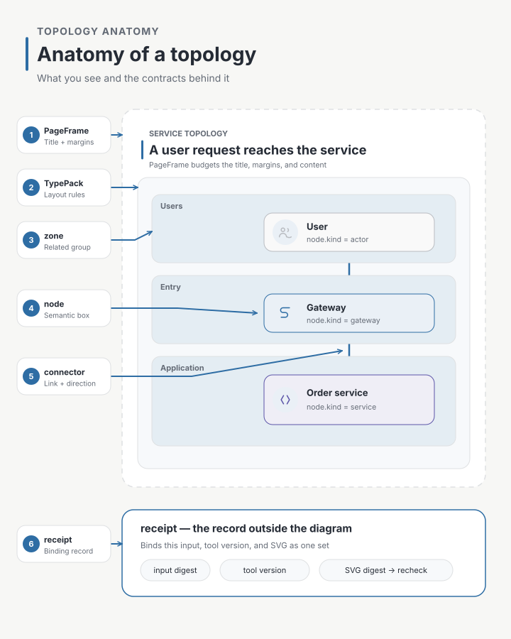
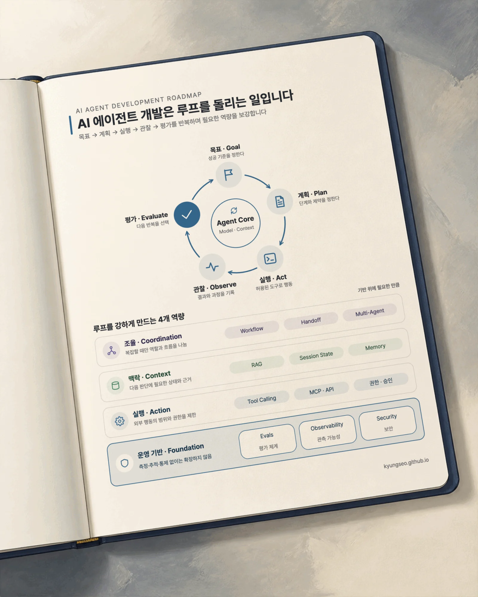
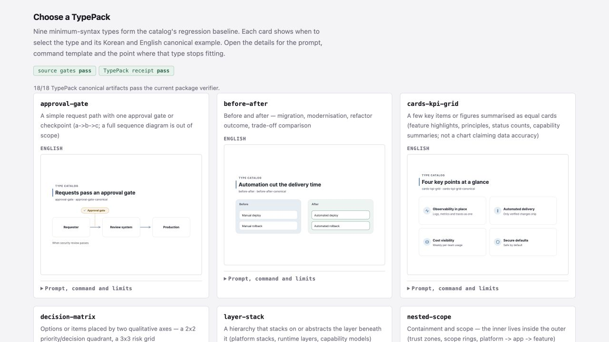

Making one technical diagram look plausible was not as difficult as I expected. What I found harder was building a system that could recreate it using the same principles when the wording, language, number of boxes, or page format changed.

The first version of `svg-infographic` started with a simple goal: create an editable SVG and leave behind a crisp PNG when needed. But after making more diagrams, I began to see a different set of problems. Colors varied slightly from one example to another. A two-line title could break the spacing. Arrows avoided boxes but bent for no reason or disappeared under labels. Korean and English versions could carry the same meaning yet look like different structures.

That changed the goal. Instead of concentrating on producing more good-looking output, I focused on preventing a defective result from being mistaken for success.

`svg-infographic 0.10.0` is the first release from that redesign.


The redesign makes four promises.

- The result is a standalone SVG that opens on its own and requests no external font, image, or script while being viewed.
- Korean is not a translation attached after the English version. It is an equal output that goes through the same structure and verification path from the beginning.
- In portable mode, the SVG embeds a subset containing the Korean glyphs it actually uses, so it keeps the same typeface and text geometry even on a computer without Pretendard.
- A receipt binds the input, the tools, and the output file so artifacts from different generations cannot quietly become mixed.

Automated checks cover a bounded set of properties: structure and layout issues such as missing or overflowing elements, font-delivery conditions, and receipt binding. A person still decides whether the diagram is readable and whether its meaning is correct.

## One file to open, one file to keep

The first decision was what should count as the default deliverable. For `svg-infographic`, it is not a picture embedded in HTML or tied to a particular viewer. It is a **standalone SVG file**.

Icons are stored as SVG paths, colors as properties on each shape, and portable-mode Korean fonts as subsets containing only the glyphs the diagram uses. Opening the diagram makes no external font, image, or script request. The file can go directly into a README or other Markdown document, a PPTX, or a vector editor. When a PNG is needed, the same SVG is rendered at twice its dimensions in a headless browser.

This approach has an important limit. The embedded font subset preserves how the existing text **looks**. It does not make every future text edit portable. New wording may require glyphs that the subset does not contain, so editing the text requires Pretendard on the target computer or regeneration of the portable artifact. “Looks the same anywhere” and “can be freely rewritten anywhere” are different promises.

I also checked that the SVG could be inserted into Microsoft PowerPoint and converted to shapes. PowerPoint, however, does not preserve the SVG's embedded subset as an editable font. Pretendard still needs to be installed on that computer if the imported text is to remain editable as text.

## I compared real scenes, not just color swatches

I also moved away from choosing whatever color looked good for each example. First I defined the roles color plays—`canvas`, `surface`, `ink`, `muted`, `focus`, `positive`, and `warning`. A palette profile and registry own the actual values, while the diagram records both the resolved color and its role. When the palette changes, the system can resolve each role again instead of finding and editing every shape by hand.

I did not choose the palette by lining up color chips alone. I generated the same topology in Korean and English, light and dark, and flat and sketch treatments. Then I compared title hierarchy, box separation, status-color intensity, and text contrast in the scenes where those colors would actually be used.


[Open the original contact sheet SVG](./svg-infographic-rebuild-canonical-skin-contact-sheet.svg)

The Azure-based architecture inside the sheet is an early palette-review scene, not one of the nine current TypePack examples. The sheet is not the source of truth for the palette. It is a **review record** I made by rebuilding real scenes from the profile and comparing them myself. The YAML and registry inside the package remain authoritative. This gave me evidence for a more useful statement than “I liked this blue”: the set of roles held up across Korean and English, light and dark.

## Keeping a diagram for years meant keeping how it was made

None of this is necessary for a diagram that will be viewed once and discarded. In that case, making an SVG, checking it by eye, and using it is enough. Receipts, stress inputs, and regeneration contracts would be pure overhead.

Skillstead's examples are different. They remain committed to the repository across releases, and the Gallery and README use them to explain the product publicly. The nine current TypePacks maintain 54 canonical artifacts across Korean and English SVGs, PNGs, and receipts. That makes it necessary to distinguish “a file that looked good once” from “a file checked again against the current package.”

Instead of fixing coordinates one by one, I separated the responsibilities.

- `PageFrame` calculates the regions available to the title, body, and margins.
- The design kernel supplies shared rules for color, typography, icons, and connectors.
- The semantic vocabulary records what a box represents—such as a user, gateway, service, or database—instead of treating it as an anonymous rectangle.
- A `TypePack` decides how to lay out a particular relationship such as a topology, process, or comparison.
- A receipt binds the input and runtime to the SVG they produced.

The purpose of this structure is not to give the layers impressive names. It is to change the title treatment without redesigning the topology, add an icon without disturbing the page margins, and find which layer is responsible when something goes wrong.

## I recorded what each box is, not only what it says

Drawing a rectangle labelled `API Gateway` is not the same as recording that the rectangle is a gateway.

In 0.10.0, each topology node has a `node.kind`. Ten kinds are available: actor, gateway, service, compute, database, cache, queue, object storage, external provider, and observability. Boundaries and zones are separate primitives that describe structure rather than nodes. Icons are selected independently. A database node may use a different icon, but an icon identifier never substitutes for the node's meaning.

The diagram below shows the role played by each part of a topology.



The page may look like nothing more than boxes and arrows, but those parts have different responsibilities. `PageFrame` manages the whole page, including its title and margins. The topology TypePack uses only the content region inside it. A zone groups related nodes, and a connector expresses a relationship and direction between two nodes. The receipt is a JSON file stored next to the SVG. It is not a visible element; it records enough provenance to check the origin of the result again.

## A TypePack is more than one diagram

A TypePack is not an empty template. It is closer to **a small package containing the diagram's instructions, a normal example, limit tests, and a record for checking the result**.

| Part | What it does |
| --- | --- |
| Manifest entry | A catalog card explaining when to select the type and which formats and variants it supports |
| Spec document | Instructions defining what the nodes and relationships mean and what the type forbids |
| Canonical input | The most representative normal scene |
| Stress input | A test scene that approaches the limits of item count, copy length, or connection complexity |
| Fit parameters | The minimum sizes and gaps needed without shrinking text or arrows |
| KO/EN artifacts | Reference outputs that express the same semantic structure in Korean and English |
| Receipt | A sidecar record used to recheck that the input, runtime, and SVG belonged to the same build |

This bundle prevents a new type from amounting to one more thumbnail. Adding a type also adds the requests that select it, the amount of content it can hold, the errors a machine can catch, and the judgments a person must still make.

## A receipt is a seal, not a certificate

If a receipt is described as “proof that the diagram followed its specification,” it is hard to see why it is necessary. More precisely, it is **a binding record showing that this input, this runtime, and this SVG belonged together**.

A digest is a short fingerprint calculated from file contents. Change even one character and the fingerprint changes. The receipt records the input digest, the digest of the code and rules that affect generation, and the digest of the finished SVG.

```text
input ── inputDigest ──┐
runtime ─ surfaceDigest ├── receipt ── recheck
SVG ── artifactDigest ─┘
```

The receipt does more than store those values. `verify` reads the original input and the actual SVG again and compares them with the record. Changing one character in the SVG changes the artifact digest. Changing the generator or its rules reveals that an older result no longer matches the current runtime surface.

Preparing this release gave me several concrete examples of why that matters.

- When the revision of the code and rules that affect generation changed, the receipts identified which outputs needed to be rebuilt.
- Build provenance in the receipts revealed that some artifacts had been produced from an uncommitted workspace, so I regenerated them from a clean staging copy.
- An experiment that changed one character in an SVG was immediately rejected with `artifact digest mismatch`.
- When only an SVG annotation changed and the PNG pixels remained identical, the digests distinguished an invisible metadata change from a stale PNG.

This cost is not always justified. If a project does not store its output, recreates it every time, and makes no public claim from it, regenerating in CI and checking the diff is simpler. A receipt earns its cost when a project **stores an artifact, keeps it for a long time, and uses it as evidence for something it says**.

A receipt does not guarantee the quality of a diagram. A person must still judge whether it is readable, whether the architecture is meaningful, and whether important elements are missing. The receipt is not a certificate that removes visual review. It is a way to repeatedly confirm that the file being reviewed still belongs to the input and production conditions recorded beside it.

## I did not treat Korean and fonts as add-ons

Korean support itself is not new in this release. What changed is that Korean is no longer handled as a compatibility item inserted into an English layout. It is a first-class input to font delivery and geometry verification.

In portable mode, the package extracts only the glyphs used by the diagram from its bundled Pretendard Regular and Bold faces and embeds that subset into the SVG. The diagram therefore keeps the same typeface and text geometry on a computer without Pretendard, and it makes no separate request to an external web font such as Noto Sans KR on Google Fonts or Pretendard from a CDN. If a required glyph or the pinned subsetting toolchain is unavailable, generation fails instead of silently switching to a system font.

Korean and English outputs use the same semantic entities, topology, and variant. Line breaks and text bounds are checked for each language, but nodes are not moved and connector paths are not arbitrarily changed only for Korean. The claim is narrower and more concrete than “Korean text appears”: **the Korean output travels with its font and can be rechecked against the same semantic structure**.

## When one page could not hold everything, I split it in two

When testing the architecture primitives, my first goal was a single 16:9 page containing the central user → gateway → service flow together with a database, cache, queue → worker, object storage, external provider, and observability.

But “everything is present” is not the same as “everything is readable.” All six layouts I tried within that limited scope stopped during routing. A scene with fewer relationships could produce an SVG, but at the README contact sheet's 263-pixel width and the Gallery card's 369-pixel width, the primitive types were still difficult to distinguish reliably.

Instead of reducing the text and arrows further, I split the acceptance into two assets.

- The `compact canonical` keeps the central user → gateway → service flow readable at small display sizes.
- The `full coverage specimen` is used at a larger size to inspect all ten semantic kinds, four zones, and the request, dependency, and event relationships.

The article also includes the [full coverage specimen for closer inspection](./svg-infographic-rebuild-full-specimen.en.svg) and its [portable receipt](./svg-infographic-rebuild-full-specimen.en.json). I rebuilt them from the public tag in a clean project, and the Korean/English artifact, receipt, and locale-pair checks all completed with zero errors.

> The lead flow, topology anatomy, palette contact sheet, and full coverage specimen in this article were all made through `svg-infographic`'s own authoring and verification path. Their shapes differ, but they follow the same PageFrame, typography, palette, icon, and checking rules. The nine TypePacks are representative types for repeatable generation and regression checks, not the limit of what the skill can draw. **Do not mistake the nine-TypePack catalog for the full range of diagrams the skill can draw.**

## It will not stop at nine

The current catalog contains nine TypePacks: process flow, approval gate, topology, layer stack, nested scope, before/after, KPI cards, decision matrix, and roadmap timeline. All nine currently have `experimental` support status, and none yet has a dedicated verifier that proves type-specific semantic accuracy.

I plan to keep adding TypePacks. Adding a type, however, will not mean placing one more thumbnail in the Gallery. A manifest and spec, canonical and stress inputs, fit parameters, Korean and English artifacts, and receipts must arrive together. The catalog should also explain what can be verified before the type joins it.

That is why I want to protect the admission criteria before optimizing for addition speed. A type such as a statistical chart, where the accuracy of values and axes is essential, will not join the catalog merely because the system can draw its shape. It belongs there only after a verifier can check that accuracy.

## Placing a result in context

`svg-infographic 0.11.0` can place a verified result on a notebook, gallery wall, or portrait monitor. A natural-language request can be as simple as this:

> Use svg-infographic to create an image that fits what I have just described. Show the result on the notebook template.

This does not change what the skill produces by default: an editable SVG and its canonical PNG rendered at exactly 2×. A projection is a separate PNG created only when the user asks for one. If that projection fails, the already verified canonical result remains valid.

The three bundled surfaces are paper notebook, gallery wall, and portrait monitor. If a projection request does not name a surface, it uses paper notebook. An explicit choice always wins. A short signature may appear in the lower-right corner, or the slot may be left empty.

[](https://kyungseo.github.io/skillstead/gallery/)

*This is a web-sized copy of a verified paper notebook projection from the official Gallery. Its content comes from a separate infographic about the AI agent development loop rather than from this article.*

A local background can be used as well. The current path requires a local raster image and a strict manifest declaring where the result belongs on that image. It does not fetch an image from a remote URL or freely redraw the verified result. The [Gallery](https://kyungseo.github.io/skillstead/gallery/) shows all three bundled surfaces and the current boundaries.

## See it for yourself

The [svg-infographic Gallery](https://kyungseo.github.io/skillstead/gallery/) shows the current `0.11.0` TypePack outputs and presentation examples, together with their prompts and receipts. For each of the nine TypePacks, it includes Korean and English canonical examples, selection guidance, build commands, and the boundary where the content no longer fits on one page.

[](https://kyungseo.github.io/skillstead/gallery/)

The following commands install only the `svg-infographic` folder from the verified 0.11.0 release, making it possible to install the same version again.

```bash
install_root="$(mktemp -d)"
git clone --depth 1 --branch svg-infographic/v0.11.0 \
  https://github.com/kyungseo/skillstead.git "$install_root/skillstead"
mkdir -p .agents/skills
cp -R "$install_root/skillstead/skills/svg-infographic" .agents/skills/
```

For a Claude Code project, change the destination in the final two lines to `.claude/skills`. See the [Skillstead installation guide](https://github.com/kyungseo/skillstead/blob/main/docs/INSTALL.md) for package requirements and platform-specific instructions.

There is no need to memorize the internal schema after installation. Start with a request like this:

> Use svg-infographic to draw a system architecture from a user through a gateway to a service. Include a database and queue, and save a standalone SVG and 2× PNG that I can place in a document.

The agent turns the natural-language request into semantic input, selects a TypePack and variant, and then runs the generator and guards. The full coverage specimen in this article was also rebuilt from a declarative case included in the package. Its input, runtime, and SVG binding are recorded in the accompanying [portable receipt](./svg-infographic-rebuild-full-specimen.en.json).

## Related material

- [svg-infographic Gallery](https://kyungseo.github.io/skillstead/gallery/)
- [svg-infographic 0.11.0 Release](https://github.com/kyungseo/skillstead/releases/tag/svg-infographic/v0.11.0)
- [English README](https://github.com/kyungseo/skillstead/blob/svg-infographic/v0.11.0/skills/svg-infographic/README.md)
- [Earlier article: Why Relationships and Spacing Come Before Drawing a Diagram](https://kyungseo.github.io/en/posts/draw-with-numbers-first/)
