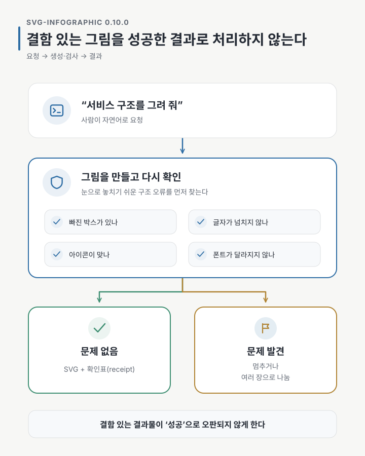
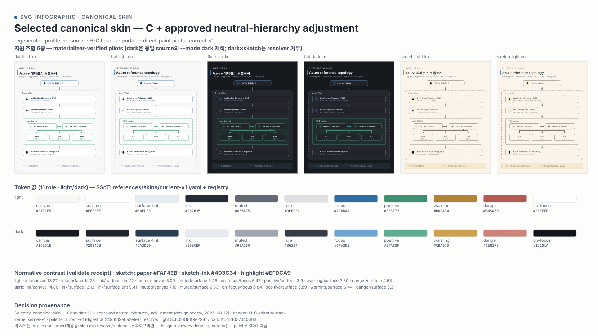
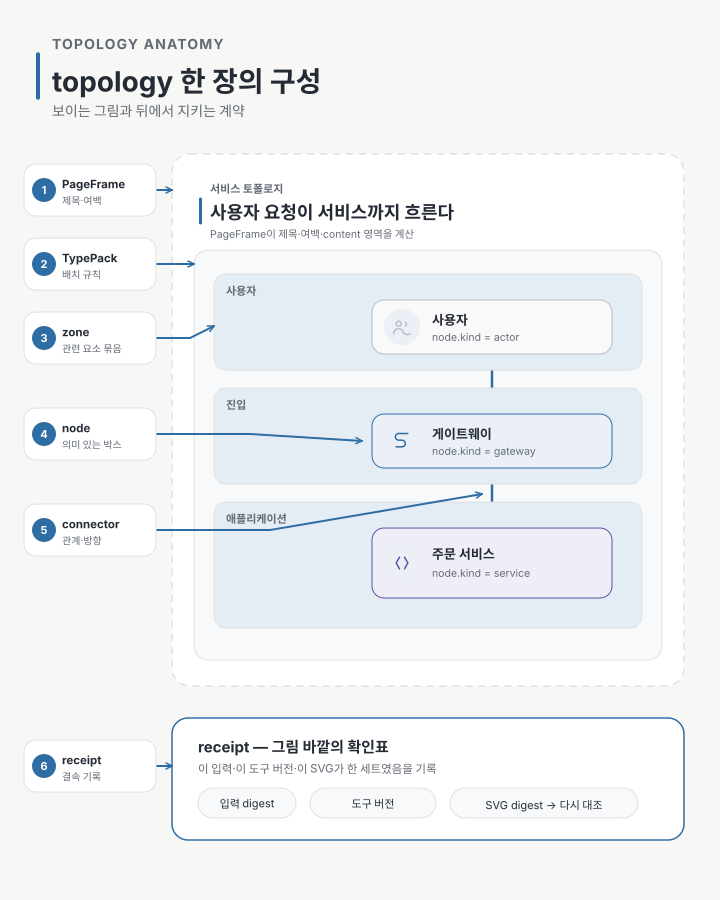
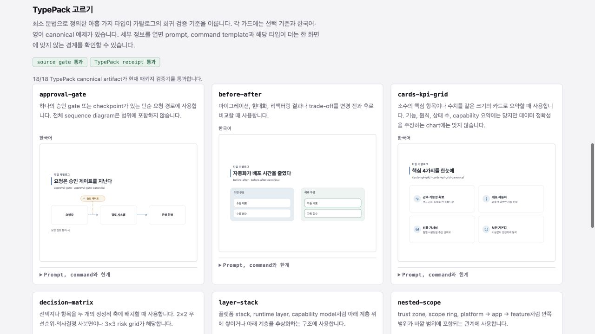

기술 다이어그램 한 장을 그럴듯하게 만드는 일은 생각보다 어렵지 않았습니다. 제가 더 어렵게 느낀 일은 문구와 언어, 박스 수와 판형이 달라져도 같은 원칙으로 다시 만들 수 있는 체계를 만드는 것이었습니다.

`svg-infographic`의 첫 버전은 편집 가능한 SVG를 만들고 필요할 때 선명한 PNG를 함께 남기는 데서 출발했습니다. 하지만 여러 장을 직접 만들다 보니 또 다른 문제가 보였습니다. 예제마다 색이 조금씩 달라졌고, 제목이 두 줄이 되면 여백이 무너졌습니다. 화살표는 박스를 피했지만 불필요하게 꺾이거나 라벨 아래로 숨었습니다. 한국어와 영어는 같은 내용을 담고 있는데도 서로 다른 구조처럼 보일 때가 있었습니다.

그때부터 목표를 바꿨습니다. 양질의 결과물을 늘리는 것보다, 결함 있는 결과물이 ‘성공’으로 오판되지 않도록 방지하는 데 초점을 맞췄습니다.

이번에 공개한 `svg-infographic 0.10.0`은 그 재설계의 첫 결과입니다.



이번 재설계의 약속은 네 가지로 요약할 수 있습니다.

- 결과물은 그 자체로 열리는 standalone SVG이며, 열어 보는 동안 외부 font·image·script를 요청하지 않습니다.
- 한국어는 영문판 뒤에 붙이는 번역본이 아니라 처음부터 같은 구조와 검증을 거치는 동등한 결과물입니다.
- portable mode에서는 실제 사용한 한글 glyph의 font subset을 SVG 안에 담아, Pretendard가 없는 컴퓨터에서도 같은 글꼴과 텍스트 geometry로 표시되게 합니다.
- 입력과 도구, 결과 파일을 receipt로 묶어 서로 다른 세대의 파일이 조용히 섞이지 않게 합니다.

다만 기계가 확인하는 범위는 빠진 요소나 넘침 같은 구조와 배치, 글꼴 제공 조건, receipt 결속입니다. 읽기 좋은지와 내용이 의미상 맞는지는 여전히 사람이 판정합니다.

## 한 파일로 열리고, 한 파일로 남는다

가장 먼저 정한 것은 무엇을 기본 결과물로 삼을지였습니다. `svg-infographic`의 기본 납품물은 HTML 안에 들어 있는 그림이나 특정 viewer가 아니라 **standalone SVG 파일**입니다.

아이콘은 SVG path로, 색은 각 도형의 속성으로, portable mode의 한글 글꼴은 실제 사용한 glyph만 추린 subset으로 파일 안에 들어갑니다. 그림을 열기 위해 외부 font, image, script를 요청하지 않습니다. README 같은 Markdown 문서나 PPTX에 바로 넣을 수 있고, 브라우저가 아닌 vector editor에서도 열 수 있습니다. PNG가 필요하면 이 SVG를 headless browser에서 2배 크기로 렌더합니다.

이 방식에도 분명한 한계가 있습니다. SVG에 내장한 font subset은 같은 모양으로 **보는 것**을 위한 것입니다. SVG 안의 문구를 다른 글자로 편집하려면 새 glyph가 필요하므로 Pretendard를 설치하거나 portable artifact를 다시 생성해야 합니다. “어디서나 같은 모양으로 보인다”와 “어디서나 자유롭게 글자를 고친다”는 같은 약속이 아닙니다.

저는 PowerPoint에서 SVG를 삽입하고 셰이프로 변환되는 것까지 직접 확인했습니다. 다만 PowerPoint는 SVG 안의 font subset을 편집용 글꼴로 보존하지 않습니다. 가져온 뒤 문구를 글자로 계속 편집하려면 그 컴퓨터에 Pretendard가 설치되어 있어야 합니다.

## 색상표 대신 실제 장면을 비교했다

색상 역시 예제마다 보기 좋은 값을 그때그때 고르는 방식에서 벗어났습니다. `canvas`, `surface`, `ink`, `muted`, `focus`, `positive`, `warning`처럼 색이 맡는 역할을 먼저 정하고, 실제 값은 하나의 palette profile과 registry가 소유하게 했습니다. 그림에는 최종 색상과 함께 그 색의 역할을 기록합니다. 나중에 palette가 바뀌어도 각 도형을 찾아 손으로 고치는 대신 같은 역할을 새 값으로 다시 계산할 수 있습니다.

후보를 고를 때도 색상 칩만 나란히 보지 않았습니다. 같은 topology를 한국어와 영어, light와 dark, flat과 sketch로 실제 생성해 놓고 제목의 위계, 박스의 구분, 상태색의 강도와 글자 대비를 함께 비교했습니다.



[contact sheet SVG 원본 열기](./svg-infographic-rebuild-canonical-skin-contact-sheet.svg)

안에 쓰인 Azure 기반 아키텍처 장면은 palette 검토용으로 만든 초기 예시이며, 현재 catalog의 아홉 TypePack 예시는 아닙니다. 이 시트는 palette의 원본이 아니라, profile로 실제 장면을 다시 만든 뒤 제가 직접 비교한 **검토 기록**입니다. palette의 기준은 여전히 package 안의 YAML과 registry에 있습니다. 덕분에 “이 파란색이 마음에 들었다”가 아니라 “한국어·영어와 밝은 화면·어두운 화면에서 이 역할 구성이 실제로 버텼다”는 근거를 남길 수 있었습니다.

## 그림을 오래 유지하려면 만드는 방식도 함께 남겨야 했다

한 번 보고 버릴 그림이라면 여기까지 할 필요가 없습니다. SVG를 만들고 눈으로 확인한 뒤 사용하면 됩니다. receipt도, stress input도, 재생성 계약도 순수한 오버헤드입니다.

하지만 Skillstead의 예제는 저장소에 커밋된 채 여러 릴리스에 걸쳐 유지됩니다. Gallery와 README는 이 결과물을 근거로 공개 설명을 합니다. 현재 아홉 TypePack은 한국어·영어 SVG, PNG, receipt를 합쳐 54개 canonical artifact를 유지합니다. 이 경우에는 “예전에 잘 나온 파일”과 “현재 코드로 다시 확인한 파일”을 구분할 수 있어야 합니다.

그래서 좌표를 하나씩 고치는 대신 책임을 나눴습니다.

- `PageFrame`은 제목과 본문, 여백이 차지할 영역을 계산합니다.
- design kernel은 색상, 글자, 아이콘과 연결선의 공통 규칙을 제공합니다.
- 의미 어휘(semantic vocabulary)는 박스가 단순한 사각형이 아니라 사용자, gateway, service, database 같은 무엇인지를 기록합니다.
- `TypePack`은 topology, process, comparison처럼 특정 관계를 어떻게 배치할지 정합니다.
- receipt는 어떤 입력과 runtime으로 어떤 SVG를 만들었는지 서로 묶습니다.

복잡성의 목적은 계층을 멋있게 설명하는 데 있지 않습니다. 제목 모양을 바꿀 때 topology를 다시 설계하지 않고, 아이콘을 추가할 때 페이지 여백을 건드리지 않으며, 문제가 생겼을 때 어느 층이 책임져야 하는지 찾기 위해서입니다.

## 박스 안의 글자보다 그 박스가 무엇인지 기록했다

아키텍처 다이어그램에서 `API Gateway`라고 쓴 사각형을 그리는 것과, 그 사각형이 실제로 gateway라는 사실을 기록하는 것은 다릅니다.

0.10.0의 topology는 각 node에 `node.kind`를 둡니다. actor, gateway, service, compute, database, cache, queue, object storage, external provider, observability 열 가지가 여기에 들어갑니다. boundary와 zone은 node가 아니라 구조를 나타내는 별도 primitive입니다. 아이콘은 이 의미와 따로 선택합니다. database node의 아이콘을 바꿀 수는 있지만, 아이콘 이름이 node의 의미를 대신하지는 않습니다.

아래 그림은 topology 한 장의 각 요소가 어떤 역할을 맡는지 보여 줍니다.



겉보기에는 박스와 화살표뿐이지만 맡은 역할은 서로 다릅니다. `PageFrame`은 제목과 여백을 포함한 종이 전체를 관리하고, topology TypePack은 그 안의 content 영역만 사용합니다. zone은 관련 node를 묶고, connector는 두 node 사이의 관계와 방향을 표현합니다. receipt는 SVG 옆에 함께 저장되는 JSON 파일로, 보이는 요소가 아니라 이 결과의 출처를 다시 확인하기 위한 기록입니다.

## TypePack 하나는 그림 한 장에 그치지 않는다

TypePack은 빈 템플릿 하나가 아닙니다. 비유하면 **그림의 사용 설명서, 정상 예제, 한계 시험과 결과 확인표를 묶은 작은 package**에 가깝습니다.

| 구성 | 일반적인 역할 |
| --- | --- |
| manifest 항목 | 언제 이 유형을 고를지, 어떤 판형과 variant를 지원할지 알려 주는 catalog 카드 |
| spec 문서 | node와 관계가 무엇을 의미하고 무엇을 금지하는지 설명하는 사용 설명서 |
| canonical input | 가장 대표적인 정상 장면 |
| stress input | 항목 수, 긴 문구, 복잡한 연결이 한계에 닿는 시험 장면 |
| fit params | 글자와 화살표를 줄이지 않고 들어가기 위한 최소 크기와 간격 |
| KO/EN artifact | 같은 의미 구조를 한국어와 영어로 만든 기준 결과 |
| receipt | 사용한 input·runtime과 나온 SVG가 한 세트였음을 다시 대조하는 sidecar 기록 |

이 묶음이 있어야 새로운 유형을 추가할 때 thumbnail만 하나 더 그리는 것으로 끝나지 않습니다. 어떤 요청에 선택되는지, 어디까지 들어가는지, 어떤 오류를 기계가 잡고 무엇을 사람이 봐야 하는지가 함께 추가됩니다.

## receipt는 합격증이 아니라 봉인 기록이다

receipt를 “spec을 잘 지켰다는 증명서”로 생각하면 왜 필요한지 잘 와닿지 않습니다. 더 정확히는 **이 입력, 이 runtime, 이 SVG가 한 세트였다는 결속 기록**입니다.

여기서 digest는 파일 내용으로 계산한 짧은 지문입니다. 내용이 한 글자라도 달라지면 지문도 달라집니다. receipt는 입력의 지문, 생성에 영향을 주는 코드·규칙 묶음의 지문, 완성된 SVG의 지문을 한곳에 적습니다.

```text
input ── inputDigest ──┐
runtime ─ surfaceDigest ├── receipt ── 다시 대조
SVG ── artifactDigest ─┘
```

receipt는 이 값을 적어 두는 데서 끝나지 않습니다. `verify`는 원본 input과 실제 SVG를 다시 읽어 receipt의 기록과 대조합니다. 그래서 파일 안의 문구 한 글자만 바뀌어도 artifact digest가 달라지고, generator에 영향을 주는 코드와 규칙이 바뀌면 이전 결과가 현재 버전과 맞지 않는다는 사실을 찾을 수 있습니다.

이번 릴리스를 준비하면서 저는 receipt가 왜 필요한지 실제로 확인했습니다.

- 생성에 영향을 주는 코드·규칙의 revision이 바뀌자 기존 receipt가 어느 결과를 다시 만들어야 하는지 드러냈습니다.
- receipt의 제작 이력이 일부 결과물이 커밋되지 않은 작업 공간에서 만들어졌음을 보여 줘, 깨끗한 별도 복사본에서 다시 생성했습니다.
- SVG에 한 글자를 바꾸는 실험은 `artifact digest mismatch`로 바로 거부됐습니다.
- SVG 주석만 바뀌어 PNG 픽셀은 같았던 경우에는 “낡은 PNG”가 아니라 보이지 않는 metadata 변화였음을 digest로 구분했습니다.

이 정도 비용이 항상 정답은 아닙니다. 결과물을 저장하지 않거나 매번 새로 만들고, 그 결과로 공개 주장을 하지 않는 프로젝트라면 CI에서 재생성하고 변경분만 보는 편이 단순합니다. receipt는 **저장하고, 오래 두고, 그 결과를 근거로 무언가 설명할 때** 값을 합니다.

receipt가 그림의 품질까지 보증하는 것도 아닙니다. 읽기 좋은지, architecture가 의미상 맞는지, 중요한 요소가 빠지지 않았는지는 여전히 사람이 봐야 합니다. receipt는 시각 검수를 없애는 합격증이 아니라, 사람이 보고 있는 파일의 입력과 제작 조건이 바뀌지 않았는지 반복해서 확인하는 장치입니다.

## 한국어와 폰트를 부가 기능으로 취급하지 않았다

한글 지원 자체는 이번에 처음 생긴 기능이 아닙니다. 달라진 점은 한국어를 영문 layout에 나중에 끼워 넣는 호환성 항목이 아니라, font delivery와 geometry 검증의 기본 입력으로 다룬다는 것입니다.

portable mode에서는 패키지에 포함된 Pretendard Regular/Bold에서 그림에 실제로 쓰인 glyph만 추려 font subset을 만들고 SVG 안에 넣습니다. 따라서 대상 컴퓨터에 Pretendard가 없어도 같은 글꼴과 텍스트 geometry로 표시되며, Google Fonts의 Noto Sans KR이나 CDN으로 제공되는 Pretendard 같은 외부 웹폰트를 따로 요청하지 않습니다. 필요한 glyph나 고정된 subset toolchain이 없으면 system font로 조용히 바꾸지 않고 생성에 실패합니다.

KO/EN 결과는 같은 semantic entity, topology, variant를 사용합니다. 각 언어의 줄바꿈과 text bounds는 별도로 확인하지만, 한국어판에서만 node를 옮기거나 connector 경로를 임의로 바꾸지는 않습니다. “한글이 보인다”보다 좁고 구체적으로, **한글 결과와 그 글꼴을 함께 배포하고 같은 의미 구조인지 다시 대조한다**고 말할 수 있습니다.

## 한 장이 버티지 못하면 둘로 나눴다

architecture primitive를 확인할 때 제가 처음 세운 목표는 16:9 한 장에 user → gateway → service 중심 흐름과 database, cache, queue → worker, object storage, external provider, observability를 모두 넣는 것이었습니다.

하지만 “모두 들어갔다”와 “읽을 수 있다”는 같은 말이 아니었습니다. 제가 제한된 범위에서 시도한 여섯 배치는 routing 단계에서 모두 멈췄습니다. 관계를 줄인 장면은 SVG를 만들 수 있었지만 README contact sheet의 263px 폭과 Gallery card의 369px 폭에서는 primitive 종류를 안정적으로 구분하기 어려웠습니다.

그래서 글자와 화살표를 더 줄이지 않고 두 자산으로 나눴습니다.

- `compact canonical`은 user → gateway → service 중심 흐름을 작은 표시 크기에서 읽히게 합니다.
- `full coverage specimen`은 열 가지 semantic kind와 네 zone, request·dependency·event 관계를 확대해서 검토할 때 사용합니다.

[확대용 full coverage specimen](./svg-infographic-rebuild-full-specimen.ko.svg)과 [함께 생성한 portable receipt](./svg-infographic-rebuild-full-specimen.ko.json)도 이 글에 포함했습니다. 공개 태그를 clean project에 설치해 다시 만들었고, KO/EN artifact·receipt·locale pair 대조는 모두 0 error였습니다.

> 이 글의 대표 흐름도, topology anatomy, palette contact sheet와 full coverage specimen은 모두 `svg-infographic`의 고유한 작성·검증 경로로 만들었습니다. 모양은 서로 다르지만 같은 PageFrame, typography, palette, icon과 검사 규칙을 따릅니다. 아홉 TypePack은 반복 생성과 회귀 검증을 위한 대표 유형일 뿐, 이 스킬이 그릴 수 있는 형태의 한계가 아닙니다. **`svg-infographic`이 아홉 가지 모양만 지원한다고 오해하지 마세요.**

## 아홉 가지에서 멈추지 않는다

현재 catalog에는 process flow, approval gate, topology, layer stack, nested scope, before/after, KPI cards, decision matrix, roadmap timeline 아홉 가지 TypePack이 있습니다. 현재 support 상태는 모두 `experimental`이며, 유형별 의미 정확성을 증명하는 전용 verifier는 아직 없습니다.

앞으로도 TypePack을 꾸준히 추가하려고 합니다. 다만 새 유형을 추가한다는 말은 thumbnail 하나를 Gallery에 올린다는 뜻이 아닙니다. manifest와 spec, canonical·stress input, fit params, KO/EN artifact와 receipt가 함께 준비되고, 무엇을 검증할 수 있는지 설명할 수 있을 때 catalog에 합류시킬 생각입니다.

그래서 추가 속도보다 입장 조건을 먼저 지키려고 합니다. 통계 chart처럼 값과 축의 정확성이 핵심인 유형은 모양을 그릴 수 있다는 이유만으로 올리지 않고, 그 정확성을 검사할 verifier가 준비된 뒤 다룹니다.

## 직접 확인하기

0.10.0의 결과와 prompt, receipt는 [svg-infographic Gallery](https://kyungseo.github.io/skillstead/gallery/)에서 볼 수 있습니다. Gallery는 아홉 TypePack 각각의 한국어·영어 canonical example과 선택 기준, 명령 예시, 한 화면에 맞지 않는 경계를 함께 보여 줍니다.

[](https://kyungseo.github.io/skillstead/gallery/)

같은 버전을 다시 설치할 수 있도록, 아래 명령은 검증을 마친 0.10.0 버전에서 `svg-infographic` 폴더만 가져옵니다.

```bash
install_root="$(mktemp -d)"
git clone --depth 1 --branch svg-infographic/v0.10.0 \
  https://github.com/kyungseo/skillstead.git "$install_root/skillstead"
mkdir -p .agents/skills
cp -R "$install_root/skillstead/skills/svg-infographic" .agents/skills/
```

Claude Code 프로젝트에서는 마지막 두 줄의 설치 위치를 `.claude/skills`로 바꾸면 됩니다. package 요구사항과 platform별 설치 방법은 [Skillstead 설치 안내](https://github.com/kyungseo/skillstead/blob/main/docs/INSTALL.ko.md)를 기준으로 확인할 수 있습니다.

설치한 뒤에는 내부 schema를 외울 필요가 없습니다. 먼저 이런 식으로 요청하면 됩니다.

> svg-infographic을 사용해서 사용자에서 gateway와 service로 이어지는 시스템 구조를 한국어로 그려 줘. database와 queue도 포함하고, 문서에 넣을 수 있게 standalone SVG와 2× PNG로 저장해 줘.

agent가 자연어 요청을 semantic input으로 구조화하고, TypePack과 variant를 선택한 뒤 generator와 guards를 실행합니다. 이 글의 full coverage specimen도 package에 포함된 선언형 case로 다시 만들고, 그때의 입력·runtime·SVG 결속은 [portable receipt](./svg-infographic-rebuild-full-specimen.ko.json)에 함께 남겼습니다.

## 관련 자료

- [svg-infographic Gallery](https://kyungseo.github.io/skillstead/gallery/)
- [svg-infographic 0.10.0 Release](https://github.com/kyungseo/skillstead/releases/tag/svg-infographic/v0.10.0)
- [한국어 README](https://github.com/kyungseo/skillstead/blob/svg-infographic/v0.10.0/skills/svg-infographic/README.ko.md)
- [이전 글: 다이어그램을 그리기 전에 관계와 여백부터 정하는 이유](https://kyungseo.github.io/posts/draw-with-numbers-first/)
