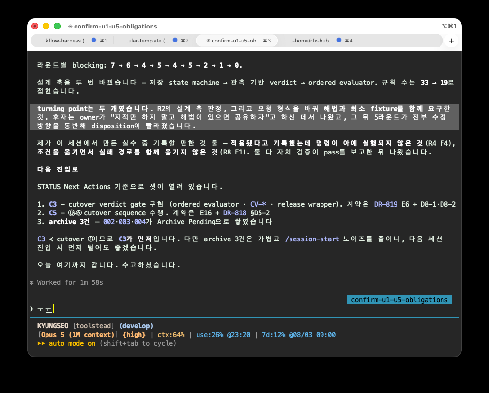

회고라고 해야 할까? 조금은 긴 글을 하나 올려봅니다.

저는 그동안 두 Agent(Codex와 Claude Code)를 함께 돌리면서 하나는 Author/Driver, 다른 하나는 Reviewer 역할을 맡겨 왔습니다. Driver가 계획하고 작성하면 Reviewer가 독립적으로 공격해 보는 방식입니다.

이 방식은 단일 Agent로 작업하는 것에 비해 시간과 비용은 더 들지만 효과는 분명했습니다. 한 Agent만으로 진행할 때보다 누락과 자기모순을 훨씬 잘 발견했고, 작성자(Author/Driver)가 당연하게 여긴 전제를 다시 의심할 수 있었습니다.

특히 Reviewer에게는 기본적으로 이렇게 요구해 왔습니다.

> 내용이나 구현의 정합성만 확인하지 말고, 방향 자체를 의심하는 냉정한 Red-team이 되어라.

그런데 오늘 비교적 넓은 범위의 정비 작업을 진행하면서 리뷰 라운드가 좀처럼 끝나지 않았습니다. 수정하면 새로운 결함이 발견되고, 다시 수정하면 또 다른 문제가 생기는 과정이 반복됐습니다.

그러다 문득 Reviewer의 태도가 조금 이상하게 느껴졌습니다. 문제의 원인과 답에 상당히 가까이 다가간 것처럼 보이는데도, 무엇이 왜 틀렸는지만 논리적으로 설명하고 멈추는 경우가 많았습니다.

그때 뒤늦게 아주 기본적인 질문이 떠올랐습니다.

> Driver와 Reviewer, 그리고 Owner는 결국 같은 작업을 성공시켜야 하는 공동 운명체 아닌가?

이건 상대 Agent가 스스로 답을 깨닫도록 훈련하는 과정이 아닙니다. 문제가 발견됐다면 정확히 지적하는 것만큼이나, 가능한 해법을 빠르게 공유하고 함께 해결하는 것이 중요합니다.

그래서 Reviewer에게 요구를 하나 추가했습니다.

> 해법이 보인다면 문제만 지적하지 말고, 권장하는 해결 방향과 최소 수정 범위, 검증 방법까지 함께 제시해 달라.

그다음 라운드부터 결과의 성격이 확실히 달라졌습니다. 모든 문제가 즉시 사라진 것은 아니지만, 적어도 Driver가 다시 추상적인 설계부터 반복하지 않아도 됐습니다. 문제의 원인과 수정 방향이 함께 전달되면서 disposition이 훨씬 빨라졌고, 논의도 더 구체적으로 진행됐습니다.

돌이켜보면 두 역할은 서로 다른 방식으로 불리하고, 또 서로 다른 강점을 갖습니다.

Driver는 넓은 범위의 요구사항과 기존 결정, 변경 이력, 구현 제약을 한꺼번에 들고 작업합니다. 실제 맥락을 가장 많이 알고 있지만, 그만큼 인지 부하가 크고 자신이 세운 전제에 갇히기 쉽습니다.

Reviewer는 전체 맥락은 상대적으로 적게 알 수 있지만, 제한된 대상을 새로운 시선으로 집중해서 볼 수 있습니다. 그래서 모순과 반례를 찾는 데 유리하고, 때로는 Driver보다 해결 구조를 더 선명하게 볼 수도 있습니다.

문제는 제가 그동안 Red-team이라는 역할을 지나치게 “비판하는 사람”으로만 정의했다는 점입니다.

Agent는 우리가 준 역할과 출력 계약에 강하게 최적화됩니다. 인간 동료라면 맥락상 당연히 덧붙였을 협업 태도까지 알아서 보완해 줄 것이라고 기대해서는 안 됩니다. Reviewer에게 지적만 요구하면 지적에 집중하고, 해법 제안을 범위 밖으로 정하면 답을 알고 있더라도 거기서 멈출 수 있습니다.

결국 개선해야 할 것은 Agent 자체라기보다 프롬프트, 더 정확히는 협업 Skill의 계약이었습니다.

앞으로 Reviewer에게는 두 가지 책임을 함께 부여하려고 합니다. (현재 작업중인 acRelay가 이니라 공개하진 않았지만 한참동안 사용해오던 manual 방식의 개인 스킬이 있습니다. 이것을 우선 개선하려 합니다. 테스트 후 결과가 좋으면 acRelay에도 반영하구요.)

1. 작성자의 전제를 그대로 물려받지 않고 독립적으로 반증할 것
2. 문제가 확인되면 원인, 권장 해법, 최소 수정 범위와 검증 방법까지 제시할 것

단, 여기에는 균형이 필요합니다.

해법을 함께 제시한다고 해서 Reviewer가 Driver의 공동 작성자가 되어서는 안 됩니다. 처음부터 수정안을 만드는 데 몰입하면 기존 방향을 방어하거나 국소적으로 고치는 데 치우쳐, 정작 “이 방향 자체가 틀린 것은 아닌가?”라는 질문이 약해질 수 있기 때문입니다.

제가 생각하는 가장 좋은 조율 방법은 리뷰를 두 단계로 분리하는 것입니다.

> 먼저 독립적으로 반증하고, 그다음 협력적으로 해결한다.

첫 단계에서는 방향, 전제, hidden cost, rollback과 누락을 냉정하게 공격합니다. 이때는 Driver의 의도에 친절하게 맞춰 주기보다, 실제로 틀릴 가능성을 먼저 봅니다.

두 번째 단계에서는 확인된 문제마다 다음을 함께 제공하도록 합니다.

- 무엇이 틀렸는가
- 근본 원인은 무엇인가
- 가장 권장하는 해결 방향은 무엇인가
- 최소한 어디까지 고치면 되는가
- 정상 경로와 실패 경로를 어떤 fixture로 검증할 것인가
- scope 확장이나 Owner 결정이 필요한 부분은 무엇인가

선택지가 여러 개여도 가능하면 우선 권장안을 하나 제시해야 합니다. 그래야 Driver가 또다시 같은 추상 설계부터 반복하지 않습니다. 다만 최종 disposition은 여전히 Driver가 `accept`, `revise`, `defend`, `needs-user` 중 하나로 결정하고, scope나 권한이 달라지는 선택은 Owner에게 올립니다.

같은 유형의 결함이 두 라운드 이상 반복된다면 국소 수정을 계속하기보다, Reviewer가 설계 축 자체를 다시 검토하자는 신호를 내는 것도 필요합니다. 라운드 수가 늘어나는 것이 항상 검토가 깊다는 뜻은 아닙니다. 때로는 잘못된 추상화를 계속 정교하게 다듬고 있다는 신호일 수 있습니다.

어쩌면 지금까지 줄일 수 있었던 리뷰 라운드를 두세 배는 더 진행해 왔던 것인지도 모릅니다. Owner인 저도 그 과정에서 불필요하게 많은 중간 판단을 해야 했습니다.

조금 아쉽지만, 이제라도 알게 된 것이 다행입니다.

Red-team의 비판적 시각과 협력적인 해법 제시는 서로 반대되는 태도가 아니었습니다. 오히려 제대로 분리해 순서대로 수행해야 하는 두 책임에 가까웠습니다.

> 냉정하게 발견하되, 발견한 뒤에는 같은 편으로서 가장 빠른 해결 경로를 함께 제시한다.

앞으로 만들 협업 Skill에는 이 원칙을 명시적으로 반영하려고 합니다. Red-team의 날카로움은 유지하되, 궁극적인 성공 기준은 지적의 개수가 아니라 작업을 안전하고 빠르게 올바른 상태로 수렴시키는 것이어야 합니다.

'조율 원칙 요약'

제가 권하는 최종 균형점은 다음과 같습니다.

- Reviewer는 판정 단계에서 독립성을 유지한다.
- 판정이 끝난 뒤에는 반드시 실행 가능한 권장 해법을 제시한다.
- 해법은 하나의 우선 권장안, 최소 수정 범위, 검증 fixture까지 구체화한다.
- Driver가 disposition과 실제 변경 책임을 유지한다.
- Owner 결정이나 scope 확장은 별도로 표시한다.
- 같은 결함이 반복되면 국소 보정을 멈추고 설계 축을 다시 의심한다.
- 리뷰의 성과는 blocker 수가 아니라 안전한 수렴까지 걸린 시간과 재발 여부로 판단한다.

이 정도면 “Reviewer가 너무 친절해져 비판성이 약해질 위험”과 “정답을 알면서도 지적만 반복하는 비생산성” 사이에서 가장 현실적인 균형이라고 생각합니다.

쉬운게 없습니다.

