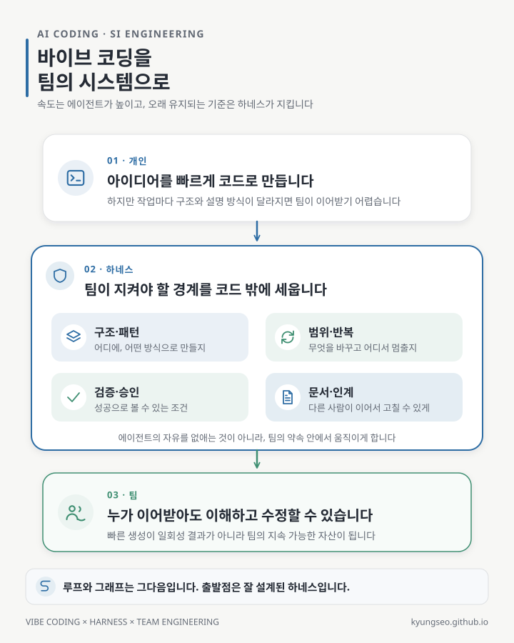

바이브 코딩을 제대로 이해하고 AI 코딩 에이전트에게 무엇을 지시하고 어디까지 맡길지 정할 수 있다면, 생각보다 훨씬 좋은 코드를 얻을 수 있습니다.

저는 여러 프로그래밍 언어를 사용해 왔지만 Go는 잘 모릅니다. 그런데 얼마 전에는 에이전트와 함께 Go 코드를 만들었고 결과도 꽤 만족스러웠습니다. 개인 저장소 중에는 Spring Boot 기반의 규모가 큰 프로젝트도 진행하고 있는데, 여기서 만들어진 코드 역시 기대 이상입니다. 잘 모르는 언어를 다루거나 큰 코드베이스를 이어 갈 때 에이전트가 주는 도움은 분명합니다.

그런데 오랫동안 SI(System Integration) 프로젝트를 해 와서 그런지, 바이브 코딩을 이해하면 할수록 한편으로는 항상 마음에 걸리는 부분도 있습니다.

개인 작업이나 초기 스타트업에서는 만든 사람이 바로 확인하고 고칠 수 있습니다. 요구사항이 바뀌면 같은 사람이 다시 에이전트에게 설명하면 됩니다. 속도가 가장 중요한 시기에는 이 방식이 매우 잘 맞습니다.

SI의 시간은 조금 다르게 흐릅니다. 프로젝트를 만든 사람과 운영하는 사람이 다를 수 있고, 개발자가 교체되며, 다른 회사나 다른 팀이 코드를 이어받기도 합니다. 몇 달 뒤에는 처음과 다른 요구사항을 반영해야 합니다. 이때 중요한 것은 지금 동작하는 코드만이 아니라, **처음 만들지 않은 사람도 구조를 이해하고 안전하게 고칠 수 있는 코드**입니다.

## 에이전트가 만든 코드라서 유지보수가 어려운 것은 아니다

문제의 원인을 단순히 “AI가 만든 코드”라고 부르면 해결 방향을 놓치기 쉽습니다. 사람도 공통 기준 없이 각자 코드를 만들면 구조와 패턴이 흔들립니다. 반대로 에이전트에게 프로젝트의 경계와 반복 가능한 검증 절차를 충분히 주면 상당히 일관된 결과를 만들 수 있습니다.

제가 더 경계하는 상황은 에이전트에게 순간의 요구만 전달하고, 나머지는 알아서 완성하라고 맡기는 경우입니다. 에이전트는 눈앞의 요청을 빠르게 해결할 수 있지만, 그 코드가 어느 모듈에 들어가야 하는지, 기존 패턴과 어떤 관계인지, 무엇을 문서에 남겨야 하는지, 어느 검증을 통과해야 완료인지까지 저절로 공유받지는 못합니다.

그러면 기능은 동작하지만 작업마다 다음과 같은 차이가 쌓일 수 있습니다.

- 같은 역할의 코드가 서로 다른 구조와 이름으로 만들어집니다.
- 비슷한 문제에 다른 패턴과 라이브러리가 사용됩니다.
- 테스트와 예외 처리가 작업자의 지시에 따라 달라집니다.
- 왜 그렇게 설계했는지, 다음 사람이 무엇을 확인해야 하는지 남지 않습니다.

각각은 작은 차이지만, 여러 사람이 오래 유지해야 하는 코드에서는 이해 비용과 변경 위험으로 돌아옵니다.

## 그래서 SI에는 더 잘 다듬어진 하네스가 필요하다

저는 에이전트가 프로젝트 안에서 일할 수 있도록 둘러싼 구조와 규칙, 도구와 검증 절차를 **하네스**(harness)라고 부릅니다. 하네스는 긴 프롬프트 하나나 코딩 규칙 문서 한 장만을 뜻하지 않습니다. 에이전트가 매번 같은 기준을 읽고, 지키고, 확인하도록 만드는 실행 환경에 가깝습니다.

SI에서 사용할 하네스에는 적어도 다음 경계가 보여야 합니다.

- **구조와 책임** — 코드를 어느 모듈에 두고, 각 계층이 무엇을 소유하는지
- **패턴과 의존성** — 어떤 구현 방식을 반복하고, 임의로 무엇을 추가하지 않는지
- **작업 범위** — 이번 변경에서 무엇을 건드리고 어디에서 멈춰야 하는지
- **검증과 승인** — 어떤 테스트·린트·빌드와 사람의 판단을 통과해야 완료인지
- **문서와 인계** — 결정 이유와 남은 위험, 다음 작업자가 확인할 내용을 어디에 기록하는지

이 규칙은 읽으라고 적어 두는 데서 끝나면 쉽게 빠집니다. 가능한 항목은 테스트와 린트, 스크립트와 CI처럼 실행 가능한 검사로 바꾸고, 확인할 수 없는 상태에서는 조용히 성공으로 처리하지 않아야 합니다. 문서 역시 마지막에 몰아서 쓰는 부록이 아니라 작업의 완료 조건에 포함해야 합니다.

하네스는 에이전트의 자유를 없애기 위한 장치가 아닙니다. 매번 길을 새로 추측하지 않아도 되도록 팀이 합의한 차선과 표지판을 제공하는 장치입니다. 경계가 분명할수록 에이전트는 불필요한 선택에 시간을 쓰지 않고 구현에 집중할 수 있고, 사람은 결과를 검토할 기준을 갖게 됩니다.

## 루프와 그래프도 결국 하네스 위에서 움직인다

최근 에이전트 생태계는 한 번의 실행을 잘 통제하는 하네스를 넘어, 결과를 관찰하고 다시 계획하는 **루프**(loop)와 여러 에이전트와 작업을 연결하는 **그래프**(graph)로 확장되고 있습니다. 더 긴 작업을 자율적으로 수행하려면 자연스러운 방향입니다.

하지만 반복 횟수와 에이전트 수가 늘어난다고 기준이 저절로 생기지는 않습니다. 경계가 모호한 실행을 반복하면 작은 흔들림도 함께 증폭됩니다. 여러 에이전트를 연결해도 각자가 다른 완료 조건을 사용한다면 인계 지점에서 다시 문제가 생깁니다.

그래서 저는 여전히 핵심은 하네스라고 생각합니다. 한 번의 작업에서 구조와 권한, 검증과 기록을 지킬 수 있어야 그 위의 루프도 안전하게 반복되고, 그래프 안의 여러 작업도 같은 방향으로 연결됩니다.

저도 이런 문제를 고려해 하네스를 오랫동안 다시 설계하고 있습니다. 목표는 에이전트가 코드를 덜 만들게 하는 것이 아닙니다. 빠르게 만든 코드가 개인의 일회성 성과로 끝나지 않고, 팀이 이해하고 검증하며 다음 변경까지 이어 갈 수 있게 만드는 것입니다.

바이브 코딩의 속도와 SI의 유지보수성은 서로 반대편에 있지 않습니다. 다만 둘을 함께 얻으려면 좋은 에이전트만큼이나, 그 에이전트가 일할 **좋은 하네스**가 필요합니다.
