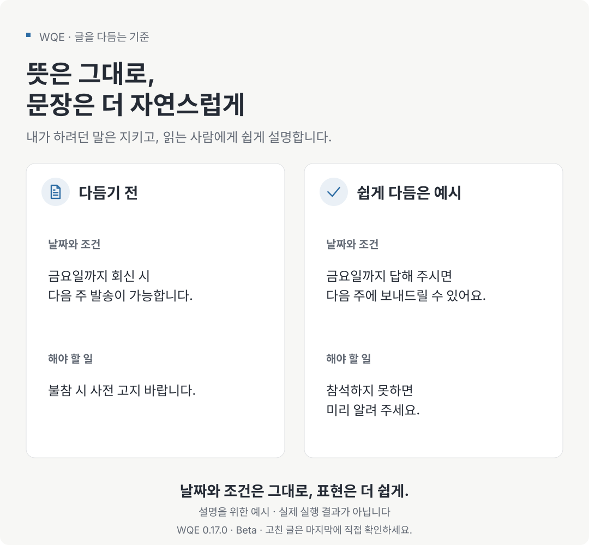

“문장을 자연스럽게 다듬어 주세요.”

AI에게 메일이나 안내문을 맡길 때 흔히 하는 요청입니다. 그런데 고쳐 준 글을 읽다 보면 묘하게 마음에 걸릴 때가 있습니다. 틀린 문장은 아닌데 평소 내가 쓰는 말과 너무 다르거나, 조심스럽게 쓴 말이 어느새 확실한 약속으로 바뀌어 있습니다.

가령 이런 문장을 고친다고 해 보겠습니다.

> 금요일까지 답해 주시면 다음 주에 보내드릴 수 있어요.

이 문장이 “다음 주에 보내드릴게요”로 바뀌면 짧고 시원하게 읽힙니다. 하지만 금요일까지 답을 받아야 한다는 조건이 사라졌고, 보낼 수 있다는 말도 보내겠다는 약속이 됐습니다. 잘 읽히는지만 봐서는 놓치기 쉬운 차이입니다.

제가 만들어 쓰는 WQE(Writing Quality Editor)는 이런 부분까지 살피도록 글쓰기 지침을 묶은 스킬입니다. 뜻과 조건은 지키면서, 읽는 사람에게 자연스러운 글로 다듬는 것이 목표입니다.

## 스킬은 자주 쓰는 지침을 담아 두는 방법입니다

스킬이라는 말이 낯설다면, AI가 필요할 때 읽고 따를 수 있도록 정리한 작업 안내서라고 생각하면 됩니다. WQE에는 글을 새로 쓸 때와 고칠 때 무엇을 살펴야 하는지, 무엇은 그대로 두어야 하는지 적혀 있습니다.

“말투는 살려 주세요”, “없는 내용을 보태지 마세요”, “조건이나 숫자는 바꾸지 마세요” 같은 부탁을 매번 처음부터 적는 대신, 이 기준을 모아 두고 글을 맡길 때 불러 쓰는 방식입니다. 사용하다가 어색한 문장을 발견하면 지침과 예시를 보완합니다.

다만 지침을 저장했다고 해서 AI가 매번 그대로 따르는 것은 아닙니다. WQE로 고친 글도 마지막에는 사람이 읽어봐야 합니다.

## 뜻은 지키고, 설명은 읽는 사람에게 맞춥니다

위 그림은 편집 기준을 보여 주기 위해 만든 예시입니다. WQE가 실행할 때마다 같은 문장을 내놓는다는 뜻은 아닙니다.

글에서 먼저 지켜야 할 것은 사실과 조건입니다. 날짜, 금액, 이름, 링크는 물론이고 “미리 알려야 한다”, “이 경우에는 예외다” 같은 내용도 빠지면 안 됩니다. 누가 무엇을 해야 하는지 달라져도 곤란합니다.

그다음에는 글쓴이의 말투를 봅니다. 친구에게 보내는 따뜻한 메시지가 딱딱한 공문처럼 바뀔 필요는 없습니다. 이미 자연스럽게 읽히는 문장이라면 그대로 두는 것이 좋습니다. 많이 고쳤다고 잘 고친 것은 아니니까요.

반면 설명 방식은 독자에 따라 바꿔야 합니다. 처음 읽는 사람에게 생소한 말이 나온다면 풀어 쓰고, 중요한 조건이 뒤에 숨어 있다면 필요한 곳으로 옮깁니다. 번역할 때도 문장을 하나씩 맞추기보다 그 언어에서 이해하기 쉬운 순서로 설명하되, 내용은 같아야 합니다.

## 문법이 맞아도 낯설게 읽히는 문장이 있습니다

안내문에 “참석 여부의 회신을 요청드립니다”라고 적혀 있다고 해 보겠습니다. 뜻은 알 수 있지만, 일상적인 모임 안내라면 “참석하실지 알려 주세요”가 더 편하게 읽힙니다.

최근 WQE를 보완하면서 신경 쓴 것도 이런 부분입니다. 설명을 읽었는데도 독자가 머릿속에서 다시 쉬운 말로 바꿔야 한다면, 문법만 확인하고 끝내서는 부족합니다. 글을 검토하는 사람끼리 쓸 법한 말보다, 실제로 무엇이 일어났고 무엇을 하면 되는지 직접 설명하도록 지침을 다듬었습니다.

쉬운 말로 고치면서 원래 판단까지 지워서는 안 됩니다. “오늘은 비가 오지 않아 우산의 방수 성능을 확인하지 못했다”는 설명을 “오늘은 비가 오지 않았다”로 줄이면, 무엇을 확인하지 못했는지가 빠집니다. 이 역시 설명을 위해 만든 예시입니다. 짧게 만드는 것보다 독자에게 필요한 답을 남기는 일이 먼저입니다.

한 문장에서 발견한 문제가 다른 문단에도 반복되는지도 살핍니다. 그렇다고 특정 단어를 전부 금지하거나 모든 문장을 길게 풀어 쓰지는 않습니다. 그 글을 읽는 사람이 바로 이해할 수 있는지가 기준입니다.

## 이렇게 맡길 수 있습니다

WQE는 기존 글을 다듬는 일뿐 아니라 메모로 초안을 쓰기, 어색한 부분만 찾기, 영어와 한국어 사이에서 글을 옮기기에도 쓰도록 만들었습니다. 작업별 이름을 외울 필요는 없습니다. 원하는 결과를 말하면 됩니다.

메일을 고칠 때는 이렇게 요청할 수 있습니다.

> WQE로 이 메일을 다듬어 주세요. 처음 연락하는 분께 보내는 글입니다. 정중하되 너무 딱딱하지 않게 쓰고, 날짜와 제가 부탁하는 내용은 그대로 두세요.

고치기 전에 의견만 받고 싶다면 그 점을 분명히 말하면 됩니다.

> WQE로 이 글에서 읽다가 막히는 부분만 짚어 주세요. 아직 문장은 고치지 마세요.

메모에서 새 글을 만들 때는 글의 재료를 함께 줍니다.

> WQE로 아래 메모를 모임 안내문으로 써 주세요. 처음 오는 분도 이해할 수 있게 설명하고, 메모에 없는 시간이나 장소는 저에게 물어봐 주세요.

독자, 글의 용도, 바뀌면 안 되는 내용을 알려주면 AI가 참고할 기준이 분명해집니다. 자료에 없는 경험이나 수치까지 그럴듯하게 채우도록 맡기지는 않습니다.

## 영어와 한국어 사이에서도 뜻과 말투를 살립니다

WQE의 주요 기능 중 하나는 영어 글을 자연스러운 한국어로, 한국어 글을 자연스러운 영어로 옮기는 일입니다. 단어를 하나씩 바꾸는 데 그치지 않고, 그 언어를 쓰는 사람이 편하게 읽을 수 있도록 표현과 순서를 다듬습니다.

예를 들어 영어 메일을 한국어로 옮길 때는 이렇게 요청할 수 있습니다.

> WQE로 아래 영어 메일을 자연스러운 한국어로 옮겨 주세요. 정중하게 부탁하는 말투를 살리고, 답변 기한과 회의를 미루는 조건은 그대로 두세요.

| 영어 원문 | 한국어로 옮긴 예시 |
| --- | --- |
| Could you get back to me by Friday? If not, we’ll need to move the meeting to next week. | 금요일까지 답해 주실 수 있을까요? 그때까지 답을 받지 못하면 회의를 다음 주로 미뤄야 합니다. |

여기서 “get back to me”는 “나에게 돌아오다”가 아니라 “답을 주다”라는 뜻입니다. 표현은 한국어답게 바꾸되, 금요일이라는 기한과 답을 받지 못했을 때의 일정 변경은 남겨야 합니다.

반대로 한국어 메시지를 영어로 보낼 때도 쓸 수 있습니다.

> WQE로 아래 메시지를 자연스러운 영어로 옮겨 주세요. 상대의 제안을 정중히 거절하면서 다른 시간을 제안하는 글입니다. 이번 주 참석이 어렵다는 뜻과 가능한 시간은 그대로 살려 주세요.

| 한국어 원문 | 영어로 옮긴 예시 |
| --- | --- |
| 이번 주에는 참석할 수 없어요. 다음 주 화요일 오후에는 가능합니다. | I can’t make it this week, but I’m available next Tuesday afternoon. |

두 예시는 뜻을 지키면서 표현을 바꾸는 방식을 설명하기 위해 작성했습니다. 실제로 사용할 때는 번역된 글에서도 날짜·조건·부탁의 강도가 같은지 확인합니다.

## 아직 사람이 확인해야 할 부분도 있습니다

현재 공개된 WQE는 0.17.0이며, 사용하면서 보완 중인 Beta 단계입니다. 지침을 추가한 것과 실제로 모든 상황에서 잘 작동하는 것은 다른 이야기입니다.

실제 확인 과정에서도 조건을 놓치거나, 글에 없는 목적을 추정하거나, 굳이 바꾸지 않아도 되는 문장을 고친 사례가 있었습니다. 사용하는 AI 모델과 실행 조건에 따라 결과가 달라질 수 있고, 최신 지침을 모든 환경에서 같은 범위로 시험한 것도 아닙니다. 언어를 바꿔 쓰는 기능은 영어와 한국어를 중심으로 확인하고 있습니다.

그래서 중요한 글은 수정 전후를 나란히 놓고 읽는 편이 좋습니다. 날짜와 조건이 남아 있는지, “할 수 있다”가 “하겠다”로 바뀌지는 않았는지, 내가 하지 않은 경험이 들어가지는 않았는지 확인합니다. 글이 자연스러워졌다고 사실까지 맞아지는 것은 아닙니다. WQE도 사실 확인이나 법률·보안 같은 전문 검토를 대신하지 않으며, AI가 쓴 흔적이나 출처를 숨기는 용도로 만들지 않았습니다.

저는 WQE를 쓰다가 마음에 걸리는 문장을 만나면, 어떻게 고쳐야 적절한지 예문과 함께 기준을 보완하고 있습니다. 다음 글을 맡길 때도 그 기준을 쓸 수 있도록요.

## WQE를 써보고 싶다면

먼저 스킬을 지원하는 AI 도구에 WQE를 설치해야 합니다. Claude Code와 Codex의 설치 방법은 [한국어 설치 안내](https://github.com/kyungseo/skillstead/blob/main/docs/INSTALL.ko.md)에 정리돼 있습니다. 여러 파일을 함께 쓰므로 `writing-quality-editor` 폴더 전체를 설치해야 합니다.

설치한 뒤에는 앞의 예시처럼 글과 원하는 결과를 알려주면 됩니다. 도구가 WQE라는 약칭을 알아보지 못하면 전체 이름인 `writing-quality-editor`를 사용하세요.

자세한 사용법과 영어↔한국어 변환 예시는 GitHub의 [WQE 한국어 안내서](https://github.com/kyungseo/skillstead/blob/main/skills/writing-quality-editor/README.ko.md)에서 읽을 수 있습니다. 이번 버전에서 바뀐 내용과 확인한 결과는 [0.17.0 한국어 릴리스 안내](https://github.com/kyungseo/skillstead/releases/tag/writing-quality-editor/v0.17.0#한국어)에 정리돼 있습니다.
